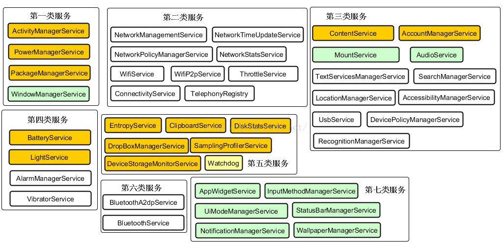

### Android相关知识  
zygote#启动流程;  进程间通信;  IPC;  Binder机制;  
[链接](basic/ipc_service/system_zygote_binder.md)  

[ActivityManagerService](basic/ipc_service/ActivityManagerService.md)  
[WindowManagerService](basic/view_window/WindowManagerService.md)  
[PackageManagerService](basic/ipc_service/PackageManagerService.md)   
[BroadcastReceiver](basic/ipc_service/BroadcastReceiver.md)  
[ContentProvider](basic/ipc_service/ContentProvider.md)  

对四大组件的认识;  对 Context 的认识;  
Application 内存回收机制; 内存回调;  
[链接](basic/context/concept.md)  
[进程, 进程优先级](basic/ipc_service/process.md)  

Activity;  Fragment;  Context;  Application;  
[链接](basic/context/Activity.md)  
Service;  IntentService;  进程保活;  
[链接](basic/ipc_service/Service.md)  

[AIDL](basic/ipc_service/AIDL.md)  
[Handler](basic/handler/Handler.md)  
[Intent](basic/context/Intent.md)   

MIME数据类型;  统一资源标识符 URI;  
[链接](/ComputerScience/network/URI.md)   

apk 打包流程;  65535 问题;  multiDex 问题;    
[链接](basic/apk_build.md)  
[adb相关](basic/adb.md)  
[jvm, dalvik, art 对比](basic/jvm_dalvik_art.md)
[Parcelable 和 Serializable](basic/parcelable_serializable.md)  
[代码混淆](basic/library/progurd.md)  
共享存储;  SharePreference; SP;  
[链接](basic/sharePreference.md)  

优化稳定性;  低功耗;  性能优化;  冷启动介绍;  冷启动优化;  ANR;  内存泄露;  
apk 压缩;  
[链接](basic/optimize_stability_lowPower.md)  

插件化; 热更新; 热修复; Plugin; ClassLoader;  dalvik ART 虚拟机;  系统;  
[链接](basic/library/plugin_hotfix_avm.md)  

常见问题;  机型差异化;  
[链接](basic/library/bug.md)  

[tools 命名空间](basic/tools.md)  

SparseArray-ArrayMap  
[ArrayMap](basic/library/ArrayMap.md)  

MVVM;  DataBinding;  LiveData;  
[链接](basic/databinding/databinding.md)   

### 自定义控件相关  
View 绘制原理, View 绘制时机, 屏幕刷新机制;   fps;  
invalidate;  requestLayout;  
为什么 view.post 可以得到控件真是宽高;  
[链接](basic/view_window/invalidate_requestLayout.md)  

Activity#setContentView 机制;  
对 Activity-Window-View 的认识;  
[链接](basic/view_window/activity_window_view.md)  

[自定义控件相关基础知识](basic/view_window/view_basic_know.md)
[Android 事件分发机制](basic/view_window/dispatchTouchEvent.md)  
[对LayoutInflater的理解](basic/view_window/LayoutInflater.md)  

动画效果  Animation 与 Animator;  
[链接](basic/view_window/animation_animator.md)

[View状态保存](basic/view_window/view_state.md)  

View 圆角化, 布局圆角化, 控件圆角化, 图片圆角化;  
[链接](basic/view_window/layout_rounder.md)  

TextureView; SurfaceView;  
[参考](basic/view_window/TextureView.md)  

[ImageView 与 Bitmap](basic/view_widget/ImageView.md)  
[RecyclerView](basic/recyclerView/RecyclerView.md)  
[ListView](basic/recyclerView/ListView.md)  
[TextView](basic/view_widget/TextView.md)  
[Dialog, PopupWindow, Toast](basic/notify/Dialog_PopupWindow_Toast.md)  
[UI自动化测试](basic/view_window/UiAutomator.md)  
音视频相关; 直播流; 播放器;  
[链接](basic/live_stream/live_stream.md)  
SurfaceFlinger,  
ActivityManagerService, PowerManagerService, PackageManagerService, WindowManagerService;  
NetworkManagementService, NetworkTimeUpdateService, NetworkPolicyManagerService, NetworkStatsService, WifiService, TelephonyRegistry;  
BatteryService, LightService, AlarmManagerService, VibratorService;  
ContentService, AccountManagerService, AudioService, MountService, SearchManagerService, UsbService, LocationManagerService;  
  

ndk;  jni;  
[链接](basic/ndk/jni.md)  

深入Android系统  
IPC机制, Binder和匿名共享内存等  
四大组件启动, 工作原理  
Window系统, Window创建过程  
系统启动过程, system_server启动过程  
动画框架, 原理  
深入Java  
深入理解Java虚拟机  
深入Linux内核  

xxService  
https://www.cnblogs.com/sunkeji/articles/7650482.html  
https://blog.csdn.net/itachi85/article/details/78186741  
