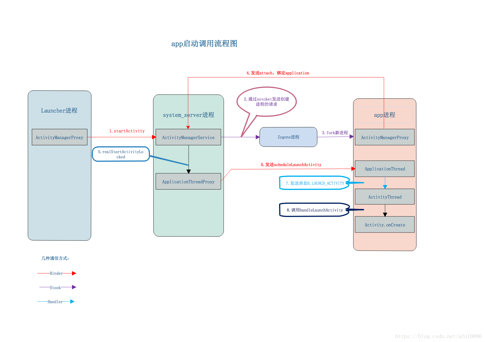

[关于展示吐司和通知](library/open_toast_notification.md)     
[Activity启动模式与任务栈](library/launchMode.md)    
[清单文件Activity标签属性](library/manifest_tag.md)    
[状态栏高度24dp](ImageFiles/status_bar_height.png)    
[Activity常见方法](library/function.md)   
[Fragment重叠异常](library/solution_001.md)  

不管 Activity 是不是被回收, 只要执行 onStop 就一定会先执行 onSaveInstanceState;  

Activity 会通过 android:id 逐个恢复View的State;  
也就是说, 如果 android:id 为空, View 将不具备恢复 State 的能力了;  
所有的自定义控件, 都应该实现State相关方法, onSaveInstanceState and onRestoreInstanceState;  
一旦Fragment从回退栈出来，Fragment本身还在，View却是重新创建的;  
但是给 TextView, EditText 设置 android:freezeText="true" 会让其在 Fragment 内, 自动保存State;     

启动一个 Activity 和 Fragment, 他们的生命周期方法, 调用顺序;  
切换横竖屏;  屏幕锁;  
[链接](library/lifecycle_sample.md)  

### Fragment  

setRetainInstance  
Fragment 具有属性 retainInstance, 默认值为 false;   
当设备旋转时, fragment 会随托管 activity 一起销毁并重建;  

如果 retainInstance 属性值为 false, FragmentManager会立即销毁该fragment实例;   
随后, 为适应新的设备配置, 新的Activity的新的FragmentManager会创建一个新的fragment及其视图;  

如果retainInstance属性值为true, 则该fragment的视图立即被销毁, 但fragment本身不会被销毁;   
为适应新的设备配置, 当新的Activity创建后, 新的FragmentManager会找到被保留的fragment, 并重新创建其视图；  
一旦发生Activity重启现象, Fragment会跳过onDestroy直接进行onDetach（界面消失、对象还在）,   
而Fragment重启时也会跳过onCreate, 而onAttach和onActivityCreated还是会被调用;  
需要注意的是, 要使用这种操作的Fragment不能加入backstack后退栈中;  
并且, 被保存的Fragment实例不会保持太久, 若长时间没有容器承载它, 也会被系统回收掉的;  

[FragmentManagerImpl, Api21](library/FragmentManagerImplApi21.md)  
getActivity()空指针问题  
❀ 搞清楚, 为什么f.mActivity() 为空    
如果app长时间在后台运行, 再次进入app的时候可能会出现crash, 而且fragment会有重叠现象;  
如果系统内存不足、切换横竖屏、app长时间在后台运行, Activity都可能会被系统回收然后重建,   
但Fragment并不会随着Activity的回收而被回收, 创建的所有 Fragment会被保存到Bundle里面, 从而导致Fragment丢失对应的Activity;  
Fragment放在ViewPager中, ViewPager只预加载三个, 在跳转到未被预加载的Item的时候, 目标Fragment也重新创建, 这个时候, 通过getActivity()获取不到context;  
❀ 解决办法  
Fragment中维护一个 全局的 Activity 对象, 在 onAttach 方法中 给其赋值, 在 onDetach 中, 把它置空;  
管理好Fragment 的生命周期, 在onCreate 开始监听, 在onDestroy时, 解除监听, 忽略掉耗时操作的回调;  


#### commit  

❀ commit()  
在主线程中异步执行, 其实也是 Handler 抛出任务, 等待主线程调度执行;  
commit() 需要在宿主 Activity 保存状态之前调用, 否则会报错;   
这是因为如果 Activity 出现异常需要恢复状态, 在保存状态之后的 commit() 将会丢失, 这和调用的初衷不符, 所以会报错;  

❀ commitAllowingStateLoss()  
commitAllowingStateLoss() 也是异步执行, 但它的不同之处在于, 允许在 Activity 保存状态之后调用, 也就是说它遇到状态丢失不会报错;  

❀ commitNow()  
commitNow() 是同步执行的, 立即提交任务;  
FragmentManager.executePendingTransactions() 也可以实现立即提交事务;  
但我们一般建议使用 commitNow(), 因为另外那位是一下子执行所有待执行的任务, 可能会把当前所有的事务都一下子执行了, 这有可能有副作用;  
此外, 这个方法提交的事务可能不会被添加到 FragmentManger 的后退栈, 因为你这样直接提交, 有可能影响其他异步执行任务在栈中的顺序;  
和 commit() 一样, commitNow() 也必须在 Activity 保存状态前调用, 否则会抛异常;  

attach 与 detach  
transaction.attach(fragment); 对应 onCreateView-onViewCreated-onActivityCreated-onStart-onResume    
transaction.detach(fragment);  对应 onPause-onStop-onDestroyView  


#### transaction  
1.. replace  加入回退栈, Fragment不销毁, 但是切换回销毁视图和重新创建视图;  
2.. replace  未加回退栈, Fragment销毁掉;  
3.. hide. show. Fragment不销毁，也不销毁视图, 隐藏和显示不走生命周期;  

replace, AFragment 加入回退栈  
在同一个位置, 第一次 replace AFragment, 第二次replace BFragment;    
```
A: onAttach -> onCreate -> onCreateView -> onActivityCreated -> onStart -> onResume;  
A: onPause -> onStop -> onDestroyView   
B: onAttach -> onCreate -> onCreateView -> onActivityCreated -> onStart -> onResume;  
```

replace, AFragment 未加回退栈  
在同一个位置, 第一次 replace AFragment, 第二次replace BFragment;    
```
A: onAttach -> onCreate -> onCreateView -> onActivityCreated -> onStart -> onResume;  
A: onPause -> onStop -> onDestroyView -> onDestroy -> onDetach  
B: onAttach -> onCreate -> onCreateView -> onActivityCreated -> onStart -> onResume;  
```


detach 与 attach  
fragmentTransaction.detach(fragmentA);  
```
onPause -> onStop -> onDestroyView  
```
fragmentTransaction.attach(fragmentA);  
```
onCreateView -> onActivityCreated -> onStart -> onResume  
```

#### fragmentManager  

popBackStack(String tag,int flags)  
```
如果  tag = null, flags = 0, 弹出回退栈中最上层的那个fragment  
如果  tag = null, flags = 1, 弹出回退栈中所有fragment  
如果  tag != null, flags = 0, 弹出该fragment以上的所有Fragment, 不包括 tag
如果  tag != null, flags = 1, 弹出该fragment以上的所有Fragment, 包括 tag  
原本 D -> C -> B -> A ;  
执行 
```

未挂载异常  
```
//  "Fragment " + this + " not attached to Activity"
transaction.add(routerFragment, RouterConfig.FM_TAG);
transaction.commitAllowingStateLoss();
manager.executePendingTransactions();
```
### startActivity流程  
  
之前, ActivityManagerNative.getDefault() 得到一个 ActivityManagerProxy 对象, 它是跟 AMS 进行通信, 是 client 端的代表;  
AMP 通过 binder 将数据传输到 AMN, 后面程序进入 system_server 进程, 开始继续执行;  
AMN 是 AMS 通信过程中 service 端的代表, 它继承于 Binder, 实现了 IActivityManager 的方法, 但它只是调用, 直接实现的类是 AMS;  


api >= 26 之后  
ApplicationThreadProxy  ApplicationThreadNative  ActivityManagerNative  BulkCursorNative  ContentProviderNative  
都被废弃;  


ActivityThread  
App的真正入口, 当开启App之后, 会调用main()开始运行, 开启消息循环队列, 启动UI线程;   

ActivityThread.ApplicationThread  
ApplicationThread 是 ActivityThread 的内部类, 继承于 IApplicationThread.Stub, 也就是 Binder;  
用来完成 ActivityManagerService 与 ActivityThread 之间的交互;    
在 ActivityManagerService 需要管理相关 Application 中的 Activity 的生命周期时, 通过 ApplicationThread 的代理对象与 ActivityThread 通讯;  

ApplicationThreadProxy  
是 ApplicationThread 在服务器端的代理, 负责和客户端的 ApplicationThread 通讯;  AMS就是通过该代理与 ActivityThread 进行通信的;  

ActivityThread.H  
H其实是一个Handler, 也是ActivityThread的一个内部类, 运行在主线程;  

Instrumentation  
管理一个活动的生命周期;  
Instrumentation是android系统中启动Activity的一个实际操作类, 也就是说Activity在应用进程端的启动实际上就是Instrumentation执行的；  

每一个应用程序只有一个Instrumentation对象, 每个Activity内都有一个对该对象的引用;  Instrumentation可以理解为应用进程的管家,   
ActivityThread要创建或暂停某个Activity时, 都需要通过Instrumentation来进行具体的操作;    

Instrumentation#newActivity();  
Instrumentation#newApplication();  

ActivityStack  
管理一个活动栈  
Activity在AMS的栈管理, 用来记录已经启动的Activity的先后关系, 状态信息等;  通过ActivityStack决定是否需要启动新的进程;  

ActivityStackSupervisor  
管理所有的活动栈  

ActivityRecord  
ActivityStack的管理对象, 每个Activity在AMS对应一个ActivityRecord, 来记录Activity的状态以及其他的管理信息;  其实就是服务器端的Activity对象的映像;  

ActivityStarter  
根据intent, flags 找到 activity, stack  

TaskRecord  
AMS抽象出来的一个"任务"的概念, 是记录ActivityRecord的栈, 一个"Task"包含若干个ActivityRecord;  AMS用TaskRecord确保Activity启动和退出的顺序;    

ActivityManagerService  
管理所有的活动;  
位于system_server进程, 从ActivityManagerService提供的接口来看, 它负责管理Activity的启动和生命周期;  

ActivityManagerProxy  
是 ActivityManagerService 在普通应用进程的一个代理对象;  
已经被废弃, 通过AIDL生成的对象;  
它只负责准备相关的数据发送到system_process进程去处理startActivity;  
应用进程通过 ActivityManagerProxy 对象调用 ActivityManagerService 提供的功能;  

应用进程并不会直接创建 ActivityManagerProxy 对象,   
而是通过调用 ActivityManagerNative 类的工具方法 getDefault 方法得到 ActivityManagerProxy 对象;  
也就是 通过 ActivityManager#getService 方法得到 ActivityManagerProxy 对象;  


#### 函数调用栈    
无论是通过 launcher 来启动 Activity 还是通过其他 Activity 来启动另一个 Activity, 都需要通过IPC调用 ActivityManagerService 的 startActivity 的方法;  

ActivityManagerService 调用 ActivityStarter.startActivityMayWait, 经过一系列复杂的调用, 收集并记录Activity的启动信息, 调整ActivityStack(让栈顶的Activity进入pause状态),  
创建并初始化Application对象, 创建ActivityThread并调用main方法;  

最后在 ActivityStackSupervisor 的 realStartActivityLocked 方法调用 app.thread.scheduleLaunchActivity 方法,   
也就是说, ActivityManagerService 调用 ApplicationThread 的 scheduleLaunchActivity 接口方法;  

Activity.startActivity  
Instrumentation#execStartActivity  
ActivityManagerProxy#startActivity  
通过Binder驱动程序就进入到 ActivityManagerService 的 startActivity 方法;  
ActivityManagerService#startActivity  
经过IPC调用，启动Activity的指令来到了ActivityManagerService，紧接着AMS调用 startActivityAsUser 着手Activity的启动工作;   

ActivityStarter#startActiviytMayWait  
AMS有一个ActivityStack, 负责Activity的调度工作, 比如维护回退栈, 但ActivityStack内的Activity是抽象成ActivityRecord来管理的, Activity对象不会存在于AMS当中;  

ActivityStarter#startActivityUncheckedLocked  
这个方法会根据Activity启动信息(提取封装到ActivityInfo类中)中的launchMode, flag等属性来调度ActivityStack中的Task和ActivityRecord;  
因此这个方法是理解Activity启动模式的关键;  

ActivityStack#resumeTopActivityInnerLocked  
这个方法内部会把前台处于Resume状态的Activity变成Pause状态后才会继续启动Activity的逻辑;  
将一个Activity变成Pause状态需要经历的调用于后面的启动调用非常相似;  

ActivityStack#startSpecificActivityLocked  
这里最后会调用AMS的startProcessLocked, 这个方法会先判断是否已经存在相应的进程, 如果不存在则通过远程调用Zygote进程来孵化出新的应用进程,  
Zygote进程孵化出新的应用进程后, 会执行ActivityThread类的main方法;  
在该方法里会先准备好Looper和消息队列, 然后调用attach方法将应用进程绑定到ActivityManagerService, 然后进入loop循环, 不断地读取消息队列里的消息，并分发消息;  
这个过程在Android的消息机制里已经非常熟悉了, 其中attach方法在与AMS绑定的过程中会调用attachApplicationLocked方法;  
attachApplicationLocked方法有两个重要的函数调用thread.bindApplication和mMainStack.realStartActivityLocked;  
thread.bindApplication将应用进程的ApplicationThread对象绑定到ActivityManagerService, 也就是说获得ApplicationThread对象的代理对象;  
mMainStack.realStartActivityLocked通知应用进程启动Activity  

ActivityStack#realStartActivityLocked  
app.thread其实就是ApplicationThread在AMS的代理对象, 实际上是调用ApplicationThread#scheduleLaunchActivity;  
接下来Activity的启动工作就交给应用进程来完成了, 别忘了这时候的Activity对象还没被创建呢;  

ActivityThread#performLaunchActivity  
通过类加载器加载Activity对象;  
创建ContextImpl对象并调用activity的attach方法，把上下文变量设置进activity中，创建Window对象和设置WindowManager;  
回调onCreate,onStart和onRestoreInstanceState方法;  

ActivityThread#handleResumeActivity  
回调Activity的onResume方法;  
调用WindowManager的addView方法，将前面在attach方法内创建出来的window对象添加到WindowManager当中;  


###  参考  
https://inthecheesefactory.com/blog/fragment-state-saving-best-practices/en  
https://github.com/nuuneoi/StatedFragment  

❀ startActivity  
https://blog.csdn.net/stonecao/article/details/6591847  
https://blog.csdn.net/qq_23547831/article/details/51224992  
http://gityuan.com/2016/03/12/start-activity/  
https://github.com/yipianfengye/androidSource/blob/master/14 activity启动流程.md
http://aspook.com/2017/02/10/Android-Instrumentation源码分析（附Activity启动流程）/  
深入理解 Android 内核设计思想  
Android 开发艺术探索  
https://blog.csdn.net/pihailailou/article/details/78545391  
https://blog.csdn.net/itachi85/article/details/64123035  
https://blog.csdn.net/qian520ao/article/details/81908505  
https://blog.csdn.net/luoshengyang/article/details/6689748  
https://blog.csdn.net/luoshengyang/article/details/6703247  
https://juejin.im/post/5c4180566fb9a049a62cdfd7  
https://juejin.im/post/5c469b23f265da614933efe8  
https://juejin.im/post/5c483eaff265da61327fa0e3  
https://blog.csdn.net/AndrExpert/article/details/81488503  
https://www.jianshu.com/p/a72c5ccbd150  
https://lrh1993.gitbooks.io/android_interview_guide/content/android/advance/app-launch.html  
https://blog.csdn.net/afu10086/article/details/80140817  

❀ Activity 参考  
http://liuwangshu.cn/framework/ams/2-activitytask.html  
http://liuwangshu.cn/framework/component/6-activity-start-1.html  
http://liuwangshu.cn/framework/component/7-activity-start-2.html  
https://developer.android.com/training/basics/activity-lifecycle/recreating?utm_campaign=adp_series_processes_012016&utm_source=medium&utm_medium=blog  


❀ fragment 参考  
http://toughcoder.net/blog/2015/04/30/android-fragment-the-bad-parts/  
http://www.jianshu.com/p/825eb1f98c19  
https://github.com/AlanCheen/Android-Resources/blob/master/Fragment.md    
https://github.com/JustKiddingBaby/FragmentRigger  
http://blog.csdn.net/u011240877/article/details/78132990#fragment-的使用  
https://www.jianshu.com/p/f2fcc670afd6  
https://www.jianshu.com/p/d9143a92ad94  
https://www.jianshu.com/p/fd71d65f0ec6  
https://www.jianshu.com/p/38f7994faa6b  
https://www.jianshu.com/p/9dbb03203fbc  
https://www.jianshu.com/p/78ec81b42f92  
https://www.jianshu.com/p/c12a98a36b2b  
http://toughcoder.net/blog/2015/04/30/android-fragment-the-bad-parts/  
https://github.com/YoKeyword/Fragmentation/blob/master/README_CN.md  
https://meta.tn/a/15e2d3292a521d700b4fef2f4ebaaa331b8df551431a766ff85b9a5b50c851fc  
https://meta.tn/a/b5b52d1cf21bb9f929cfc2b78b03927c97e74d076d094b12656c6c8c661d3072  

❀ getActivity()空指针问题  参考  
http://blog.csdn.net/goodlixueyong/article/details/48715661  

❀ application 参考  
http://www.jianshu.com/p/f665366b2a47  

❀ context 参考  
http://liuwangshu.cn/framework/context/2-activity-service.html  
https://blog.csdn.net/guolin_blog/article/details/47028975  


❀ onActivityResult  
请放弃使用 类似的库, 因为在 页面被回收, 页面重启后, 回调不会被执行的；  
https://github.com/VictorAlbertos/RxActivityResult  
https://github.com/florent37/InlineActivityResult  
https://github.com/NateWickstrom/RxActivityResult  
https://github.com/nekocode/RxActivityResult  

❀ 启动模式 IntentFilter  
https://juejin.im/post/5c5d85da6fb9a049fd104d8f  
