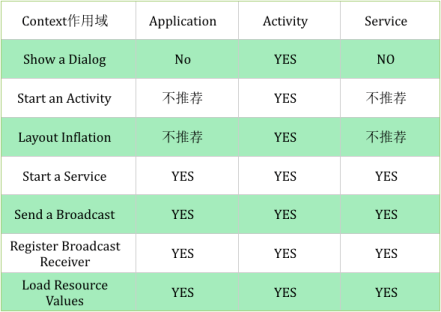

Activity 是一种交互型组件, 用于展示视图, 接收用户的输入和滑动等操作;  
Service 是一种计算型组件, 用于后台执行一些列的计算任务, 工作在后台, 用户无法感知它的存在;  
BroadcastReceiver 是一种消息型组件, 用于在不同组件, 或者在不同应用之间传递消息;  
ContentProvider 是一种数据共享型组件, 用于组件之间, 或者应用之间共享数据;  
### 对#Context的认识    
Application, Service 中的 Context, 即 getApplicationContext, 被当作应用;  
Activity 中的 Context, 即 activity.this, 被当作视图;  
Context 是一个抽象类, 类继承结构图:  
```
Context;    
    ContextImpl;  
    ContextWrapper;  
        Application;  
        Service;  
        ContextThemeWrapper;  
            Activity;  
```
具体的 context 的功能都是 ContextImpl 去实现的;  
在 Activity, Service 中  
getApplication();  
getApplicationContext();  
getBaseContext();  
其中, getApplication  与 getApplicationContext 是同一个对象, 都是 Application 的引用;   
getBaseContext 得到的是 ContextImpl 的引用;  


在 Fragment 中  
getContext();  
getActivity();  


在ContentProvider中  
getContext();  


在BroadcastReceiver中  
```
public void onReceive(Context context, Intent intent) {
    context.getApplicationContext();
}
```
 
  


### Application内存回收  
ActivityManagerService 集中管理所有进程的内存资源分配, 所有进程需要申请或释放内存之前必须调用 ActivityManagerService 对象,   
获得其“许可”之后才能进行下一步操作, 或者 ActivityManagerService 将直接“代劳”;  
ActivityManagerService#trimApplications  
ActivityManagerService#activityIdle  
ActivityManagerService#performAppGcsLocked  
ActivityManagerService#performAppGcsIfAppropriateLocked  
ActivityManagerService#releaseActivityInstance  
ActivityStackSupervisor#activityIdleInternalLocked  

ActivityManagerService#trimApplications  
(1) 当程序执行到 trimApplications() 之后, 首先检查 mRemovedProcesses 列表中的进程;  
mRemovedProcesses 列表中主要包含了 crash 的进程、5 秒内没有响应并被用户选在强制关闭的进程、以及应用开发这调用 killBackgroundProcess 想要杀死的进程;  
调用 Process.killProcess 将所有此类进程全部杀死;  
(2) 调用 applyOomAdjLocked() 函数, 若返回true, 说明 Linux 内核支持 setOomAdj() 接口, updateOomAdjLocked 将修改 adj 的值并通知 linux 内核,   
内核根据 adj 值以及内存使用情况动态管理进程资源(lowmemorykiller 和 oom_killer);  
若 applyOomAdjLocked() 返回为false, 则表示当前系统不支持 setOomAdj() 接口, 将在本地进行默认的资源回收;  
(3)进程被杀死的条件是  
必须是非 persistent 进程, 即非系统进程；  
必须是空进程, 即进程中没有任何 activity 存在;如果杀死存在 Activity 的进程, 有可能关闭用户正在使用的程序, 或者使应用程序恢复的时延变大, 从而影响用户体验；  
必须无 broadcast receiver;运行 broadcast receiver 一般都在等待一个事件的发生, 用户并不希望此类程序被系统强制关闭；  
进程中 service 的数量必须为 0;存在 service 的进程很有可能在为一个或者多个程序提供某种服务, 如 GPS 定位服务;杀死此类进程将使其他进程无法正常服务;  
(4)检查当前进程  
当该进程中所有的 Activity 都还必须满足三个条件：Activity 的状态已经保存, 当前处在不可见状态并且 Activity 已经 Stop;  
这时杀掉进程只会降低下次调用程序时的加载速度, 下次启动时将恢复到关闭之前的状态, 并不会在用户体验上造成致命的影响,   
由于进程中 Activity 的数量不是 0, 下一步需要对每个 activity 执行 destroyActivityLocked() 销毁, 最后才杀死进程;  

  
回调函数  
```
Application
/**当后台程序已经终止资源还匮乏时会调用这个方法*/
@Override
public void onLowMemory() {
	super.onLowMemory();
	LogUtil.e("onLowMemory");
}

/**当终止应用程序对象时调用, 不保证一定被调用*/
@Override
public void onTerminate() {
	super.onTerminate();
	LogUtil.e("onTerminate");
}

/**
 * 表示应用程序的 所有UI界面 被隐藏了, 即用户点击了Home键或者Back键导致应用的UI界面不可见．
 * 这时候应该释放一些资源
 * ComponentCallbacks2.TRIM_MEMORY_UI_HIDDEN    20
 * 
 * 
 * 
 * 表示应用程序正常运行, 并且不会被杀掉;但是目前手机的内存已经有点低了, 
 * 系统可能会开始根据LRU缓存规则来去杀死进程了;
 * TRIM_MEMORY_RUNNING_MODERATE    5
 * 
 * 
 * 
 * 表示应用程序正常运行, 并且不会被杀掉;但是目前手机的内存已经非常低了, 
 * 我们应该去释放掉一些不必要的资源以提升系统的性能, 同时这也会直接影响到我们应用程序的性能;
 * TRIM_MEMORY_RUNNING_LOW    10
 * 
 * 
 * 
 * 表示应用程序仍然正常运行, 但是系统已经根据LRU缓存规则杀掉了大部分缓存的进程了;
 * 这个时候我们应当尽可能地去释放任何不必要的资源, 不然的话系统可能会继续杀掉所有缓存中的进程, 
 * 并且开始杀掉一些本来应当保持运行的进程, 比如说后台运行的服务;
 * TRIM_MEMORY_RUNNING_CRITICAL    15
 * 
 * 
 * 
 * 表示手机目前内存已经很低了, 系统准备开始根据LRU缓存来清理进程;
 * 这个时候我们的程序在LRU缓存列表的最近位置, 是不太可能被清理掉的, 
 * 但这时去释放掉一些比较容易恢复的资源能够让手机的内存变得比较充足, 
 * 从而让我们的程序更长时间地保留在缓存当中, 这样当用户返回我们的程序时会感觉非常顺畅, 
 * 而不是经历了一次重新启动的过程;
 * TRIM_MEMORY_BACKGROUND    40
 * 
 * 
 * 
 * 表示手机目前内存已经很低了, 并且我们的程序处于LRU缓存列表的中间位置, 
 * 如果手机内存还得不到进一步释放的话, 那么我们的程序就有被系统杀掉的风险了;
 * TRIM_MEMORY_MODERATE    60
 * 
 * 
 * 
 * 表示手机目前内存已经很低了, 并且我们的程序处于LRU缓存列表的最边缘位置, 
 * 系统会最优先考虑杀掉我们的应用程序, 在这个时候应当尽可能地把一切可以释放的东西都进行释放;
 * TRIM_MEMORY_COMPLETE    80
 */
@Override
public void onTrimMemory(int level) {
	super.onTrimMemory(level);
}
```


### 参考  
http://www.jianshu.com/p/46c35c5079b4     
http://www.jianshu.com/p/994cd73bde53    
http://www.jianshu.com/p/94e0f9ab3f1d  

application  
https://www.ibm.com/developerworks/cn/opensource/os-cn-android-mmry-rcycl/index.html  
https://stackoverflow.com/questions/7536988/android-app-out-of-memory-issues-tried-everything-and-still-at-a-loss/7576275#7576275  
