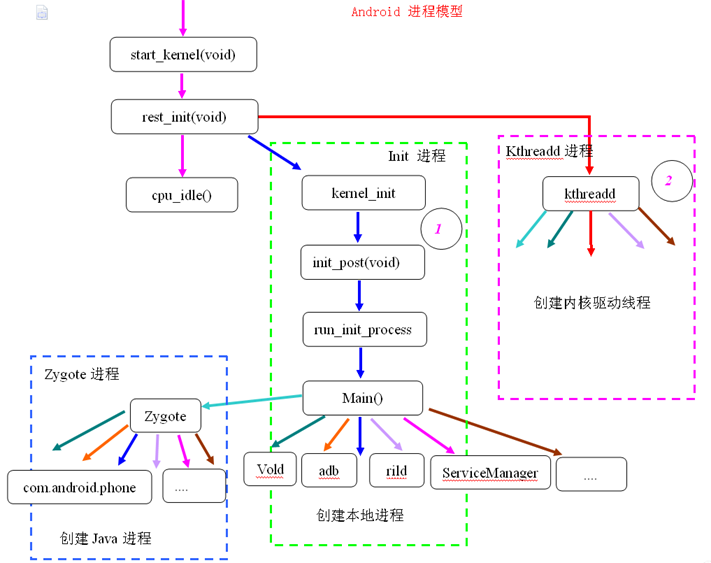

应用程序进程具有两个特点:  
一是进程的入口函数是 ActivityThread.main,   
二是进程天然支持 Binder 进程间通信机制;  

### 系统进程的具体描述  
init 进程 fork zygote 进程;  
init 进程 fork service_manager 进程;
zygote 进程 fork system_server 进程;  
system_server 进程, 启动 ActivityManagerService, ActivityManagerService 向 native 的 ServiceManager 注册服务;  
ActivityManagerService 工作在 system_server 进程;  
App 进程, 通过 binder 机制, 和 ActivityManagerService 进行通信;  
ActivityManagerService 通过 socket 和 zygote 进程, 进行通信; 
#### init#进程  
当按下电源键   
cpu 上电, 芯片上的预设代码开始执行, 加载引导程序 Bootloader 到 ram 中运行;  
Bootloader 负责初始化硬件资源和加载 linux kernel, 然后将控制权交给 linux kernel;    
linux kernel 得到控制权后, 调用下列一系列函数:  
初始化内存分配;  
初始化文件系统;  
加载硬件驱动;  
初始化和启动属性服务;  
fork init 进程, init 进程会启动 ServiceManager 和 android 的 Zygote 进程;  
启动 ServiceManager 为 BinderDevice 注册上下文管理者;   
  


#### ServiceManager  
ServiceManager 对应 service_manager.c文件;  
init 进程 fork ServiceManager 进程, ServiceManager 是 0号 binder 实体, 负责注册和管理 binder;  
ServiceManager 进程, 做了哪些事情:  
1.. 调用 binder_open()函数, 打开 binder 驱动, 并调用 mmap()方法分配 128k 的内存映射空间;  
2.. 调用 binder_become_context_manager()函数, 通知 binder 驱动, 使其成为守护进程, 并成为 binder 的上下文管理者;  
3.. 验证 seLinux 权限, 判断进程是否有权注册, 或者查看指定服务;  
4.. 调用 binder_loop()函数, 进入循环体, 等待 Client 端的请求, 并调用 binder_parser 来解析-处理消息, 进入循环体之后, 永远不会退出, 除非发生致命错误;  
5.. 一旦 ServiceManager 发生重启, zygote, media, surfaceFlinger 等都会被重新加载;  
注册服务的过程, 根据服务名称, 但同一个服务已注册, 重新注册前会先移除之前的注册信息;  
死亡通知: 当 binder 所在进程死亡后,会调用 binder_release 方法,然后调用 binder_node_release, 这个过程便会发出死亡通知的回调;  

❀ ServiceManager 的功能  
1.. 注册  
当创建 Binder Server 就要向 ServiceManager 注册;  

2.. 查询  
应用程序可以向 ServiceManager 发起请求, 获取某个 Binder Server 的句柄;  

3.. 其他信息查询  
诸如 ServiceManager 的版本号, 当前状态等;  

❀ Client 获得实名 Binder 的引用  
Server 向 SMgr 注册了 Binder 实体及其名字后, Client 就可以通过名字获得该 Binder的引用了;  
从面向对象的角度, 这个 Binder 对象现在有了两个引用: 一个位于 SMgr 中, 一个位于发起请求的 Client 中;  
如果接下来有更多的 Client 请求该 Binder, 系统中就会有更多的引用指向该 Binder, 就象 java 里一个对象存在多个引用一样;   

❀ 匿名 Binder  
并不是所有 Binder 都需要向 SMgr 注册的;  
Server 端可以通过, 已经建立的 Binder 连接, 完成通信, 将创建的 Binder 实体传给 Client, 当然这条已经建立的 Binder 连接必须是通过实名 Binder 实现;  
由于这个 Binder 没有向 SMgr注册名字, 所以是个匿名 Binder;  
Client 将会收到这个匿名 Binder 的引用, 通过这个引用向位于 Server 中的实体发送请求;  
匿名 Binder 为通信双方建立一条私密通道, 只要 Server 没有把匿名 Binder 发给别的进程,  别的进程就无法获得该 Binder 的引用, 向该 Binder 发送请求;   


android.os.ServiceManager  
是一个工具, 通过 ServiceManager 可以得到 getService, 得到一个 IBinder 对象, 而 IBinder 对象, 对应 binder 引用;  
ServiceManager.addService 启动的服务, 是 Binder 的子类;  


#### zygote#进程  
Android 是基于 Linux 系统的, 当手机开机的时候, Linux 的内核加载完成之后, 就会启动一个 "init" 的进程;   
在 Linux 系统中, 所有的进程都是由 init 进程 fork 出来的, zygote 进程也不例外;  
在 Android 系统中, 所有的应用程序进程以及系统服务进程 SystemServer, 都是由 Zygote 进程 fork 出来的, 都是 zygote 的子进程;  

Zygote 进程, 做了哪些事情:   
1.. 解析 init.zygote.rc 中的参数, 创建 AppRuntime 并调用 AppRuntime.start()方法;  
2.. 调用 AndroidRuntime 的 startVM()方法创建虚拟机, 再调用 startReg()注册 JNI 函数;     
3.. 通过 JNI 方式调用 ZygoteInit.main(), 第一次进入 Java 世界;  
4.. registerZygoteSocket()建立 socket 通道, 作为 IPC 通信服务端, zygote 作为通信的服务端, 用于响应客户端请求;   
5.. 通过 registerZygoteSocket 函数创建服务端 Socket, 并通过 runSelectLoop 函数等待 ActivityManagerService 的请求来创建新的应用程序进程;  
6.. fork SystemServer 进程;  
7.. 执行 preloadClasses  和 preloadResource 函数, 分别是加载 class 文件到内存, 和加载资源文件到内存, 这个过程是很耗时间的, 所以开机会比较慢;   
    preload()预加载通用类, drawable 和 color 资源, openGL 以及共享库以及 WebView, 用于提高 app 启动效率;  

#### SystemServer#进程  
com.android.server.SystemServer 是一个进程;  
在 ZygoteInit.main()方法中, 调用 forkSystemServer()方法 fork 了 SystemServer 进程;  
进程描述: className="com.android.server.SystemServer", 进程名字="system_server";  
SystemServer 进程, 做了哪些事情:  
1.. 启动 Binder 线程池, 这样就可以与其他进程进行通信;   
2.. 创建 SystemServiceManager 类, 用于对系统的服务进行创建, 启动和生命周期管理;  
3.. 启动各种系统服务, 比如, ActivityManagerService, PackageManagerService, WindowManagerService, DisplayManagerService 等等, 他们(这几个Service)都工作在 SystemServer 进程;  
4.. 最后调用Looper.loop(); 进行消息循环, 后续会处理相关消息;  

com.android.server.SystemServiceManager  
是一个工具, 通过 SystemServiceManager 可以 startService;  
SystemServiceManager.startService 启动的服务, 是 SystemService 的子类;  

#### ActivityManagerService  
工作在 SystemServer 进程;  
SystemServer 进程 #run 方法 ⤑ #startBootstrapServices 方法 ⤑  启动 ActivityManagerService;  
在 SystemServer.java 的 run方法, ActivityManagerService 向 Native 的 ServiceManager 注册服务;  
ActivityManagerService 是服务端对象, 负责系统中所有 Activity 的生命周期;  
创建 ActivityManager, ProcessRecord, ServiceManager;  
start 方法中, 反射调用 ActivityThread.main方法;  

createSystemContext  
初始化系统上下文对象 mSystemContext, 并设置默认的主题,mSystemContext 实际上是一个 ContextImpl 对象;    
调用 ActivityThread.systemMain()的时候, 会调用 ActivityThread.attach(true), 而在attach()里面,  
则创建了 Application 对象, 并调用了 Application.onCreate();  

内部关系  
AMP 是 AMN 的内部类, 它们都实现了 IActivityManager 接口, 这样它们就可以实现代理模式, 具体来讲是远程代理, AMP 和 AMN 是运行在两个进程的;  
AMP 是 Client 端, AMN 则是 Server 端, 而 Server 端中具体的功能都是由 AMN 的子类 AMS 来实现的, 因此AMP就是AMS在Client端的代理类;   
AMN 又实现了Binder类, 这样AMP可以和AMS就可以通过Binder来进行进程间通信;  

ActivityManager 通过 AMN 的 getDefault 方法得到 AMP, 通过 AMP 就可以和 AMN 进行通信, 也就是间接的与 AMS 进行通信;  
除了 ActivityManager, 其他想要与 AMS 进行通信的类都需要通过AMP;  

#### 在 Launcher 中点击  App 的图标后, 发生了什么  
点击桌面 App 图标, Launcher-App 进程采用 Binder IPC向 system_server 进程发起 startActivity 请求;  
system_server 进程接收到请求后, 向 zygote 进程发送创建进程的请求;  
Zygote 进程 fork 出新的子进程, 即 App 进程;  
App 进程, 通过 Binder IPC 向 system_server 进程发起 attachApplication 请求;  
system_server 进程在收到请求后, 进行一系列准备工作后, 再通过 binder IPC 向 App 进程发送 scheduleLaunchActivity 请求;  
App 进程的 binder 线程 (ApplicationThread) 在收到请求后, 通过 handler 向主线程发送 LAUNCH_ACTIVITY 消息;  
主线程在收到 Message 后, 通过发射机制创建目标 Activity, 并回调 Activity.onCreate()等方法;  
到此, App 便正式启动, 开始进入 Activity 生命周期, 执行完 onCreate/onStart/onResume方法, UI 渲染结束后便可以看到 App 的主界面;  

Activity 启动流程, 详见  
[链接](/Android/basic/context/Activity.md)  

### 为什么是#binder  
1.. Activity, BroadcastReceiver, ContentProvider, Service, Messenger, AIDL (这几种, 底层全是 binder 机制);  
2.. socket 方式;  
3.. 基于文件共享的方式;  

传统的 IPC 机制, 只能适用于父子, 兄弟之间的亲属关系的进程之间通信, 有:  
管道 (Pipe), 信号 (Signal), 跟踪 (Trace);    
后来新增:  命名管道 (Named Pipe), 报文队列 (Message), 共享内存 (Share Memory), 信号量 (Semaphore), 套接字 (Socket);  

❀ 性能考虑  
1.. socket  
socket 作为一个通用接口, 传输效率低, 开销大, 主要用在跨网络的进程间通信, 和本机上的低速通信;   

2.. 消息队列和管道  
消息队列和管道通信, 采用存储 - 转发方式, 即数据先从发送方缓存区, 拷贝到内核开辟的缓存区中, 至少有两次拷贝过程;   
而采用 Binder 机制的话, 则只需要经过1次内存拷贝即可,  从发送方的缓存区, 拷贝到内核的缓存区, 而接收方的缓存区, 与内核的缓存区, 是映射到同一块物理地址的;  

3.. 共享内存  
共享内存虽然无需拷贝, 但控制复杂, 难以使用;  

❀ 从稳定性的角度  
Binder 是基于C/S架构的, 是指客户端(Client)和服务端(Server)组成的架构;  
Client 端有什么需求, 直接发送给 Server 端去完成, 架构清晰, Server 端与 Client 端相对独立, 稳定性较好;  
Android 系统中对外只暴露 Client 端, Client 端将任务发送给 Server 端, Server 端会有一些列的权限控制策略, 来控制访问权限;  
目前权限控制很多时候, 是通过弹出权限询问对话框, 让用户选择是否运行;  

❀ 安全考虑  
传统 IPC 没有任何安全措施, 完全依赖上层协议;  
传统 IPC 的接收方无法获得对方进程可靠的 UID/PID (用户ID/进程ID), 从而无法鉴别对方身份;  
Android 为每个安装好的应用程序分配了自己的 UID, 故进程的 UID 是鉴别进程身份的重要标志;  

❀ 结论  
并不是 Linux 现有的 IPC 机制不够好, 每种 Linux 的 IPC 机制都有存在的价值, 同时在 Android 系统中也依然采用了大量 Linux 现有的 IPC 机制,    
根据每类 IPC 的原理特性, 因时制宜, 不同场景特性往往会采用其下最适宜的;  
比如在 Android OS 中的 Zygote 进程的 IPC 采用的是 Socket 机制, Android 中的 Kill Process 采用的 signal 机制等等;  
而 Binder 更多则用在 system_server 进程与 App 层的 IPC 交互;  
基于以上原因, Android 建立一套新的IPC机制来满足系统对通信方式, 传输性能和安全性的要求, 采用基于 OpenBinder 实现的 Binder 通信机制;  
Binder 基于 Client-Server 通信模式, 传输过程只需一次拷贝, 为发送发添加UID/PID身份, 既支持实名 Binder 也支持匿名 Binder, 安全性高;  


### Binder#通信流程概述  
按下电源键  ⤑  init进程  ⤑  Zygote进程  和  ServiceManager 进程   
RAM 可以分为用户空间 和 内核空间, 每一个进程只能运行在自己的工作空间, 当然是在用户空间分配的, 要想跨进程通信, 只能通过内核空间;  
bindService, startActivity, sendBroadcast 等操作都会用到 Binder;  
Binder 机制主要涉及到了四种角色: Client, Server, ServiceManager,  Binder driver;  

client 通过获得一个 server 的代理接口, 与 server 进行直接调用;  
代理接口中定义的方法与 server 中定义的方法是一一对应的;  
client 调用某个代理接口中的方法时, 代理接口的方法会将 client 传递的参数打包成为 Parcel 对象, 并发送给内核中的 binder driver;  
server 会读取 binder driver 中的请求数据, 如果是发送给自己的, 解包Parcel对象, 处理并将结果返回;  
整个的调用过程是一个同步过程, 在 server 处理的时候, client 会 block 住;  

### BinderDriver  
尽管名叫驱动, 实际上和硬件设备没有任何关系, 只是实现方式和设备驱动程序是一样的;  
它工作于内核态, 提供 open(), mmap(), poll(), ioctl()等标准文件操作, 以字符驱动设备中的 misc 设备注册在设备目录/dev 下, 用户通过/dev/binder 访问该它;  
驱动负责进程之间 Binder 通信的建立, Binder 在进程之间的传递, Binder 引用计数管理, 数据包在进程之间, 的传递和交互等一系列底层支持;  

Binder Driver 会将自己注册成 misc device, 并向上层提供一个/dev/binder 节点, Binder 节点对应的不是硬件设备, 而是运行于内核态;  
Binder Driver 的代码位于 linux 目录的 drivers/misc/binder.c 中;  

binder_open  
上层进程在访问 Binder 驱动时, 首先就需要打开/dev/binder 节点, 也就是利用 binder_open()函数;  

binder_mmap  
mmap 函数主要用于申请内存;  

binder_ioctl  
这个是 Binder 接口函数中, 工作量最大的一个函数, 用于文件的读写操作;  
BINDER_WRITE_READ   读写操作;  
BINDER_SET_MAX_THREADS   设置最大线程数;  
BINDER_SET_CONTEXT_MGR   ServiceManager 专用, 变成上下文管理者;  

### Binder#协议  
Binder 协议基本格式是(命令+数据), 使用 ioctl(fd, cmd, arg)函数实现交互;  
命令由参数 cmd 承载, 数据由参数 arg 承载, 随 cmd 不同而不同;  
```
BINDER_WRITE_READ   读写操作;  
BINDER_SET_MAX_THREADS   设置最大线程数;  
BINDER_SET_CONTEXT_MGR   ServiceManager 专用, 变成上下文管理者;  
BINDER_THREAD_EXIT  通知 Binder 驱动当前线程退出了;  
BINDER_VERSION  获得 Binder 驱动的版本号;  
```

### Binder#实体  
Binder 实体, 是各个 Server 以及 ServiceManager 在 Binder 驱动中的存在形式, 内核通过 Binder 实体, 可以找到用户空间的 Server 对象;  
Binder 实体, 实际上是内核中 binder_node 结构体的对象, 它的作用是在内核中保存 Server 和 ServiceManager 的信息, 例如: Binder 实体中保存了 Server 对象在用户空间的地址;  

### Binder#引用 
说到 Binder 实体, 就不得不说"Binder引用", 所谓 Binder 引用, 实际上是内核中 binder_ref 结构体的对象;  
换句话说, 每一个 Binder 引用, 都是某一个 Binder 实体的引用, 通过 Binder 引用, 可以在内核中找到它对应的 Binder 实体;  
如果将 Server 看作是 Binder 实体的话, 那么 Client 就好比 Binder 引用;  
Client 要和 Server 通信, 它就是通过保存一个 Server 对象的 Binder 引用, 
再通过该 Binder 引用在内核中找到对应的 Binder 实体, 进而找到 Server 对象, 然后将通信内容发送给 Server 对象;  
Binder 实体和 Binder 引用都是内核(即, Binder驱动)中的数据结构;  
每一个 Server 在内核中就表现为一个 Binder 实体, 而每一个 Client 则表现为一个 Binder 引用;  
这样每个 Binder 引用都对应一个 Binder 实体, 而每个 Binder 实体则可以多个 Binder 引用;  

### Server 注册到 ServiceManager 中  
Server 首先会向 Binder 驱动发起注册请求, 而 Binder 驱动在收到该请求之后, 就将该请求转发给 ServiceManager;  
但是 Binder 驱动怎么才能知道该请求是要转发给 ServiceManager 的呢?  
这是因为 Server 在发送请求的时候, 会告诉 Binder驱动这个请求是交给 0号 Binder 引用对应的进程来进行处理的;  
而 Binder 驱动中指定了 0号引用是与 ServiceManager 对应的;  
在 Binder 驱动转发该请求之前, 它其实还做了两件很重要的事:   
1.. 当它知道该请求是由一个 Server 发送的时候, 它会新建该 Server 对应的 Binder 实体;   
2.. 它在 ServiceManager 的"保存Binder引用的红黑树"中, 查找是否存在该 Server 的 Binder 引用;  
找不到的话, 就新建该 Server 对应的 Binder 引用, 并将其添加到"ServiceManager的保存Binder引用的红黑树"中;  
简言之, Binder 驱动会创建 Server 对应的 Binder 实体, 并在 ServiceManager 的红黑树中添加该 Binder 实体的 Binder 引用;  
当 ServiceManager 收到 Binder 驱动转发的注册请求之后, 它就将该 Server 的相关信息注册到"Binder引用组成的单链表"中;  
这里所说的 Server 相关信息主要包括两部分: Server 对应的服务名 + Server 对应的 Binder 实体的一个 Binder 引用;  

### Client#获取远程服务   
Client 要和某个 Server 通信, 需要先获取到该 Server 的远程服务, 那么 Client 是如何获取到 Server 的远程服务的呢?  
Client 首先会向 Binder 驱动发起获取服务的请求, Binder 驱动在收到该请求之后也是该请求转发给 ServiceManager 进程;  
ServiceManager 在收到 Binder 驱动转发的请求之后, 会从"Binder引用组成的单链表"中, 找到要获取的 Server 的相关信息;  
至于 ServiceManager 是如何从单链表中找到需要的 Server 的呢?  答案是 Client 发送的请求数据中, 会包括它要获取的 Server 的服务名;  
而 ServiceManager 正是根据这个服务名来找到 Server 的;  
接下来, ServiceManager 通过 Binder 驱动将 Server 信息反馈给 Client的, 它反馈的信息是 Server 对应的 Binder 实体的 Binder 引用信息;  
而 Client 在收到该 Server 的 Binder 引用信息之后, 就根据该 Binder 引用信息创建一个 Server 对应的远程服务;  
这个远程服务就是 Server 的代理, Client 通过调用该远程服务的接口, 就相当于在调用 Server 的服务接口一样;  
因为 Client 调用该 Server 的远程服务接口时, 该远程服务会对应的通过 Binder 驱动, 和真正的 Server 进行交互, 从而执行相应的动作;  

### Binder#通讯模型  
01.. Server 进程启动之后, 会进入挂起状态, 等待 Client 的请求;  
02.. 当 Client 需要和 Server 通信时, 会将请求发送给 Binder 驱动;  
03.. Binder 驱动收到请求之后, 会唤醒 Server 进程;  
04.. 接着 Binder 驱动还会反馈信息给 Client, 告诉 Client, 它发送给 Binder 驱动的请求, Binder 驱动已经收到;  
05.. Client 将请求发送成功之后, 就进入等待状态, 等待 Server 的回复;   
06.. Binder 驱动唤醒 Server 之后, 就将请求转发给 Server 进程;  
07.. Server 进程解析出请求内容, 并将回复内容发送给 Binder 驱动;  
08.. Binder 驱动收到回复之后, 唤醒 Client进程;  
09.. 接着 Binder 驱动还会反馈信息给 Server, 告诉 Server, 它发送给 Binder 驱动的回复, Binder 驱动已经收到;  
10.. Server 将回复发送成功之后, 再次进入等待状态, 等待 Client 的请求;  
11.. 最后, Binder 驱动将回复转发给 Client;  

### ProcessState  
ProcessState 是以单例模式设计的;  
每个进程在使用 binder 机制通信时, 均需要维护一个 ProcessState 实例, 来描述当前进程在 binder 通信时的状态;  
ProcessState 有如下2个主要功能:  
1.. 创建一个 thread,该线程负责与内核中的 binder 模块进行通信, 称该线程为 Pool thread;  
2.. 为指定的 handle 创建一个 BpBinder 对象, 并管理该进程中所有的 BpBinder 对象;  

IPCThreadState也是以单例模式设计的;  
由于每个进程只维护了一个 ProcessState 实例, 同时 ProcessState 只启动一个 Pool thread, 也就是说每一个进程只会启动一个 Pool thread, 因此每个进程则只需要一个 IPCThreadState 即可;  
Pool thread 的实际内容则为:  IPCThreadState::self()->joinThreadPool();  

### Binder#跨进程通讯流程主要为如下 4 步  
ServiceManager 初始化   
当该应用程序启动时, ServiceManager 会和 Binder 驱动进行通信, 告诉 Binder 驱动它是服务管理者  
Binder 驱动新建 ServiceManager 对应的 Binder 实体  

Server 向 ServiceManager 申请注册   
Server 向 Binder 驱动发起注册请求, Binder 为它创建 Binder 实体;  
然后 ServiceManager 会根据这个 Server 的名称, 创建一个 Binder 引用, 并添加到 Binder 引用表;  

Client 获取远程服务   
Client 首先会向 Binder 驱动发起获取服务的请求, 传递要获取的服务名称;  
Binder 驱动将该请求转发给 ServiceManager 进程;  
ServiceManager 查找到 Client 需要的 Server 对应的 Binder 实体的 Binder 引用信息, 然后通过 Binder 驱动反馈给 Client;  
Client 收到 Server 对应的 Binder 引用后, 会创建一个 Server 对应的远程服务, 即 Server 在当前进程的代理;  

Client 通过代理调用 Server   
Client 调用远程服务, 远程服务收到 Client 请求之后, 会和 Binder 驱动通信;  
因为远程服务中有 Server 的 Binder 引用信息, 因此驱动就能轻易的找到对应的 Server, 进而将Client 的请求内容发送 Server;  

### 各个类的作用  

android.app.IActivityManager  
android.app.IApplicationThread  

ActivityManagerService 继承于 IActivityManager.Stub, 驻留在 system_server 进程;  
PowerManagerService 继承于 SystemService  

com.android.server.SystemService  
SystemService是一个抽象类  

ServiceManager: 通过 getIServiceManager 方法获取的是 ServiceManagerProxy 对象;   
ServiceManager 的 addService, getService 实际工作都交由 ServiceManagerProxy 的相应方法来处理;  
ServiceManagerProxy: 其成员变量 mRemote 指向 BinderProxy 对象, ServiceManagerProxy 的 addService, getService 方法最终是交由 mRemote 来完成;  
ServiceManagerNative: 其方法 asInterface()返回的是 ServiceManagerProxy 对象, ServiceManager 便是借助 ServiceManagerNative 类来找到 ServiceManagerProxy;  
Binder: 其成员变量 mObject 和方法 execTransact()用于 native 方法  
BinderInternal: 内部有一个 GcWatcher 类, 用于处理和调试与 Binder 相关的垃圾回收。  
IBinder: 接口中常量 FLAG_ONEWAY: 客户端利用binder跟服务端通信是阻塞式的, 但如果设置了FLAG_ONEWAY,   
这成为非阻塞的调用方式, 客户端能立即返回, 服务端采用回调方式来通知客户端完成情况, 另外 IBinder 接口有一个内部接口 DeathDecipient(死亡通告);  

[类图](ImageFiles/java_binder_framework.jpg)   


n 就是native        p 就是proxy  
/framework/base/core/java/               (Java)  
/framework/base/core/jni/                (JNI)  
/framework/native/libs/binder            (Native)  
/framework/native/cmds/servicemanager/   (Native)  
/kernel/drivers/staging/android          (Driver)  
Java framework  

frameworks native 链接  
https://github.com/aosp-mirror/platform_frameworks_base/tree/master/core/jni   
binder.h    http://androidxref.com/8.0.0_r4/xref/frameworks/native/cmds/servicemanager/binder.h  
binder.c    http://androidxref.com/8.0.0_r4/xref/frameworks/native/cmds/servicemanager/binder.c  
service_manager.c    http://androidxref.com/8.0.0_r4/xref/frameworks/native/cmds/servicemanager/service_manager.c    
BnInterface    http://androidxref.com/8.0.0_r4/xref/frameworks/native/include/binder/IInterface.h#63  
BpInterface    http://androidxref.com/8.0.0_r4/xref/frameworks/native/libs/binder/include/binder/IInterface.h#63    

IBinder    http://androidxref.com/8.0.0_r4/xref/frameworks/native/include/binder/Binder.h  
IBinder    http://androidxref.com/8.0.0_r4/xref/frameworks/native/libs/binder/include/binder/Binder.h  
BpBinder    http://androidxref.com/8.0.0_r4/xref/frameworks/native/libs/binder/include/binder/BpBinder.h  
BpBinder    http://androidxref.com/8.0.0_r4/xref/frameworks/native/include/binder/BpBinder.h  
BBinder    http://androidxref.com/8.0.0_r4/xref/frameworks/native/libs/binder/include/binder/Binder.h#27  
BBinder    http://androidxref.com/8.0.0_r4/xref/frameworks/native/include/binder/Binder.h#27  
RefBase    http://androidxref.com/8.0.0_r4/xref/frameworks/rs/cpp/util/RefBase.h#65  
IServiceManager    http://androidxref.com/8.0.0_r4/xref/frameworks/native/include/binder/IServiceManager.h  
IServiceManager    http://androidxref.com/8.0.0_r4/xref/frameworks/native/libs/binder/include/binder/IServiceManager.h    
BpRefBase    http://androidxref.com/8.0.0_r4/xref/frameworks/native/libs/binder/include/binder/Binder.h#80  
BpRefBase    http://androidxref.com/8.0.0_r4/xref/frameworks/native/include/binder/Binder.h#80   
BpServiceManager    http://androidxref.com/8.0.0_r4/xref/frameworks/native/libs/binder/IServiceManager.cpp#127    
android_util_Binder.cpp    http://androidxref.com/8.0.0_r4/xref/frameworks/base/core/jni/android_util_Binder.cpp   


Binder Driver  
binder_proc        binder_thread        binder_node        

BinderProxy 继承自 Java 层的IBinder接口,   BpBinder 继承自 Native 层的接口;  

BpBinder   
是由ProcessState创建的,  BinderProxy是由javaObjectForIBinder函数通过JNI的NewObject() 创建的;  
属于client进程, 但是持有 remote server;  
BpBinder 是Native层的代理, 又由javaObjectForIBinder函数转化成Java层的BinderProxy;  

binder_proc是描述进程上下文信息的, 每一个用户空间的进程都对应一个binder_proc结构体;  
binder_node是Binder实体对应的结构体, 它是Server在Binder驱动中的体现;  
binder_ref是Binder引用对应的结构体, 它是Client在Binder驱动中的体现;  

Process 负责打开 Binder Device驱动设备, 进行mmap等准备工作;  
IPCThreadState 负责Binder驱动的具体命令的通信;  
在getService()场景中, 调用者从Java层的IBinder.transact()开始, 层层往下调用到 IPCThreadState.transact(),   
然后通过waitForResponse进入主循环, 直到ServiceManager恢复后, 才结束, 之后将结果回传给Java层;  

AIDL:   
IInterface--Stub--Proxy--Stub具体实现  
ContentProvider:   
IContentProvider--ContentProviderNative--ContentProviderProxy--ContentProvider.Transport  
管理四大组件的AMS:   
IActivityManager--ActivityManagerNative--ActivityManagerProxy--ActivityManagerService  
负责ActivityThread和AMS之间的通讯  
IApplicationThread--ApplicationThreadNative--ApplicationThreadProxy--ApplicationThread  

IBinder代表跨进程传输的能力,   
IInterface则代表远程服务端具备的能力;    

Binder是IBinder的实现类, 因此它具备跨进程传输的能力, 它实际上就是远程Server端的Binder对象本身;  
Binder对象是Server端对象本身, 是Server进程用的, 与此对应的BinderProxy则是远程Binder的代理对象;  
ActivityManager  

https://developer.android.com/guide/components/bound-services?utm_campaign=adp_series_processes_012016&utm_source=medium&utm_medium=blog  


### 参考#binder  
https://blog.csdn.net/u011240877/article/details/72801425  
http://wangkuiwu.github.io/2014/09/01/Binder-Introduce/  
http://blog.csdn.net/universus/article/details/6211589  
http://www.cnblogs.com/samchen2009/p/3316001.html  
https://blog.csdn.net/coding_glacier/article/details/7520199  
Binder系列00    http://gityuan.com/2015/10/31/binder-prepare/  
Binder系列01    http://gityuan.com/2015/11/01/binder-driver/  
Binder系列02    http://gityuan.com/2015/11/02/binder-driver-2/  
Binder系列03    http://gityuan.com/2015/11/07/binder-start-sm/  
Binder系列04    http://gityuan.com/2015/11/08/binder-get-sm/  
Binder系列05    http://gityuan.com/2015/11/14/binder-add-service/  
Binder系列06    http://gityuan.com/2015/11/15/binder-get-service/  
Binder系列07    http://gityuan.com/2015/11/21/binder-framework/  
Binder系列08    http://gityuan.com/2015/11/22/binder-use/  
Binder系列09    http://gityuan.com/2015/11/23/binder-aidl/
Binder系列10    http://gityuan.com/2015/11/28/binder-summary/  
https://blog.csdn.net/carson_ho/article/details/73560642  
https://www.jianshu.com/p/1eff5a13000d  
http://www.aoaoyi.com/archives/1006.html
https://blog.csdn.net/bettarwang/article/details/51166823  
https://juejin.im/entry/59c9cd8e518825745c636ffd  
https://github.com/android-cjj/SourceAnalysis-1/blob/master/Binder源码分析.md  
https://www.cnblogs.com/a284628487/p/3187320.html  
https://www.diycode.cc/topics/384  
https://www.jianshu.com/p/88fd0dcd0528  
https://adbcode.com/2017/05/11/Android Binder分析/  
https://adbcode.com/2017/06/27/Android Binder进阶/  
https://adbcode.com/2017/06/27/详解Binder类/  
http://blog.51cto.com/13064681/1944339  
http://windrunnerlihuan.com/2016/06/12/Binder简要分析  
https://www.kancloud.cn/alex_wsc/androidsystem/483924  
https://www.ctolib.com/topics-79743.html  
http://houzhi.me/2016/04/30/android-sourcecode-binder-process-analysis/  
https://blog.csdn.net/u010132993/article/details/72582655  
http://blog.csdn.net/luoshengyang/article/details/6618363  
http://www.cnblogs.com/innost/archive/2011/01/09/1931456.html  
http://gityuan.com/2015/10/31/binder-prepare/  
http://blog.csdn.net/universus/article/details/6211589  
http://wangkuiwu.github.io/2014/09/01/Binder-Introduce/  
https://juejin.im/post/5c4e73cfe51d45522a4256fb  
https://juejin.im/post/5c5bd0e0e51d457fa83a4d5b  

废柴  
http://weishu.me/2016/01/12/binder-index-for-newer/    
https://www.jianshu.com/p/3d053abba04b   
http://www.cnblogs.com/innost/archive/2011/01/09/1931456.html  
http://blog.csdn.net/luoshengyang/article/details/6618363  
https://www.jianshu.com/p/1eff5a13000d  
https://blog.csdn.net/codefly/article/details/17058607  
https://blog.csdn.net/desler/article/details/47908017  
https://blog.csdn.net/freekiteyu/article/details/70082302  

### 参考#zygote  
https://juejin.im/post/5c3832e66fb9a049e308510b  
https://github.com/LRH1993/android_interview/blob/master/android/advance/app-launch.md  
https://github.com/yipianfengye/androidSource/blob/master/14%20activity%E5%90%AF%E5%8A%A8%E6%B5%81%E7%A8%8B.md  
http://gityuan.com/2016/03/12/start-activity    
https://juejin.im/post/5c4471e56fb9a04a027aa8ac  


ActivityManagerService 参考  
http://blog.csdn.net/itachi85/article/details/76405596  
http://blog.csdn.net/itachi85/article/details/77542286


SystemServer 进程  参考  
http://blog.csdn.net/qq_23547831/article/details/51105171    
http://blog.csdn.net/itachi85/article/details/55053356  
http://liuwangshu.cn/framework/booting/3-syetemserver.html  


init进程 参考  
http://blog.csdn.net/mr_zhaojy/article/details/52776254    
http://blog.csdn.net/itachi85/article/details/54783506     
http://blog.csdn.net/hu3167343/article/details/38230271  
http://www.cnblogs.com/nokiaguy/archive/2013/04/14/3020774.html  
http://blog.jobbole.com/67931/  
http://blog.csdn.net/fu_kevin0606/article/details/53383031  
http://blog.csdn.net/sunao2002002/article/details/52454878  
http://blog.csdn.net/gaugamela/article/details/52133186  


Zygote 进程 参考   
http://blog.csdn.net/qq_23547831/article/details/51104873  
http://blog.csdn.net/luoshengyang/article/details/6768304    
http://blog.csdn.net/itachi85/article/details/55047104  
http://liuwangshu.cn/framework/booting/2-zygote.html  
http://www.cnblogs.com/samchen2009/p/3294713.html  
https://blog.csdn.net/itachi85/article/details/55047104  
http://huaqianlee.github.io/2015/08/23/Android/%E9%AB%98%E9%80%9AAndroid%E8%AE%BE%E5%A4%87%E5%90%AF%E5%8A%A8%E6%B5%81%E7%A8%8B%E5%88%86%E6%9E%90-%E4%BB%8Epower-on%E4%B8%8A%E7%94%B5%E5%88%B0Home-Lanucher%E5%90%AF%E5%8A%A8/  


Activity启动过程全解析  
http://blog.csdn.net/zhaokaiqiang1992/article/details/49428287  

Android应用程序进程启动过程的源代码分析  
http://blog.csdn.net/luoshengyang/article/details/6747696  

Android应用程序启动过程源代码分析  
http://blog.csdn.net/luoshengyang/article/details/6689748  

Android应用程序在新的进程中启动新的Activity的方法和过程分析  
http://blog.csdn.net/luoshengyang/article/details/6720261  

Android应用程序的Activity启动过程简要介绍和学习计划  
http://blog.csdn.net/luoshengyang/article/details/6685853  

Android进程间通信（IPC）机制Binder简要介绍和学习计划  
http://blog.csdn.net/luoshengyang/article/details/6618363  

Android系统启动流程（四）Launcher启动过程与系统启动流程  
http://blog.csdn.net/itachi85/article/details/56669808  
http://blog.csdn.net/itachi85/article/details/64123035  
http://blog.csdn.net/itachi85/article/details/64243223  
http://blog.csdn.net/itachi85/article/details/69388942  
http://blog.csdn.net/itachi85/article/details/72825768  
http://blog.csdn.net/itachi85/article/details/73065603  

Android深入四大组件（六）Android8.0 根Activity启动过程（前篇）    
http://blog.csdn.net/itachi85/article/details/78569299  

Android系统启动流程（四）Launcher启动过程与系统启动流程  
http://blog.csdn.net/itachi85/article/details/56669808  

http://www.jianshu.com/p/19e95bc40e37  
http://www.jianshu.com/p/f6234a975048  
http://blog.csdn.net/qq_23547831/article/details/51224992  

理解Android进程创建流程  
http://gityuan.com/2016/03/26/app-process-create/  

http://www.cnblogs.com/nokiaguy/archive/2013/04/14/3020774.html  
http://www.cnblogs.com/nokiaguy/p/3164799.html  
http://liuwangshu.cn/framework/booting/1-init.html  
https://blog.csdn.net/fu_kevin0606/article/details/53383031  
https://blog.csdn.net/sunao2002002/article/details/52454878  
https://blog.csdn.net/gaugamela/article/details/52133186  
https://blog.csdn.net/hu3167343/article/details/38230271  
http://liuwangshu.cn/framework/applicationprocess/1.html  
http://liuwangshu.cn/framework/applicationprocess/2.html  
http://liuwangshu.cn/framework/component/1-activity-start-1.html  
http://liuwangshu.cn/framework/component/1-activity-start-2.html  


### 名词解释  

MISC    Mobile Information Service Center 移动信息服务中心   

mmap  
发音 "em-map" maps files or devices into memory  是将一个文件或者其它对象映射进内存;
mmap 操作提供了一种机制, 让用户程序能直接访问设备内存, 这种机制, 相比较在用户空间, 和内核空间互相拷贝数据, 效率更高;  
在要求高性能的应用中比较常用, mmap 映射内存必须是页面大小的整数倍, 面向流的设备不能进行 mmap, mmap 的实现和硬件有关;  
文件被映射到多个页上, 如果文件的大小不是所有页的大小之和, 最后一个页不被使用的空间将会清零, mmap 在用户空间映射调用系统中作用很大;  


#### 管道  
简单来说, 管道就是一个文件  
在管道的两端, 分别是两个打开文件的, 文件描述符, 这两个打开文件描述符, 都是对应同一个文件, 其中一个是用来读的, 别一个是用来写的;  
一般的使用方式就是, 一个线程通过读文件描述符, 来读管道的内容, 当管道没有内容时, 这个线程就会进入等待状态,   
而另外一个线程, 通过写文件描述符, 来向管道中写入内容, 写入内容的时候, 如果另一端正有线程, 正在等待管道中的内容, 那么这个线程就会被唤醒;  
这个等待和唤醒的操作是如何进行的呢, 这就要借助 Linux 系统中的 epoll 机制了, Linux 系统中的 epoll 机制为处理大批量句柄而作了改进的 poll,   
是 Linux 下多路复用 IO 接口 select/poll 的增强版本, 它能显著减少程序, 在大量并发连接中, 只有少量活跃的情况下的系统 CPU 利用率;  
```
(01) pipe(wakeFds), 该函数创建了两个管道句柄;  
(02) mWakeReadPipeFd=wakeFds[0], 是读管道的句柄;   
(03) mWakeWritePipeFd=wakeFds[1], 是写管道的句柄;   
(04) epoll_create(EPOLL_SIZE_HINT), 是创建epoll句柄;  
(05) epoll_ctl(mEpollFd, EPOLL_CTL_ADD, mWakeReadPipeFd, & eventItem), 它的作用是告诉 mEpollFd, 它要监控 mWakeReadPipeFd 文件描述符的 EPOLLIN 事件,   
```
即当管道中有内容可读时, 就唤醒当前正在等待管道中的内容的线程;  