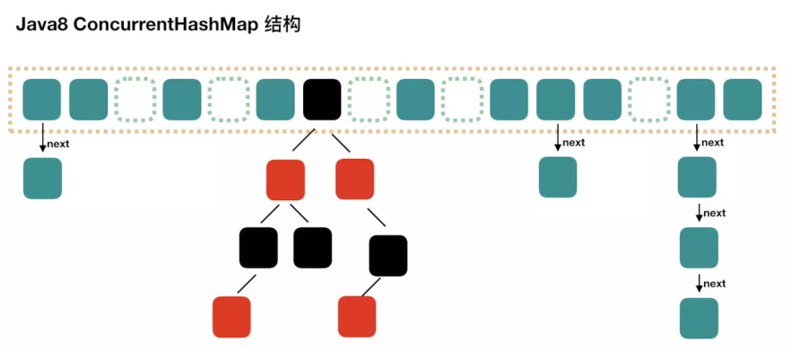

[java_collection](/Java/java_collection.md)  

ArrayMap 继承于 SimpleArrayMap  

ArrayMap  
ArraySet  
SparseArray  
SparseBooleanArray  
SparseIntArray  
SparseLongArray  
LongSparseArray  

### SimpleArrayMap  
~x = -x-1  
~0: 0 的反码 = -1;  
~1: 1 的反码 = -2;  
~2: 3 的反码 = -3;  
~100: 100 的反码 = -101;  

SimpleArrayMap 持有 int mHashes[];  
size: mHashes 数组存放了多少个有效数据, 也就是 mArray 数组存放了多少个 key-value, 一个key-value, 存储在 mArray 数组的相邻的位置, 先存 key, 后存 value;  

SimpleArrayMap#put(K key, V value)  
1.. 计算 key.hashCode  
2.. 在 全局的 hash 数组里面, 二分法查找 当前 key.hasCode 对应的 index,  
  如果没有找到, 返回 length 的反码;  
  如果可以找到, 也就是说, hashCode相等, 
      再判断 equals 是否相等;
      如果 equals 是相等的, 那么认为是同一个对象, 做 value 的替换即可;  
      如果 equals 是不相等的, 那么从当前的 mHashes 数组中遍历, 如果之前有 hashCode 重复, 那么要判断这些出现重复的数据的 index, 并在 mArray 数组中, 取出来 key 值, 再判断 equals 是否一致;  
          如果, hashCode 一致, 但是 所有的 equals 都不一致, 那么认为, 有新的 hash 冲突;    
3.. 解决 hashCode 冲突, 是在当前 mHashes 数组 和 mArray 数组的末尾处, 存储 hash 值, 和 key-value;  

当数组元素达到容量限制时, 会倍增扩容, 用 System.arraycopy 拷贝老数组元素;  
当数据量较小的情况下, 事实上安卓平台下, 数据量与后端相比较而言, 数据量显得微不足道, 使用SimpleArrayMap相对来说, 是比较节约内存空间的; 

整体时间复杂度是 O(log n), 在查找 hash 冲突时, 需要遍历所有的 key.equals 方法, 时间复杂度是 O(n);  
HashMap 在这方面做的就比较好, 有hash 冲突时, 只需要遍历当前节点上的链表即可, 不需要判断所有的元素;  
 

### ArrayMap vs HashMap vs SparseArray  
为什么 HashMap 更占内存, ArrayMap 更节省内存?  
ArrayMap 用一个 Object 数组, 存储 key 和 value, 用 int 数组, 存储 key.hash 值;  
HashMap 维护了, Node 数组,  每个 Node 包括 key-value-hash, Node 指针;  
还维护了 Set<Entry<K, V>> entrySet, 用来迭代所有节点;  
还维护了 TreeNode, 用来存储树的节点;  
ArrayMap 存储的是 key-value 的原始数据, HashMap 存储的是 key-value 的包装数据- Node 节点;  
  
正如上面图示, hash 数组很有可能出现, 数组元素并未存满, 形成稀疏数组, 导致浪费内存;  
所以 ArrayMap 更节省内存;  

在扩容的时候, ArrayMap 存在数组的迁移, 使用 System.arraycopy 拷贝老数组元素;  
HashMap 扩容, 需要遍历所有的节点, 并判断要不要更换 index;  

在数据量较小的安卓平台下, 安卓的集合框架, 更节省内存, 时间复杂度是log2n, 性能表现不俗;  
如果是数据量较大, 例如超过1K, 还是用HashMap做, 更加合理一些;  
同样也不是线程安全的;  

SparseArray 用 int 数组, 存储 hash 数组, 用 Object 数组, 存放 value, 不需要解决 hash 冲突,  效率更高;  
同样 hash 到 index 的换算方式, 是和 ArrayMap 是一样的;  
所以, SparseArray 效率一定比 ArrayMap 高, 更节省内存, 但是 key 只能是 int 类型;  

### 参考  
http://gityuan.com/2019/01/13/arraymap  
https://www.jianshu.com/p/7b9a1b386265  

