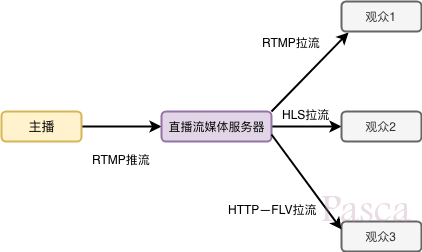

1.. 视频组成:  
内容元素:  图像, 音频, 元信息;  
编码格式:  
    视频编码: H.264, H.265, MPEG4;  
    音频编码: AAC, HE-ACC;  
容器封装:  mp4, mov, flv, av;  

一段视频, 如果经过编码压缩后, 可以大幅度的缩小体积, 而各种不同的压缩算法对应不同的编码格式;  
如今主流的音视频编码格式就是H.264+AAC, 也是各大平台兼容性最好的编码格式方案;  
传输时也是被压缩算法处理的视频,  所以在播放端也需要一个解码的过程;  
因此, 在编码和解码之间, 显然需要一个编码器和解码器都可以理解的约定;  
就图像而言, 生产端的编码器将多张图像进行编码后生成一段端的GOP(Group of pictures),  播放端的解码器则是读取一段段的GOP解码后读取画面再渲染显示;  

2.. 视频直播的准确定义  
直播就是将每帧数据(Video/Audio/Data Frame), 打上时序标签后进行流式传输的过程;  
发送端源源不断的采集音视频数据, 经过编码, 封包, 推流, 再经过CDN进行扩散传播;  
播放端则源源不断的下载数据并按时序进行解码播放;  
这样就完成了边生产, 边传输, 边播放的直播过程了;  
简而言之, 视频直播技术, 就是将视频内容的最小颗粒(I/P/B帧), 基于时序标签, 以流式传输的一种技术;  

3.. 直播业务逻辑  
直播也分为两种, 一种就是直播服务, 一种叫互动直播;  
所以互动直播的延时会比直播更低, 甚至达到了毫秒级(100ms);  
  
推流: 指的是把采集阶段封装好的内容传输到服务器的过程;  
拉流: 即将服务器封装好的内容拉取到播放端解码播放的过程;  
  

数据采集 ⤑ 数据预处理 ⤑ 数据编码 ⤑ 数据传输(流媒体服务器) ⤑ 解码数据 ⤑ 直播播放;  
4.. 具体的流程  
A. 数据采集(主播端)  

### 参考  
search key  直播技术实现原理  
https://blog.csdn.net/qinglianchen0851/article/details/84849459  
https://blog.csdn.net/ou775968876/article/details/76146287  
https://blog.csdn.net/zhiboshequ/article/details/54406264  
https://blog.csdn.net/tencent_bugly/article/details/52981166  
https://www.jianshu.com/p/8a8e9d120985  

