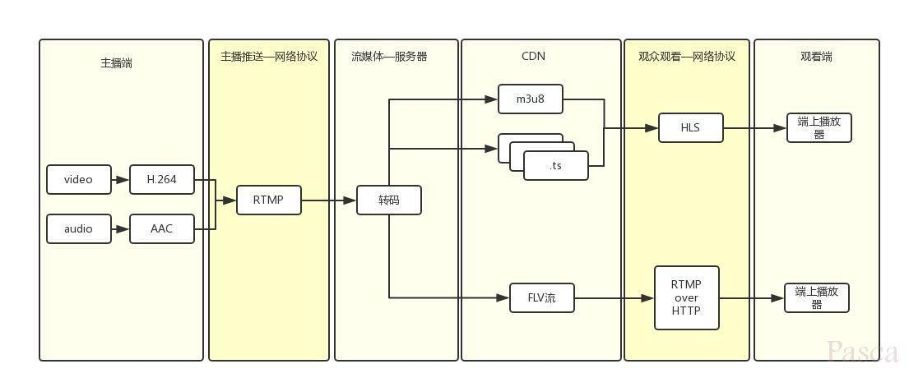

1.. 视频组成:  
内容元素:  图像, 音频, 元信息;  
编码格式:  
    视频编码: H.264, H.265, MPEG4;  
    音频编码: AAC, HE-ACC;  
容器封装:  mp4, mov, flv, av;  

一段视频, 如果经过编码压缩后, 可以大幅度的缩小体积, 而各种不同的压缩算法对应不同的编码格式;  
如今主流的音视频编码格式就是H.264+AAC, 也是各大平台兼容性最好的编码格式方案;  
传输时也是被压缩算法处理的视频,  所以在播放端也需要一个解码的过程;  
因此, 在编码和解码之间, 显然需要一个编码器和解码器都可以理解的约定;  
就图像而言, 生产端的编码器将多张图像进行编码后生成一段端的GOP(Group of pictures),  播放端的解码器则是读取一段段的GOP解码后读取画面再渲染显示;  

2.. 视频直播的准确定义  
直播就是将每帧数据(Video/Audio/Data Frame), 打上时序标签后进行流式传输的过程;  
发送端源源不断的采集音视频数据, 经过编码, 封包, 推流, 再经过CDN进行扩散传播;  
播放端则源源不断的下载数据并按时序进行解码播放;  
这样就完成了边生产, 边传输, 边播放的直播过程了;  
简而言之, 视频直播技术, 就是将视频内容的最小颗粒(I/P/B帧), 基于时序标签, 以流式传输的一种技术;  

3.. 直播业务逻辑  
直播也分为两种, 一种就是直播服务, 一种叫互动直播;  
所以互动直播的延时会比直播更低, 甚至达到了毫秒级(100ms);  
  
推流: 指的是把采集阶段封装好的内容传输到服务器的过程;  
拉流: 即将服务器封装好的内容拉取到播放端解码播放的过程;  
  

数据采集 ⤑ 数据预处理 ⤑ 数据编码 ⤑ 数据传输(流媒体服务器) ⤑ 解码数据 ⤑ 直播播放;  
4.. 具体的流程  
A. 数据采集(主播端)  

### 文件格式  
❀ 文件格式
我们知道操作系统中的文件名都有后缀, 即扩展名, 例如 1.doc, 2.jpg, 3.avi 等;  
设置扩展名的目的, 是让系统中的应用程序, 来识别并关联这些文件, 让相应的文件由相应的应用程序打开;  
常见的文件格式如 1.avi, 2.mpg, 3.mp4 这些都叫做视频的文件格式, 可由电脑上安装的视频播放器关联和打开(播放);  

❀ 封装格式  
封装格式(Format), 也称多媒体容器(Multimedia Container), 是将已编码压缩好的视频轨道, 音频轨道和元数据(视频基本信息如标题, 字幕等)按照一定的格式规范,  
打包放到一个文件中, 形成特定文件格式的视频文件;  
封装格式主要分为两大类: 面向存储的和面向流媒体的;  
面向存储的, 常见的有 AVI, ASF(WMA/WMV), MP4, MKV, RMVB(RM/RA)等;  
面向流媒体的, 常见的有 FLV, TS(需要配合流媒体网络传输协议, 如 HLS, RTMP 等), MP4 也支持流媒体方式(配合HTTP等);  

MP4: 经典的视频封装格式, 移动端(iOS/Android), PC Web 多终端都能良好支持, 但 MP4 视频文件头太大, 结构复杂;   
    如果视频较长(如数小时), 则其文件头会过大, 影响视频加载速度, 故更适合短视频场景;  
HLS(HTTP Live Streaming): 苹果公司推出的基于 HTTP 的流媒体网络传输协议, 视频的默认封装格式是 TS, 除了多个 TS 分片文件, 还定义了用来控制播放的m3u8索引文件(文本文件),   
    可以规避普通 MP4 长时间缓冲头部数据的问题, 比较适合点播场景, 移动端(iOS/Android)支持较好, 但 PC 端 IE 存在兼容性问题依赖播放器的二次开发(建议使用阿里云Web播放器);  
FLV: Adobe 公司推出的标准, 在 PC 端有 Flash 的强力支持, 但在移动终端只有 APP 实现播放器才能支持(建议使用阿里云播放器), 大部分手机端浏览器均不支持, 特别是苹果的移动设备都不支持;  
DASH(Dynamic Adaptive Streaming over HTTP): 使用 fragmented MP4(fMP4)格式, 将 MP4 视频分割为多个分片, 每个分片可以存在不同的编码形式(如分辨率, 码率等),   
    播放器端可自由选择需要播放的视频分片, 实现自适应多码率, 不同画质内容的无缝切换, 提供更好的播放体验, 其中MPD文件类似HLS的m3u8文件,   
    国外视频网站如 YouTube, Netflix 等较多使用 DASH;  
HLS+fMP4(HTTP Live Streaming with fragmented MP4): 此处单列, 但本质上还是HLS协议, 苹果公司于 WWDC 2016宣布新的 HLS 标准支持文件封装格式为 fragmented MP4,   
    使用方法与 TS 分片类似, 意味着一次转码可同时打包成 DASH 和 HLS;  

❀ 编码方式  
视频编码方式(Codec)是指能够对数字视频进行压缩或解压缩(视频解码)的程序, 通常这种压缩属于有损数据压缩, 将某个视频格式转换成另一种视频格式;  
1.. H.26X系列:  
H.261: 主要在老的视频会议和视频电话产品中使用;   
H.263: 主要用在视频会议, 视频电话和网络视频上;   
H.264: H.264/MPEG-4 第十部分, 或称 AVC(Advanced Video Coding, 高级视频编码), 是一种视频压缩标准, 一种被广泛使用的高精度视频的录制, 压缩和发布格式;   
H.265: 高效率视频编码(High Efficiency Video Coding, 简称HEVC)是一种视频压缩标准, H.264/MPEG-4 AVC的继任者;  
    HEVC不仅提升图像质量, 同时也能达到 H.264/MPEG-4 AVC 两倍的压缩率(等同于同样画面质量下码率减少50%),  
    可支持4K分辨率甚至超高画质电视, 最高分辨率可达8192×4320(8K分辨率), 这是目前发展的趋势; 

2.. MPEG系列:  
由 ISO(国际标准组织机构)下属的 MPEG(运动图象专家组)主导;  
MPEG-1 第二部分: 主要使用在 VCD 上, 有些在线视频也使用这种格式, 该编解码器的质量大致上和原有的VHS录像带相当;  
MPEG-2 第二部分: 等同于H.262, 使用在DVD, SVCD和大多数数字视频广播系统和有线分布系统(Cable Distribution Systems)中;  
MPEG-4 第二部分: 可以使用在网络传输, 广播和媒体存储上, 比起 MPEG-2 和第一版的 H.263, 它的压缩性能有所提高;  
MPEG-4 第十部分: 技术上和 ITU-TH.264 是相同的标准, 二者合作, 诞生了 H.264/AVC 标准, ITU-T 将其命名为 H.264, 而 ISO/IEC 称它为 MPEG-4 高级视频编码(Advanced Video Coding, AVC);  

3.. AVS:  
Audio Video coding Standard, 我国自主知识产权的信源编码标准, 是"信息技术 先进音视频编码"系列标准的简称, 目前已完成两代AVS标准的制定; 
第一代 AVS 标准包括国家标准 AVS+的压缩效率与国际同类标准H.264/AVC最高档次(High Profile)相当; 
第二代 AVS 标准, 简称 AVS2, 首要应用目标是超高清晰度视频, 支持超高分辨率(4K以上), 高动态范围视频的高效压缩;  
    AVS2的压缩效率比上一代标准AVS+和H.264/AVC提高了一倍, 超过国际同类型标准HEVC/H.265; 

❀ 转码  
视频转码(Video Transcoding)是指将已经压缩编码的视频码流, 转换成另一个视频码流, 以适应不同的网络带宽, 不同的终端处理能力和不同的用户需求;  
转码本质上是一个先解码, 再编码的过程, 因此转换前后的码流可能遵循相同的视频编码标准, 也可能不遵循相同的视频编码标准;  

❀ 转封装  
转封装指的是将视频或音频的封装格式进行转换, 如将 AVI 的视频转换为 MP4, 其间并不会进行音视频的编码和解码工作,  
而是直接将视频和音频压缩码流从, 一种封装格式文件中获取出来, 然后打包成另一种封装格式的文件, 相比转码, 转封装有两大特点:  
处理速度极快, 音视频编解码过程十分复杂, 占据了转码的绝大部分时间, 转封装不需要进行编码和解码, 节约了大量的处理时间;  
音视频质量无损, 没有解码(解压缩)和编码(压缩)过程, 所以不会有音视频的压缩损伤;  
转封装后的文件与原始文件的分辨率, 码率等几乎一致, 故播放时也称其为原画;  

### 参考  
search key  直播技术实现原理  
https://blog.csdn.net/qinglianchen0851/article/details/84849459  
https://blog.csdn.net/ou775968876/article/details/76146287  
https://blog.csdn.net/zhiboshequ/article/details/54406264  
https://blog.csdn.net/tencent_bugly/article/details/52981166  
https://www.jianshu.com/p/8a8e9d120985  

转码-编码-码率-码流-分辨率-帧率  
https://help.aliyun.com/document_detail/99380.html  

OBS  
Open Broadcaster Software  是一个免费的开源的视频录制和视频实时流软件, 有多种功能并广泛使用在视频采集, 直播等领域;  

VOD  
Video on Demand  点播  

