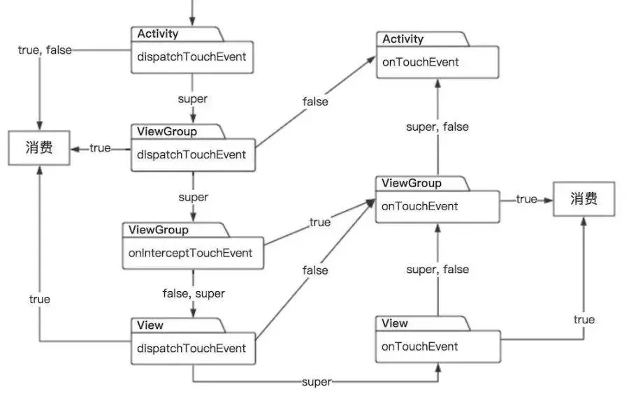

### Android 事件分发机制  
返回 true|false 的意思是, 没有调用 super, 没有做任何处理, 直接返回了 true|false;  
返回默认的意思是, 调用了 super, 并且返回了这个默认值;  

❀ dispatchTouchEvent 的事件分发逻辑如下:  
Activity.dispatchTouchEvent 返回 true|false, 事件只在 Activity.dispatchTouchEvent 进行处理;  
Activity.dispatchTouchEvent 返回 super.dispatchTouchEvent(ev); 默认值是 true, 事件向下分发;  

View|ViewGroup.dispatchTouchEvent 返回 true, 事件在当前 View|ViewGroup.dispatchTouchEvent 方法进行消费-处理, 那么事件会停止分发;  
View|ViewGroup.dispatchTouchEvent 返回 false, 事件又传递给上一层的 onTouchEvent 进行处理, 它的上一层可能是 ViewGroup 或者 Activity;  

View.dispatchTouchEvent 返回 super.dispatchTouchEvent(ev); 默认值是 true, 事件会传递给当前 View.onTouchEvent 进行消费-处理;  
ViewGroup.dispatchTouchEvent 返回 super.dispatchTouchEvent(ev); 默认值是 true, 事件会传递给当前 ViewGroup.onInterceptTouchEvent 进行处理;  

❀ onInterceptTouchEvent 的事件拦截逻辑如下:  
如果 onInterceptTouchEvent 返回 true, 那么事件会被拦截, 交给当前 ViewGroup.onTouchEvent 进行消费-处理;  
如果 onInterceptTouchEvent 返回 false, 那么事件不会被拦截, 继续传递给子 View, 再由子 View.dispatchTouchEvent 来分发这个事件;  
如果 onInterceptTouchEvent 返回 super.onInterceptTouchEvent(ev), 默认值是 false, 事件不会被拦截, 处理方式同返回 false 一样;  

❀ onTouchEvent 的事件响应逻辑如下:  
View|ViewGroup.onTouchEvent 返回了 true, 则会接收并消费-处理该事件, 后续仍然会继续收到事件;  

View|ViewGroup.onTouchEvent 返回了 false, 那么事件又传递给上一层的 onTouchEvent 来接收;  
如果传递到上一层的 onTouchEvent 也返回 false, 那么事件会继续向上传递, 一直到 Activity.onTouchEvent 中;  
如果有一个 ViewGroup|Activity.onTouchEvent 消费-处理了这个事件, 那么后续的事件都会在这个 ViewGroup|Activity.onTouchEvent 中消费-处理;  
其他的 View 都不会再收到事件;  

如果 Activity 的所有子 View 都不接收事件的时候, 也就是所有的子 View, 都不处理事件;  
无论 Activity.onTouchEvent 无论返回 true|false|super.onTouchEvent, 那么当前 Activity 永远都会继续收到事件, 也就是说, 事件不会没人管;  

如果返回 super.onTouchEvent(ev);  
Activity.super.onTouchEvent(ev); 默认值是 false;  
ViewGroup.super.onTouchEvent(ev); 默认值是 false;  
View.super.onTouchEvent(ev); 默认值是 true;  

  
