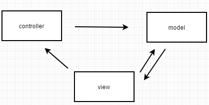
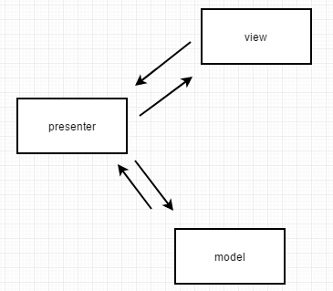
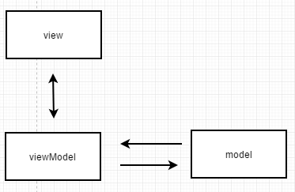

### mvc-mvp-mvvm  
❀ MVC 架构模式  
  
model 层, 包含数据模型, 与数据库操作, 网络请求, 持久层, 内存缓存等;  
controller 是对业务逻辑的处理, 比方说协同几个任务或者几个接口来处理一些逻辑;  
view 持有 controller 的引用,  
view 持有 model 的引用;  
controller 持有 model 的引用;  
一个 controller 对应多个 view;  
model 变更之后, 利用观察者模式, 直接通知 view, 不需要通过 controller 转发;  
view 的点击事件, 可以传递给另一个 view, 或者引起自身的变化;  
view 的点击事件, 也可以调用 controller 做出相应的改变, 比如一些列的逻辑操作, 例如存储操作等;  
view 的点击事件, 也可以直接操作某个数据类, 让其发生变化;  
controller 进行一些列的处理, 会更新数据类, 也可以把结果回调给 view, 让view 做出一些表现;  
❀ MVP 架构模式  
  
model 层, 包含数据模型, 与数据库操作, 网络请求, 持久层, 内存缓存等;  
一个 presenter 对应一个 view;  
presenter 并不是直接控制 view 的, 而是控制 view interface, 与其进行交互, view 实现 view interface, 降低耦合度, 方便单测;  
model 的变更会首先通知 presenter, presenter 会对 view 进行一系列的操作;  
presenter 接收 view 的事件, 做出相应的改变, 例如更新数据;  

❀ MVVM 架构模式  
  
model 是包含 view 的属性和对应操作, 的数据模型;  
view 的变化会直接影响 viewModel, viewModel 的变化或者内容也会直接体现在 view 上;  

### 插件化  
https://github.com/goeasyway/EasyPlug  
https://github.com/DroidPluginTeam/DroidPlugin  
https://github.com/CtripMobile/DynamicAPK  
https://github.com/jasonross/Nuwa  
https://github.com/limpoxe/Android-Plugin-Framework  
https://github.com/kaedea/android-dynamical-loading/tree/develop/android-frontia  
https://www.ibm.com/developerworks/cn/java/j-lo-classloader/  
https://github.com/singwhatiwanna/dynamic-load-apk    
https://github.com/tiann/understand-plugin-framework    
https://github.com/ljqloveyou123/LiujiaqiAndroid  
https://github.com/ManbangGroup/Phantom  

### 热修复  

http://w4lle.com/2017/05/04/hotpatch-summary/  
Tinker  
https://github.com/Tencent/tinker  
http://www.tinkerpatch.com/Docs/intro  
http://www.jianshu.com/p/3bd2cf801e4c  

RocooFix  
https://github.com/dodola/RocooFix  

Robust  
https://github.com/Meituan-Dianping/Robust  
https://tech.meituan.com/2016/09/14/android-robust.html  
https://tech.meituan.com/2017/03/17/android-autopatch.html  
http://w4lle.com/2017/03/31/robust-0/  
http://w4lle.com/2018/05/28/robust-1/  

AndFix  
http://w4lle.com/2016/03/03/Android热补丁之AndFix原理解析/  

### 架构与组件化 (Architecture and Components)  
https://www.jianshu.com/p/f17f5d981de7  
https://github.com/CameloeAnthony/AndroidArchitectureCollection  
https://8thlight.com/blog/uncle-bob/2012/08/13/the-clean-architecture.html  
http://www.jianshu.com/p/3edcf85539a6  
https://github.com/chrisbanes/tivi  
https://github.com/bufferapp/clean-architecture-components-boilerplate  
https://github.com/googlesamples/android-architecture-components  
https://github.com/googlesamples/android-architecture  
https://github.com/iqiyi/Andromeda  
https://github.com/oldergod/android-architecture  
https://github.com/HelloChenJinJun/NewFastFrame  
https://github.com/xiaojinzi123/Component  
https://github.com/Tinder/StateMachine  

非黑即白  
https://listenzz.github.io/android-architecture-part-1-every-new-beginning-is-hard  
https://listenzz.github.io/android-architecture-part-2-clean-architecture.html  
https://listenzz.github.io/android-architecture-part-3-applying-clean-architecture-android.html  
https://listenzz.github.io/android-architecture-part-4-applying-clean-architecture-on-android-hands-on.html  
https://listenzz.github.io/android-lifecyle-works-perfectly-with-rxjava.html    

下面的, 是没看的  
https://github.com/KunMinX/VIABUS-Architecture  
https://www.jianshu.com/p/c1ee77f8237f  
https://github.com/yangchong211/LifeHelper  
https://github.com/CameloeAnthony/AndroidArchitectureCollection  
https://github.com/Juude/Awesome-Android-Architecture    
https://github.com/luckybilly/CC    
https://github.com/fashare2015/MVVM-JueJin  
https://github.com/LyndonChin/MasteringAndroidDataBinding  
https://github.com/iammert/AndroidArchitecture  
https://github.com/wheat7/Cashew  
https://developer.android.com/topic/libraries/architecture/index.html  
https://github.com/android10/Android-CleanArchitecture  
https://github.com/android10/Android-CleanArchitecture-Kotlin    
https://github.com/goldze/MVVMHabit  
https://juejin.im/post/59e36b216fb9a0452724a0ed  
https://github.com/G-Joker/WeaponApp  
https://github.com/googlesamples/android-architecture-components  
https://github.com/MindorksOpenSource/android-mvvm-architecture  
https://juejin.im/post/5be7bbd9f265da61797458cf  
https://github.com/googlesamples/android-architecture  
https://github.com/Juude/Awesome-Android-Architecture  
https://github.com/Geekince/Awesome-Architecture  
https://github.com/limedroid/XDroidMvp  
https://github.com/north2016/T-MVP  
https://github.com/luckybilly/AndroidComponentizeLibs  
https://github.com/mqzhangw/JIMU  
https://github.com/airbnb/MvRx  
https://github.com/CameloeAnthony/AndroidArchitectureCollection  
https://github.com/ivacf/archi  
https://github.com/KunMinX/android-viabus-architecture  
https://github.com/freeletics/RxRedux  

然并卵  
https://github.com/xiaobailong24/MVVMArms  

组件化  
竹格子  
https://www.jianshu.com/p/1b1d77f58e84  
https://www.jianshu.com/p/59822a7b2fad  
https://www.jianshu.com/p/c7459b59dcd5  
https://www.jianshu.com/p/03c498e05a46  
https://www.jianshu.com/p/aa17cf4b2dca  

张华洋    
https://blog.csdn.net/guiying712/article/details/55213884  
https://blog.csdn.net/guiying712/article/details/78057120  

https://github.com/BrillantZhao/AndroidMouldProject2  
https://github.com/guiying712/AndroidModulePattern  
https://github.com/liweijieok/ModularSample  
https://github.com/LiushuiXiaoxia/AndroidModular  
https://www.jianshu.com/p/0ea37b2c7ce7  
https://www.jianshu.com/p/b475affa092f  
https://juejin.im/post/5a1cc83551882503eb4b0334  
https://mp.weixin.qq.com/s/j--FGxUuSEmw6E3Ogxe6ag  
https://github.com/Meituan-Dianping/Shield  
https://juejin.im/post/5a2b95b96fb9a045284669a9  
https://github.com/HelloChenJinJun/NewFastFrame  
https://www.jianshu.com/p/d372cc6802e5  
https://github.com/luckybilly/CC  

http://blog.csdn.net/hongchengling2/article/details/73682690  

其他  
https://github.com/PrototypeZ/SaveState  
https://github.com/yifei8/ABridge/issues  
https://github.com/dmdevgo/RxPM  

不好   
https://github.com/ittianyu/relight  
https://github.com/Arello-Mobile/Moxy  

