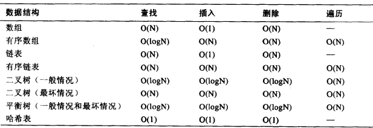
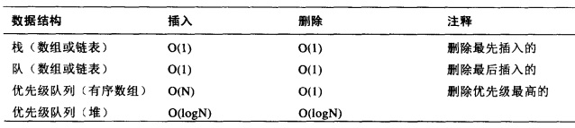
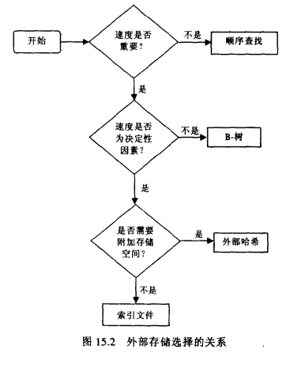

### 数据结构基本概念
数据 (data),   
数据元素 (data element),   
关键字 (key),   
主关键字(primary key),   
数据结构 (data structure),   

基本概念  
数据结构是指, 存在一种或多种特定关系的数据元素的集合, 是指数据元素之间存在的关系, 包括如下几个概念:   

1.. 数据的逻辑结构
线性结构: 数据元素只有一个前驱数据元素和一个后继数据元素;  
树结构: 每个数据元素只有一个前驱数据元素, 可有零个或若干个后继数据元素;  
图结构: 每个数据元素可有零个或若干个前驱数据元素, 零个或若干个后继数据元素;  

2.. 数据的存储结构  
顺序存储结构  
顺序存储就是把数据存储在一块连续的存储介质上, 数组就是典型的顺序存储;  

非顺序存储结构  
非顺序存储就是各个数据不一定存在一个连续的存储介质上, 链表就是典型的非顺序存储;  

数据操作  
初始化;  
判断是否空状态;  
统计数据元素个数;  
遍历(traverse), 指按照某种次序访问一个数据结构中的所有元素, 每个数据元素只能被访问一次, 得到一个包含所有数据元素的线性序列;  
插入(insert), 指定元素;  
删除(remove), 指定元素;  
查找(search), 指在数据结构中寻找满足给定条件的数据元素;  
排序(sort), 指对数据元素按照指定关键字值的大小递增(或递减)次序重新排列;  

### 数据结构横向比较  
有序数组
查找, 更新最快;  
插入和删除慢, 比如插入数组时候需要移动其后面的值, 效率低;  
大小受限, 固定;  

链表   
查找, 更新较慢;  
插入和删除最快;  
大小不受限;  

二叉树  

平衡树  

二叉搜索树   

最优二叉树

AVL树  

红黑树  

  

  

  

