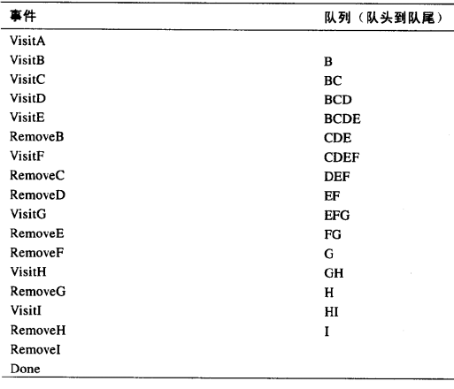

###### 广度优先搜索  

规则1  
访问一个未知顶点，这个顶点必须和当前顶点是邻接的，标记它并插入队列中；  

规则2  
如果不能执行规则1，那么队首顶点出队，当作当前顶点，继续执行规则1；

规则3    
队列为空，不能执行规则2，则搜索结束；  

  
    
从顶点A访问所有顶点的整个过程，依次顺序是 ABCDEFGHI  

广度优先就像，水波或者声波，逐层向外扩散；  

