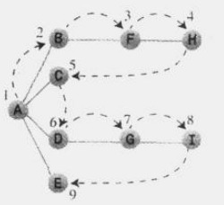
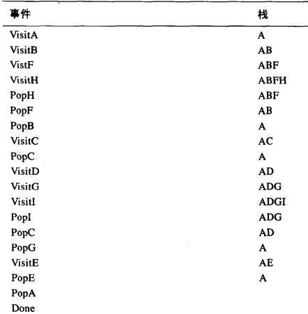

###### 深度优先搜索  

规则1  
访问一个相邻的、未访问的顶点，标记它、放在栈中；  

规则2  
如果不能执行规则1，且栈不为空，就从栈顶弹出一个顶点；  

规则3  
如果不能执行 规则1  和 规则2，就完成了整个搜索；  

  
    
从顶点A访问所有顶点的整个过程，依次顺序是 ABFHCDGIE  

深度优先搜索算法 要沿着一条路径 到达最远的顶点，直至不能继续前进，然后返回，继续下一路径，直至算法结束；  

