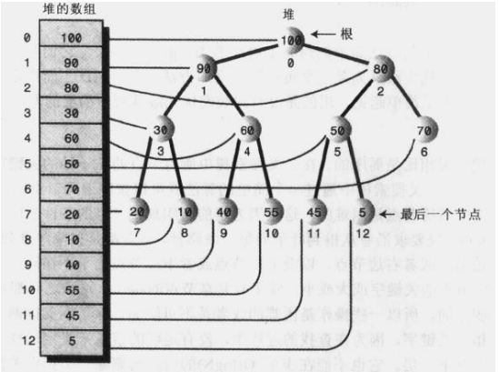
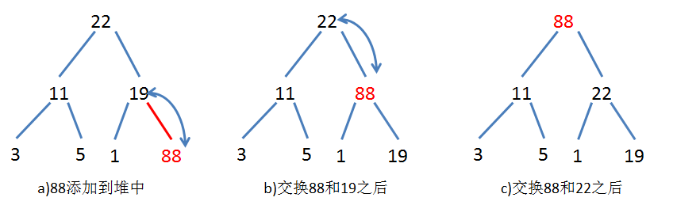

###### 堆结构
堆，也叫优先队列，是一棵完全二叉树；  
最大堆是一棵每一个节点的值都不小于其孩子的值 的树（大的在上面）。  
最小堆是一棵每一个节点的值都不大于其孩子的值 的树（小的在上面）。  

因为Java的优先队列（PriorityQueue）是最小堆，下面所有描述，都是基于最小堆；  
每次insert的时候，都会做堆排序，使得其满足最小堆的属性；  
每次remove的时候，都会做堆排序，使得其满足最小堆的属性；    
每次取出来的元素，永远都是 priorityValue 是最小的，也就是最优先的；  

> 数组下标的关系

leftChildIndex = parentIndex * 2 +1;
rightChildIndex = parentIndex * 2 +2;
parentIndex = (currIndex - 1) / 2;

> 最小堆的特点

1. 是完全二叉树，除了最后一层节点，不需要是满的，其他层左右节点都是满的；  
2. 基于数组实现（根据 数组下标的关系 可知，基于链表是非常复杂的）；  
3. 堆中每个节点的值，都小于左右子节点的值；    

> 最小堆插入  

1. 将新元素增加到数组的末尾；
2. 堆需要自下而上调整；  
3. 新元素与其父节点比较，如果新元素小于父节点则将两者交换位置；  
4. 不断进行第上述俩步操作，直到不需要交换新元素和父节点，或者达到堆顶；  

> 最小堆删除  

1. 堆需要自上往下调整；  
2. 比较左右子节点，将小的元素上调；  
3. 不断进行上述步骤，直到不需要调整或者调整到堆底；  

> 参考  

- http://blog.csdn.net/chenhanzhun/article/details/21086973