###### 红黑树的 插入示例

> 当前节点【N  50】

  
满足【旋转法则：（1）】

> 当前节点【30】

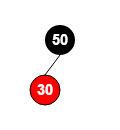  
满足【旋转法则：（2）】

> 当前节点【40】

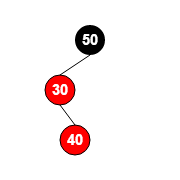  
满足【旋转法则：（4）】  
左旋转  
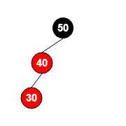  

> 当前节点【30】

老的旋转点，是新节点；  
不在父节点的，是新节点；  

满足【旋转法则：（5）】  

将“父节点”设为“黑色”  
将“祖父节点”设为“红色”  
以“祖父节点”为支点进行右旋转  

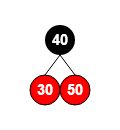  

> 当前节点【60】

满足【旋转法则：（3）】  

将“父节点”设为黑色；  
将“叔叔节点”设为黑色；  
将“祖父节点”设为“红色；  
将“祖父节点”设为“当前节点”(红色节点)；即，之后继续对“当前节点”进行操作；  

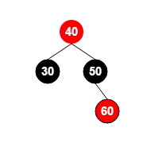  

> 当前节点【40】

满足【旋转法则：（1）】  

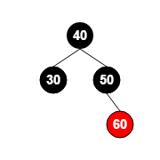    

> 当前节点【70】

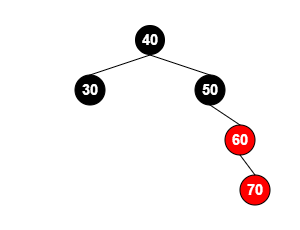  

满足【旋转法则：（4）】  
左旋转  
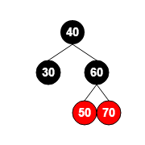  

> 当前节点【80】

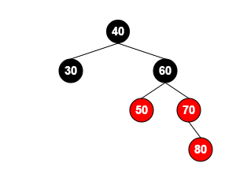  

满足【旋转法则：（3）】  

将“父节点”设为黑色；  
将“叔叔节点”设为黑色；  
将“祖父节点”设为“红色；  
将“祖父节点”设为“当前节点”(红色节点)；即，之后继续对“当前节点”进行操作；  

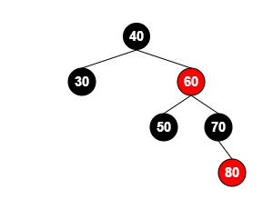  

> 当前节点【60】  

满足【旋转法则：（2）】  

> 当前节点【90】    

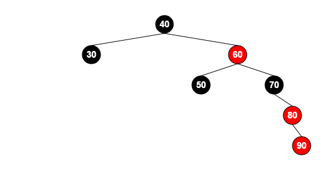    

满足【旋转法则：（4）】  
左旋转，旋转的时候，各个老节点的颜色是不变的；  
【N  80】跑到原来【N  70】的位置，  
【N  80】作为新的父节点，父节点仍是 黑色的，  
【N  70】作为新的子节点，子节点仍是 红色的。
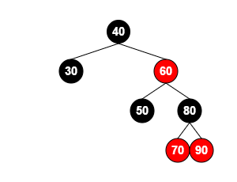    

> 当前节点【100】    

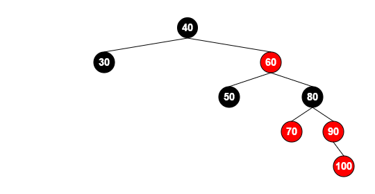    

满足【旋转法则：（3）】  

将“父节点”设为黑色；  
将“叔叔节点”设为黑色；  
将“祖父节点”设为“红色；  
将“祖父节点”设为“当前节点”(红色节点)；即，之后继续对“当前节点”进行操作；  

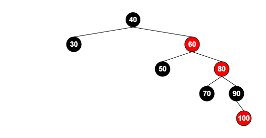    

> 当前节点【80】    

      

满足【旋转法则：（4）】  
左旋转，旋转的时候，各个老节点的颜色是不变的；  
【N  60】跑到原来【N  40】的位置，  
【N  60】作为新的父节点，父节点仍是 黑色的，  
【N  40】作为新的子节点，子节点仍是 红色的。
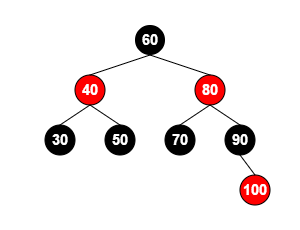    

