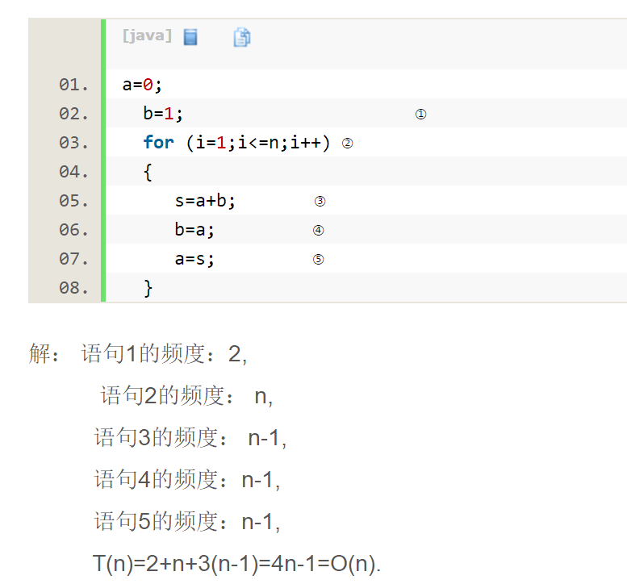
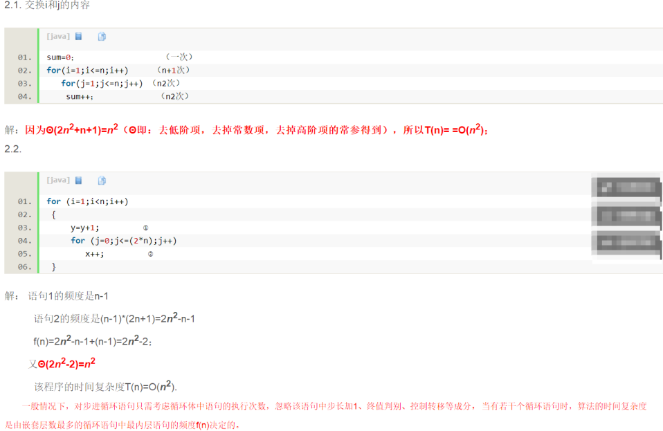
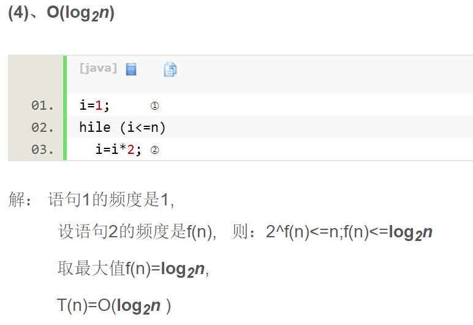

算法定义  
是一个有穷规则的集合，其规则确定一个解决某一特定类型问题的操作序列。

特点  
有穷性  
确定性  
输入  
输出  
可行性  

算法设计目标  
正确性  
可读性  
健壮性  
高时间效率  
高空间效率  

### 求时间复杂度  
如果算法的执行时间不随着问题规模n的增加而增长，即使算法中有上千条语句，其执行时间也不过是一个较大的常数。此类算法的时间复杂度是O(1)。  

❀ O(1)  
```
long result = 1;
result += 100;
result -= 24;
result *= 24;
result /= 24;
LogTrack.w(result);
```
无论执行多少次，都是对result的基本运算处理，和数据源大小没什么关系  

❀ O(n)  
```
for (i=1; i<=n; i++)  
       x++;  
```
时间复杂度就是 O(n)  
推导步骤  
   

❀ O(n^2)  
```
for (i=1; i<=n; i++)  
       x++;  
for (i=1; i<=n; i++)  
    　for (j=1; j<=n; j++)  
          x++;  
```

因为 第一个的复杂度是 O(n)， 第二个的复杂度是 O(n^2)；  
整体的复杂度就是 为Ο(n+n^2)  =  O(n^2)；  
推导步骤  
  

❀ O(n^3)  
```
int n = 30;
for (int i = 0; i < n; i++) {
    for (int j = 0; j < n; j++) {
        for (int k = 0; k < n; k++) {
            
        }
    }
}
```
当i=m, j=k的时候,内层循环的次数为k当i=m时, j 可以取 0,1,...,m-1 , 所以这里最内循环共进行了0+1+...+m-1=(m-1)m/2次所以,i从0取到n,   
则循环共进行了: 0+(1-1)*1/2+...+(n-1)n/2=n(n+1)(n-1)/6所以时间复杂度为O(n3).  


❀ O(log2n)  
```
int i = 1;
int n = 1024;
while (i < n) {
    i = i * 2;
}
```
推导步骤   
  

### 参考  
http://www.cppblog.com/85940806/archive/2011/03/12/141672.html  


