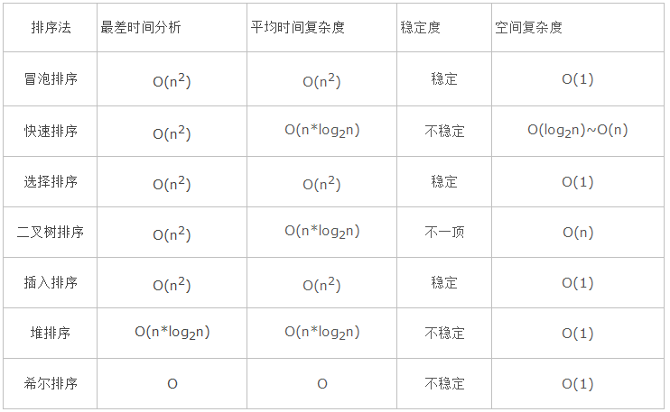

### 冒泡排序  
生成递增数组;  
```
private static void bubbleSort(int array[]) {
    if (array == null || array.length <= 1) {
        return;
    }
    for (int i = 0; i < array.length - 1; i++) {
        for (int j = 0; j < array.length - i - 1; j++) {
            if (array[j] > array[j + 1]) {
                int temp = array[j];
                array[j] = array[j + 1];
                array[j + 1] = temp;
            }
        }
    }
}
```
### 简单选择排序  
生成递增数组;  
```
private static void selectionSort(int[] array) {
    if (array == null || array.length <= 1) {
        return;
    }
    for (int i = 0; i < array.length - 1; i++) {
        int k = i;
        for (int j = i + 1; j < array.length; j++) {
            if (array[k] > array[j]) {
                k = j;
            }
        }
        if (k != i) {
            int temp = array[k];
            array[k] = array[i];
            array[i] = temp;
        }
    }
}
```
### 快速排序 #递归  
生成递增数组;  
```
public static void sort(int array[]) {
    if (array == null || array.length <= 1) {
        return;
    }
    sort(array, 0, array.length - 1);
}

private static void sort(int[] array, int low, int high) {
    if (array == null || array.length <= 1) {
        return;
    }
    int index = partition(array, low, high);
    if (low < index - 1) {  //  左边还需要快排
        sort(array, low, index - 1);
    }
    if (index + 1 < high) {  //  右边还需要快排
        sort(array, index + 1, high);
    }
}

/**
 * 返回基准的下标
 */
public static int partition(int[] array, int low, int high) {
    int pivot = array[low];  //  选第一个元素作为枢纽元
    while (low < high) {
        while (low < high && array[high] >= pivot) {
            high--;
        }
        array[low] = array[high];  //  从后面开始找到第一个小于 pivot 的元素, 放到 low 位置
        while (low < high && array[low] <= pivot) {
            low++;
        }
        array[high] = array[low];  //  从前面开始找到第一个大于 pivot 的元素, 放到 high 位置
    }
    array[low] = pivot;  //  最后枢纽元放到 low 的位置
    return low;
}
``` 
### 快速排序 #非递归  
生成递增数组;  
```
/**
 * 快速排序#非递归用
 */
public static void sort(int array[]) {
    if (array == null || array.length <= 1) {
        return;
    }
    int stack[] = new int[array.length];
    //  栈中保存下次需要排序的子数组的开始位置和结束位置
    int top = -1;
    stack[++top] = 0;
    stack[++top] = array.length - 1;
    while (top > 0) {
        int high = stack[top--];
        int low = stack[top--];
        int index = partition(array, low, high);
        if (low < index - 1) {  //  左边子数组入栈
            stack[++top] = low;
            stack[++top] = index - 1;
        }
        if (index + 1 < high) {  //  右边子数组入栈
            stack[++top] = index + 1;
            stack[++top] = high;
        }
    }
}


/**
 * 返回基准的下标
 */
public static int partition(int[] array, int low, int high) {
    int pivot = array[low];  //  选第一个元素作为枢纽元
    while (low < high) {
        while (low < high && array[high] >= pivot) {
            high--;
        }
        array[low] = array[high];  //  从后面开始找到第一个小于pivot的元素，放到low位置
        while (low < high && array[low] <= pivot) {
            low++;
        }
        array[high] = array[low];  //  从前面开始找到第一个大于pivot的元素，放到high位置
    }
    array[low] = pivot;  //  最后枢纽元放到low的位置
    return low;
}
``` 
  


### 参考  
http://www.jianshu.com/p/ae97c3ceea8d  

快速排序, 非递归写得好  
https://www.cnblogs.com/TenosDoIt/p/3665038.html  

快速排序, 原理介绍  
https://blog.csdn.net/adusts/article/details/80882649  
