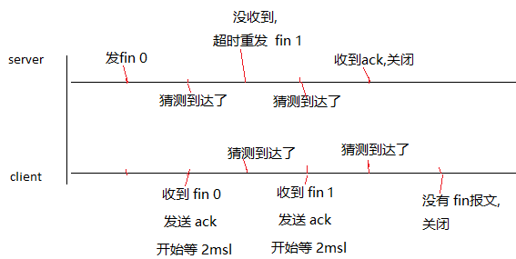
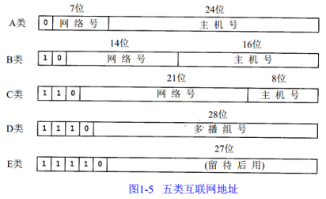

### TCP-IP协议  
[HTTP 与 HTTPS](network/Https.md)  
[URI 与 URL](network/URI.md)  
首先TCP-IP不是一个协议, 而是一个协议族的统称, 是互联网最基本的协议族;  
TCP-IP协议族, 主要分4层, 数据链路层 → 网络层 → 传输层 → 应用层;  

❀ 应用层  Application Layer  
应用层, 负责处理特定的应用程序细节;  
几乎各种不同的 TCP / IP实现, 都会提供下面这些通用的应用程序:  
HTTP 超文本传输协议;    DNS  域名解析系统;   
Telnet 远程登录;    FTP 文件传输协议;    SMTP 简单邮件传送协议;    SNMP 简单网络管理协议;    

❀ 传输层  Transport Layer  
运输层主要为, 两台主机上的应用程序, 提供端到端的通信;  
在 TCP - IP协议族中, 有两个互不相同的传输协议: TCP 和 UDP;  

TCP 为两台主机, 提供高可靠性的数据通信;  
它所做的工作包括, 把应用程序交给它的数据, 分成合适的小块, 交给下面的网络层, 确认接收到的分组, 设置发送, 最后确认分组的超时时间等;  
由于传输层提供了, 可靠的端到端的通信, 因此应用层, 可以忽略所有这些细节;  

UDP 则为应用层提供一种非常简单的服务, 它只是把称作数据报的分组, 从一台主机, 发送到另一台主机, 但并不保证该数据报能到达另一端;  
任何必需的可靠性, 必须由应用层来提供;  
常见协议:  TCP, UDP;  

❀ 网络层  Internet Layer  
网络层, 处理分组在网络中的活动, 例如分组的选路;  
在TCP / IP协议族中, 网络层协议包括 IP协议,  ICMP协议, 以及 IGMP 协议;  
常见协议:  ICMP, IP, IGMP;  

❀ 数据链路层  Data Link Layer  
数据链路层, 通常包括操作系统中的, 设备驱动程序, 和计算机中对应的网络接口卡;  
它们一起处理与电缆, 或其他任何传输媒介的, 物理接口细节;  
常见协议:  ARP, RARP;  

DNS  
位于应用层的协议, 它提供域名到 IP 地址之间的解析服务;  
计算机既可以被赋予 IP 地址, 也可以被赋予主机名和域名;  
比如 www.hackr.jp, 用户通常使用主机名, 或域名来访问对方的计算机,  而不是直接通过IP 地址访问;   
因为与 IP 地址的一组纯数字相比, 用字母配合数字, 的表示形式, 来指定计算机名, 更符合人类的记忆习惯;  
但要让计算机去理解名称,  相对而言就变得困难了, 因为计算机更擅长, 处理一长串数字;   
为了解决上述的问题,  DNS 服务应运而生; DNS 协议提供通过域名查找 IP 地址, 或逆向从 IP 地址反查域名的服务;  

### TCP传输控制协议  
TCP 是面向连接的通信协议, 通过三次握手建立连接, 通讯完成时要拆除连接, 由于 TCP 是面向连接的, 所以只能用于端到端的通讯;  
TCP 位于传输层, 提供可靠的字节流服务;    
所谓的字节流服务(Byte Stream Service), 是指, 为了方便传输, 将大块数据, 分割成, 以报文段(segment)为单位, 的数据包, 进行管理;  
而, 可靠的传输服务是指,  能够把数据, 准确可靠地传给对方, 能够确认数据最终是否送达到对方;  

为了准确无误地, 将数据送达目标处,  TCP 协议采用了, 三次握手(three-way handshaking)策略;  
用 TCP 协议, 把数据包, 送出去后,  TCP 不会对传送后的情况置之不理,  它一定会向对方确认是否成功送达;  
握手过程中使用了 TCP 的标志(flag):  
SYN(synchronous 建立联机) ,  sequence number(顺序号码);  
ACK(acknowledgement 确认), 在连接建立后所有传送的报文段 ACK 必须为 1; 
acknowledge number(确认号码);  
PSH(push 传送) ,  
FIN(finish 结束), FIN = 表示释放一个连接;   
RST(reset 重置) ,  URG(urgent 紧急);  
established(连接已经建立),   
❀ 三次握手  
1.. 客户端向服务端发送,  
      synchronous = 1;   
      sequence number = 产生一个随机数;  
      发送数据包给服务端, 要求建立连接, 并等待服务端确认;  
      客户端进入 SYN_SENT 状态;  

2.. 服务端收到后, 若同意建立连接, 则向客户端发送,  
      synchronous = 1, 
      acknowledgement = 1;  
      acknowledge number = 客户端的 sequence number +1;  
      sequence number = 产生一个随机数;  
      服务端进入 SYN_RECVD 状态;  
    
3.. 最后, 客户端收到后, 检查 acknowledge number 是否正确,  
       确认 acknowledgement 是不是1, 来判断服务端同意建立连接, 再向服务端发送,  
       acknowledgement = 1;  
       acknowledge number = 服务端的 sequence number +1;  
       sequence number = 客户端之前产生的 sequence number + 1;  
       代表 "握手" 结束, 客户端和服务端都进入 ESTABLISHED 状态;  

完成握手, 客户端就可以正常发数据给服务端了;  
若在握手过程中, 某个阶段莫名中断,  TCP 协议会再次,以相同的顺序,发送相同的数据包;  

❀ 四次挥手  
1.. 客户端向服务端发送,  
       FIN = 1;  
       acknowledgement = 1;  ?  (很多都没有这个, 估计是真的没有)  
       sequence number = 产生一个随机数;  
       客户端进入 FIN_WAIT_1 状态;  
       
2.. 服务端收到请求后, 向服务端发送,   
      acknowledgement = 1;  
      acknowledge number = 客户端的 sequence number +1;  
      sequence number = 产生一个随机数;  
      服务端 进入 CLOSE_WAIT;  
      客户端进入 FIN_WAIT_2 状态;  

3.. 服务端在确认结束之后, 向客户端发送,  
      FIN = 1;  
      acknowledgement = 1;  
      sequence number = 产生一个随机数;  
      acknowledge number = 客户端的 sequence number +1;  
      服务端进入 LAST_ACK 状态;  

4..客户端收到 服务端的 FIN 后, 客户端进入TIME_WAIT状态, 会向服务端发送,  
      acknowledgement = 1;  
      sequence number = 客户端之前产生的 sequence number + 1;  
      acknowledge number = 服务端最后一次产生的 sequence number +1;  
      2MSL后, 客户端没有收到报文, 代表服务端已经关闭, 客户端也要进入CLOSED状态;       

FIN_WAIT_1:  
其实 FIN_WAIT_1 和 FIN_WAIT_2 状态的真正含义都是表示等待对方的 FIN 报文;  
FIN_WAIT_1 状态实际上是当 SOCKET 在 ESTABLISHED 状态时, 它想主动关闭连接, 向对方发送了 FIN 报文, 此时该 SOCKET 即进入到 FIN_WAIT_1 状态;  
而当对方回应 ACK 报文后, 则进入到 FIN_WAIT_2 状态;  
当然在实际的正常情况下, 无论对方何种情况下, 都应该马上回应 ACK 报文;  

FIN_WAIT_2:  上面已经详细解释了这种状态, 实际上 FIN_WAIT_2 状态下的SOCKET, 表示半连接, 也即有一方要求 close 连接,  
但另外还告诉对方, 我暂时还有点数据需要传送给过去(ACK信息), 稍后再关闭连接;  

TIME_WAIT:  
表示收到了对方的 FIN 报文, 并发送出了 ACK 报文, 就等 2MSL 后即可回到 CLOSED 可用状态了;  
如果 FIN_WAIT_1 状态下, 收到了对方同时带 FIN 标志和 ACK 标志的报文时, 可以直接进入到 TIME_WAIT 状态, 而无须经过 FIN_WAIT_2 状态;  

CLOSE_WAIT:  
这种状态的含义其实是表示在等待关闭, 当对方 close 一个 SOCKET 后发送 FIN 报文给自己, 系统毫无疑问地会回应一个 ACK 报文给对方, 此时则进入到 CLOSE_WAIT 状态;  
接下来呢, 实际上还需要考虑的, 是否还有数据发送给对方, 如果没有的话, 那么就可以 close 这个 SOCKET, 发送 FIN 报文给对方, 也即关闭连接;  
所以在 CLOSE_WAIT 状态下, 需要完成的事情是等待去关闭连接;  

LAST_ACK:  
它是被动关闭一方在发送 FIN 报文后, 最后等待对方的 ACK 报文, 当收到 ACK 报文后, 也即可以进入到 CLOSED 可用状态了;  

❀ MSL  
MSL是 Maximum Segment Lifetime 英文的缩写, 中文可以译为"报文最大生存时间", 他是任何报文在网络上存在的最长时间, 超过这个时间报文将被丢弃;      
RFC 793 [Postel 1981c] 指出MSL为2分钟, 然而, 实现中的常用值是30秒, 1分钟, 或2分钟;  

❀ TIME-WAIT 状态必须等待 2MSL 时间呢?  
1.. 保证客户端发送的最后一个 ACK 报文段, 可以到达服务端, 使得服务端正常关闭,  
如果客户端在 TIME-WAIT 状态不等待一段时间, 而是在发送完 ACK 报文段后, 就立即释放连接, 就无法收到服务端重传的 FIN+ACK 报文段, 因而也不会再发送一次确认报文段, 这样, 服务端就无法关闭;  
为了保证客户端发送的最后一个 ACK 报文能够到达服务端, 这个 ACK 报文段有可能丢失, 因而使处在 LAST_ACK 状态的服务端, 收不到客户端发送的 FIN + ACK 报文段的确认;  
服务端会超时重传这个 FIN+ACK 报文段, 而客户端就能在 2MSL 时间内收到这个重传的 FIN+ACK 报文段;  

假设 1MSL = 1分钟;  
0min 时刻, 服务端发送 FIN 报文给客户端, 他认为 1min 后, 客户端能收到, 在 1min 时刻, 客户端会发确认报文过来, 2min 时刻, 服务端能收到客户端发的确认报文;  
在 1min 时刻, 客户端收到了服务端发过来的 FIN 报文, 客户端立刻发送确认报文给服务端, 但是消息延误, 在 2min 时刻, 服务端没有收到客户端发过来的确认报文;  
在 2min 时刻, 服务端已经等待了 1min, 开始做超时重发, 在 3min 时刻, 客户端是可以收到这个 FIN 报文;  
刚刚讲到, 客户端在 1min 时刻, 发了确认报文, 会等待 2MSL, 也就是会等到 3min 时刻, 所以在 3min 时刻, 客户端第二次收到了, 服务端的 FIN 报文, 再次开始计时, 并重复动作;  
一直到, 服务端收到了客户端的确认报文, 服务端正常关闭, 客户端在 2MSL 没有收服务端的新的 FIN 报文, 客户端关闭;   
  

2.. 客户端在发送完 FIN+ACK 报文段后, 再经过 2MSL 时间, 就可以使本连接这段时间内, 所产生的所有报文段, 都从网络中消失,  
这样就可以使下一个新的连接中, 不会出现这种旧的连接请求的报文段;  

❀ 为什么要进行三次握手?  
为了防止已失效的, 连接请求报文段, 突然又传送到了服务端, 因而产生错误;  
客户端发出的第一个, 连接请求报文段, 并没有丢失, 而是在某个网络结点, 长时间的滞留了, 以致在连接释放以后才到达服务端,  
本来这是一个早已失效的报文段, 但服务端收到此失效的, 连接请求报文段后, 就误认为是, 客户端再次发出的一个新的连接请求,  
于是就向客户端发出确认报文段, 同意建立连接, 假设不采用"三次握手", 那么只要服务端发出确认, 新的连接就建立了,  
由于现在客户端并没有发出建立连接的请求, 因此不会理睬服务端的确认, 也不会向服务端发送数据,  
但服务端却以为新的运输连接已经建立,  并一直等待客户端发来数据, 这样, 服务端的很多资源就白白浪费掉了,   
采用"三次握手"的办法可以防止上述现象发生, 如果客户端不会向服务端发出确认, 服务端由于收不到确认, 就知道客户端并没有要求建立连接, 主要目的防止服务端一直等待, 浪费资源;  

❀ 为什么要进行四次挥手, 关闭会比打开多一次?  
简单来说, 就是 TCP 允许半关闭状态的存在;  
当客户端向服务端发送 FIN 报文, 服务端向客户端回传确认报文后, 服务端处于半关闭状态;  
服务端没有发送 FIN 报文给客户端, 表示服务端还有没发送完的数据, 如果服务端已经发送完数据了, 就会发送 FIN 报文给客户端,  
客户端确认服务端发送的 FIN 报文, 这时, 双方都已经发送完了数据, 连接就断开了, 然后回收相关资源;  

❀ SYN攻击  
在三次握手过程中, Server 发送 SYN-ACK 之后, 收到 Client 的 ACK  之前的 TCP 连接称为半连接(half-open connect), 此时 Server 处于 SYN_RCVD 状态,  
当收到 ACK 后, Server 转入 ESTABLISHED 状态, SYN 攻击就是 Client 在短时间内伪造大量不存在的IP地址, 并向 Server 不断地发送 SYN 包,  
Server 回复确认包, 并等待 Client 的确认, 由于源地址是不存在的, 因此, Server 需要不断重发直至超时,   
这些伪造的 SYN 包将产时间占用未连接队列, 导致正常的SYN请求因为队列满而被丢弃, 从而引起网络堵塞甚至系统瘫痪;   
SYN 攻击时一种典型的 DDOS 攻击, 检测 SYN 攻击的方式非常简单, 即当 Server 上有大量半连接状态且源 IP 地址是随机的, 则可以断定遭到SYN攻击了;  

❀ 假如客户端按照服务器的要求重新建立连接, 却搞错了服务器的端口号, 会发生什么情况呢?   
有两种可能, 一种是服务器端的 TCP 收到客户端请求, 查看本机上是否有进程在监听相应的端口, 如果有, 就把请求交给这个进程, 一般而言, 这个进程不会接受这个连接的, 于是它会发一个RST给客户端;  
还有一种可能是 TCP 没有找到哪个进程在监听相应的端口, 于是 TCP 就会直接发一个 RST 给客户端, 一般而言都会是这种情况;  

### Internet Protocol  
IP不是可靠的协议, IP协议没有提供一种数据未传达以后的处理机制;  
IP 协议的作用是把各种数据包传送给对方; 而要保证确实传送到对方那里, 则需要满足各类条件;  
其中两个重要的条件是 IP 地址, MAC地址;  

❀ IP路由选择  
当一个IP数据包准备好了的时候, 是如何将IP数据包送到目的地的呢？它是怎么选择一个合适的路径来"送货"的呢？    
如果IP数据包的TTL（生命周期）已到, 则该IP数据包就被抛弃;  
搜索路由表, 优先搜索匹配主机, 如果能找到和IP地址完全一致的目标主机, 则将该包发向目标主机  
搜索路由表, 如果匹配主机失败, 则匹配同子网的路由器, 这需要“子网掩码(1.3.)”的协助;如果找到路由器, 则将该包发向路由器;  
搜索路由表, 如果匹配同子网路由器失败, 则匹配同网号路由器, 如果找到路由器, 则将该包发向路由器;  
搜索陆游表, 如果以上都失败了, 就搜索默认路由, 如果默认路由存在, 则发包  
如果都失败了, 就丢掉这个包;    
这再一次证明了, ip包是不可靠的;因为它不保证送达;  

❀ 子网寻址  
最终一个IP地址就成为 网络号码+子网号+主机号;  
例如一个B类地址：210.30.109.134;  
210.30  代表 网络号;  
109 代表 子网号;  
134 代表 主机号;  

  
A 类 范围 0.0.0.0 到 127.255.255.255, 私有地址 10.0.0.0 到 10.255.255.255, 保留地址 127.0.0.0 到 127.255.255.255, 0.0.0.0 到 0.255.255.255    
B 类 范围 128.0.0.0 到 191.255.255.255, 私有地址 172.16.0.0 到 172.31.255.255, 保留地址 169.254.0.0 到 169.254.255.255;  
C 类 范围 192.0.0.0 到 223.255.255.255, 私有地址 192.168.0.0 到 192.168.255.255;  
D 类 范围 224.0.0.0 到 239.255.255.255, 专用地址 224.0.0.0-224.0.0.255, 公用地址 224.0.1.0-238.255.255.255, 私有地址 239.0.0.0-239.255.255.255;    
E 类 范围 240.0.0.1 到 255.255.255.254,   

### 参考  
https://quafoo.gitbooks.io/http2-rfc7540-zh-cn-en/chapter3/section3.5.html  
https://www.jianshu.com/p/ef892323e68f  
https://hit-alibaba.github.io/interview/basic/network/TCP.html  

RST攻击  
https://blog.csdn.net/russell_tao/article/details/7228923  
https://blog.csdn.net/hacker00011000/article/details/52319111  

DNS  
https://juejin.im/post/5c98482c5188252d9559247e

图解HTTP  
计算机网络第五版  
HTTP权威指南  

### 词条  
ARP           Address Resolution Protocol                                                     地址解析协议  
CDN          Content Delivery Network                                                         内容分发网络  
DNS           Domain Name System                                                                域名系统, 域名解析系统  
DoS           Denial of Service                                                                          拒绝服务攻击  
HTTP         HyperText Transfer Protocol                                                     超文本传输协议  
HTTPS       HyperText Transfer Protocol over Secure Socket Layer   
ICMP         Internet Control Message Protocol                                         控制报文协议  
IGMP         Internet Group Management Protocol                                   组管理协议  
IP                Internet protocol                                                                         因特网, 互联协议  
LAN            Local Area Network                                                                    局域网  
MAC          Media Access Control Address                                                  媒体访问控制地址  
MIME        Multipurpose Internet Mail Extension                                    数据格式, 多用途因特网邮件扩展  
OSI            Open System Interconnection Reference Model                  开放式系统互联通信参考模型  
RARP         Reverse Address Resolution Protocol                                     反向地址转换协议  
SNMP        Simple Network Management Protocol                                 简单网络管理协议  
SMTP         Simple Mail Transfer Protocol                                                  简单邮件传输协议  
SSL             Secure Socket Layer                                                                   安全套接字层  
TCP            Transmission Control Protocol                                                传输控制协议  
TLS             Transport Layer Security                                                           传输层安全协议  
UDP           User Datagram Protocol                                                           用户数据报协议  
URI            Uniform Resource Identifier                                                     统一资源标识符   
URL            Uniform Resource Locator                                                       统一资源定位符  
REST          Representational State Transfer                                             表现层状态转移  
ROA           The Resource-Oriented Architecture                                      面向资源的架构  

