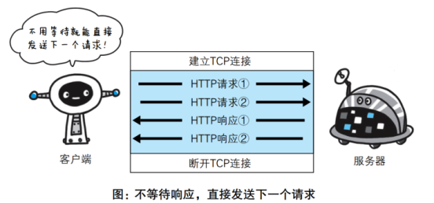
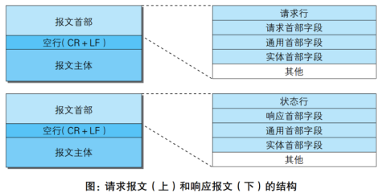
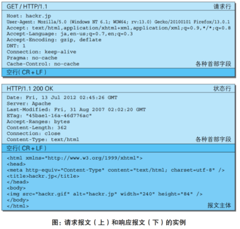

HTTP 是一种无状态(stateless)协议, 对于发送过的请求或响应, 都不做持久化处理;   
这是为了, 更快地处理大量事务, 确保协议的可伸缩性, 而特意把 HTTP 协议设计成如此简单的;  
但为了实现期望的保持状态功能, 于是引入了 Cookie 技术;  

HTTP 劫持与 DNS 劫持的区别  
HTTP 劫持: 你打开的是人民日报的官方网站, 右下角却弹出了蓝翔的挖掘机广告;  
DNS 劫持: 你在地址栏输入的是人民日报的网页地址, 却打开了淘宝特卖的钓鱼网站;  

### 一次完整的网络请求过程  
1.. 域名解析;  
2.. TCP 的三次握手, 建立 TCP 连接;  
3.. 建立TCP连接后发起HTTP请求;  
4.. 客户端解析 ResponseBody;  
5.. TCP 四次挥手, 断开 TCP 连接;  


Http 连接实际上就是 TCP 连接, 和一些使用 TCP 连接的规则:  
从 URL 中解析出服务器的主机名;  
查询这个主机名对应的 IP 地址, 获取端口号;  
发送连接到对应的, 主机+端口;  
发送 GET 等请求;  
TCP 协议, 为了方便通信, 将 HTTP 请求报文, 按序号, 分割成多个报文段, 把每个报文段可靠的传给对方;  
IP 协议, 负责搜索对方地址, 一边中转一边传送;  
TCP 协议, 从发送方那里, 接收到报文段, 按照序号, 重组请求报文;  
HTTP 协议的职责, 对请求的服务做出响应, 并以同样的 TCP/IP 协议, 向用户端回传;    
关闭连接;  
❀ 多条连接如何区分?  
每条TCP连接都会包含<源IP地址, 源端口号, 目的IP地址, 目的端口号>   
TCP连接所需要的套接字函数    
```
s = socket(params)  //  创建一个新的, 未命名, 未关联的, 套接字;  
bind(s, local: ip)  //  向套接字, 赋值一个本地端口号  
connect(s, remote: ip)  //  创建一条本地套接字, 与远程主机, 及端口号, 的连接;  
listen(s, ...)  //  标识一个本地套接字, 使其可以合法的接收连接;  
s2 = accept(s)  //  等待某人建立一条, 到本地端口的连接;  
n = read(s, buffer, n)  //  从套接字缓存区读取 n 个字节;  
n = write(s, buffer, n)  //  向套接字缓存, 写入 n 个字节;  
close(s)  //  关闭TCP连接  
shutdown(s, side)  //  关闭 TCP 连接, 的输入 或 输出端;  
getSocketOpt(s, ...)  //  读取某个套接字, 配置项;  
```

❀ HTTP请求与响应:   
发送端:  
1.. 应用层  HTTP 数据;  
2.. 传输层  TCP首部 + HTTP 数据;  
3.. 网络层  IP首部 + TCP首部 + HTTP 数据;  
4.. 链路层  以太网首部 + IP首部 + TCP首部 + HTTP 数据;  
发到接收端,   
5.. 链路层  以太网首部 + IP首部 + TCP首部 + HTTP 数据;  
6.. 网络层  IP首部 + TCP首部 + HTTP 数据;  
7.. 传输层  TCP首部 + HTTP 数据;  
8.. 应用层  HTTP 数据;

发送端在, 层与层之间传输数据时, 每经过一层时, 必定会被打上, 该层所属的首部信息;  
反之, 接收端在层与层传输数据时, 每经过一层时会把对应的首部消去;  

与HTTP协议密切相关的协议: IP,  TCP,  DNS;  

每进行一次 HTTP 通信就要断开一次 TCP 连接  
```
建立 TCP 连接;  
HTTP 请求 & 响应;  
断开 TCP 连接;  
...
再来一个请求, 会重复这个操作单元;  
```

❀ 使用 Cookie 的状态管理  
HTTP 是无状态协议, 它不对之前发生过的请求和响应的状态进行管理;也就是说, 无法根据之前的状态进行本次的请求处理;  
不可否认, 无状态协议当然也有它的优点; 由于不必保存状态, 自然可减少服务器的 CPU 及内存资源的消耗;  
从另一侧面来说, 也正是因为 HTTP 协议本身是非常简单的, 所以才会被应用在各种场景里;  
保留无状态协议这个特征的同时又要解决类似的矛盾问题, 于是引入了 Cookie 技术; Cookie 技术通过在请求和响应报文中写入 Cookie 信息来控制客户端的状态;  
Cookie 会根据从服务器端发送的响应报文内的一个叫做 Set-Cookie的首部字段信息,  通知客户端保存 Cookie;  
当下次客户端再往该服务器发送请求时, 客户端会自动在请求报文中加入 Cookie 值后发送出去;  
服务器端发现客户端发送过来的 Cookie 后,  会去检查究竟是从哪一个客户端发来的连接请求,  然后对比服务器上的记录, 最后得到之前的状态信息;  

响应报文(服务器端生成 Cookie 信息)  
```
HTTP/1.1 200 OK
Date: Thu, 12 Jul 2012 07:12:20 GMT
Server: Apache
＜Set-Cookie: sid=1342077140226724; path=/; expires=Wed,
10-Oct-12 07:12:20 GMT＞
Content-Type: text/plain; charset=UTF-8
```
请求报文(自动发送保存着的 Cookie 信息)  
```
GET /image/ HTTP/1.1
Host: hackr.jp
Cookie: sid=1342077140226724
```

### 请求方式  

GET 请求  
用于获取消息实体;  
参数在长链接之后 的 ? 之后, 用 key=value 形式并用 & 符号分割;  
如果要传中文参数, 必须要用 URLEncoding  和 URLDecoding 进行交互;  
不能添加body;  
只发送一次 TCP 数据包, 把 http header 和 query params 一起发送出去, 服务器响应 200;  


POST 请求  
用来传输消息实体;  
参数可以放在长链接之后, 和 GET 请求一样;    
参数可以放在并 body, 参数的编码形式, 要和后端统一, 最好要用UTF-8;  
有一些浏览器上, 发送两次 tcp 数据包, 先发送 header 服务器响应 100 continue, 继续发送 body, 服务器响应 200, 但是 Firefox 只发送一次 tcp 数据包;  

PUT 请求  
PUT 方法用来传输文件;  
就像 FTP 协议的文件上传一样, 要求在请求报文的主体中, 包含文件内容, 然后保存到请求 URI 指定的位置;  
但是, 鉴于 HTTP/1.1 的 PUT 方法自身不带验证机制, 任何人都可以上传文件 , 存在安全性问题, 因此一般的 Web 网站不使用该方法;  
若配合 Web 应用程序的验证机制, 或架构设计采用 REST(REpresentationalState Transfer, 表征状态转移)标准的同类 Web 网站, 就可能会开放使用 PUT 方法;  

HEAD 请求  
用于获得报文首部, 不返回报文主体部分;  
用于确认URI 的有效性, 及资源更新的日期时间等, 例如: 返回 index.html 有关的响应首部;  

DELETE 请求  
DELETE 方法用来删除文件, 是与 PUT 相反的方法; DELETE 方法按请求 URI 删除指定的资源;  
但是,  HTTP/1.1 的 DELETE 方法本身和 PUT 方法一样不带验证机制, 所以一般的 Web 网站也不使用 DELETE 方法;  
当配合 Web 应用程序的验证机制, 或遵守 REST 标准时还是有可能会开放使用的;  

OPTIONS 请求  
OPTIONS 方法用来查询针对请求 URI 指定的资源支持的方法;  
响应体例如：  
```
HTTP/1.1 200 OK
Allow: GET, POST, HEAD, OPTIONS
```

TRACE 请求  
客户端通过 TRACE 方法可以查询发送出去的请求是怎样被加工修改 / 篡改的;  
这是因为, 请求想要连接到源目标服务器可能会通过代理中转,  TRACE 方法就是用来确认连接过程中发生的一系列操作;    
但是,  TRACE 方法本来就不怎么常用, 再加上它容易引发 XST(Cross-Site Tracing, 跨站追踪)攻击, 通常就更不会用到了;  

CONNECT 请求    
CONNECT 方法要求在与代理服务器通信时建立隧道, 实现用隧道协议进行 TCP 通信;  
主要使用 SSL(Secure Sockets Layer, 安全套接层)和 TLS(Transport Layer Security, 传输层安全)协议把通信内容加密后经网络隧道传输;  


HTTP 的缺点    
通信使用明文(不加密), 内容可能会被窃听  
不验证通信方的身份, 因此有可能遭遇伪装  
无法证明报文的完整性, 所以有可能已遭篡改  


Http 请求是⽆状态的  
协议对于事务处理没有记忆能⼒ "事物处理"  "记忆能⼒"  
对同⼀个 url 请求没有上下⽂关系 "上下⽂关系"  
每次的请求都是独⽴的, 它的执⾏情况和结果与前⾯的请求和之后的请求是⽆直接关系的, 它不会受前⾯的请求应答情况直接影响, 也不会直接影响后⾯的请求应答情况 "⽆直接联系" "受直接影响"  
服务器中没有保存客户端的状态, 客户端必须每次带上⾃⼰的状态去请求服务器 "状态"  
### HTTP.优化改进  
❀ keep-alive 机制  
如果浏览器加载一个 HTML 网页, HTML 中可能需要加载数十个资源, 典型场景下, 这些资源中大部分来自同一个站点;  
按照 HTTP1.0 的做法, 这需要建立数十个 TCP 连接, 每个连接负责一个资源请求;  
创建一个 TCP 连接需要3次握手, 而释放连接则需要 2次或 4次挥手;  
重复的创建和释放连接, 极大地影响了网络效率, 同时也增加了系统开销;  
为了有效地解决这一问题, HTTP/1.1提出了 Keep-Alive 机制:  
当一个 HTTP 请求的数据传输结束后, TCP连接不立即释放, 如果此时有新的HTTP请求, 且其请求的 Host 通上次请求相同, 则可以直接复用为释放的TCP连接,   
从而省去了 TCP 的释放, 和再次创建的开销, 减少了网络延时;  
在现代浏览器中, 一般同时开启 6~8个 keep-alive connections 的 socket 连接, 并保持一定的链路生命, 当不需要时再关闭;  
而在服务器中, 一般是由软件根据负载情况(比如 FD 最大值, Socket 内存, 超时时间, 栈内存, 栈数量等), 决定是否主动关闭;  
持久连接的特点是, 只要任意一端, 没有明确提出断开连接, 则保持 TCP 连接状态;  
持久连接的好处在于, 减少了 TCP 连接的重复建立, 和断开所造成的额外开销, 减轻了服务器端的负载;  
另外, 减少开销的那部分时间, 使 HTTP 请求和响应, 能够更早地结束,  这样 Web 页面的显示速度也就相应提高了;  

❀ 管线化  
持久连接, 使得多数请求, 以管线化(pipe-lining)方式发送, 成为可能;  
以前发送请求后, 需等待并收到响应, 才能发送下一个请求;  
管线化技术出现后, 不用等待响应, 亦可直接发送下一个请求;  
这样就能够做到, 同时并行发送多个请求,  而不需要一个接一个地等待响应了;  
比如, 当请求一个包含 10 张图片的 HTML Web 页面, 与挨个连接相比, 用持久连接可以让请求更快结束;  
而管线化技术则比持久连接还要快, 请求数越多, 时间差就越明显;  
  

❀ HTTP/2  
HTTP/1.x 不会压缩请求和响应报头, 导致了不必要的网络流量;    
HTTP/1.x 不支持资源优先级导致底层TCP连接利用率低下;    
简单来说 HTTP/2 主要解决了以下问题：  

头部压缩  
HTTP/2 使用 HPACK 压缩格式压缩请求和响应报头数据, 减少不必要流量开销;  
头部压缩是HTTP/2中非常重要的特点, 它针对同一个 Client 和一个 Server 之间进行数据传输时, 有一些header在多次的请求中是相同的, 这样多次请求就会出现多次传输相同的 header;  
HTTP/2 协议针对这种情况, 对所有 header 信息建立索引, 如果在下一次传输时相同的 header 直接用索引的编号去传输;  
这样就不会传输一长串的字符串, 减少了网络传输信息量, 提升了传输效率;  
当然, 头部压缩也存在一些缺点 , 因为不管是 Client 端还是 Server 端, 都要维持索引表, 确定每个索引值对应 HTTP header 的信息;  
通过占用更多内存换取数据量传输的减少, 也可以认为是通过空间换时间, 对于现在内存日益扩大的情况下, 增加传输效率才是更重要的;  

请求与响应复用  
HTTP 之前的版本最多支持 Keep-Alive, 可以在一个 TCP 连接上传输多个 HTTP 请求;  
对于最基本的 Keep-Alive, 只能在一个请求传输完, 进行下一个请求的传输;  
在这个基础上还有 pipeline, 可以在请求方向上同时传输多个 get 请求, 但都不是真正的多路复用;  

HTTP/2 通过引入新的二进制分帧层, 实现了完整的请求和响应复用, 客户端和服务器, 可以将 HTTP 消息分解为互不依赖的帧, 然后交错发送, 最后再在另一端将其重新组装;  
HTTP/2 在 TCP 连接的基础上, 增加了stream 的概念, 每个 stream 都可以处理单独的一个 HTTP 请求;  
在这个基础上, 在一条 TCP 连接上可以同时传输多个 stream, 而且不同 stream 都有对应编号, 因此就支持了真正的多路复用;  

指定数据流优先级  
将 HTTP 消息分解为很多独立的帧之后, 我们就可以复用多个数据流中的帧, 客户端和服务器交错发送和传输这些帧的顺序就成为关键的性能决定因素;  
为了做到这一点, HTTP/2 标准允许每个数据流都有一个关联的权重和依赖关系

流控制  
HTTP/2 提供了一组简单的构建块, 这些构建块允许客户端和服务器实现其自己的数据流和连接级流控制;  


### HTTP.报文  
HTTP 报文大致可分为报文首部和报文主体两块; 两者由最初出现的空行(CR+LF)来划分;通常, 并不一定要有报文主体;  
  
  
  
CR＋LF  
CR(Carriage Return, 回车符：16进制 0x0d)和 LF(Line Feed, 换行符：16进制 0x0a)  

Content-Type   
```
//  提交的数据按照 key1=val1&key2=val2 的方式进行编码, key和val都进行了URL转码  
// 这是标准的编码格式;
application/x-www-form-urlencoded  

//   数据被编码为一条消息, 页上的每个控件对应消息中的一个部分;  
multipart/form-data  

//  数据以纯文本形式(text/json/xml/html)进行编码, 其中不含任何控件或格式字符;  
text/plain  

//  JSON  
application/json  
//  二级制文件流;  
application/octet-stream  
```
### HTTP.首部字段  
❀ 通用首部字段  
Connection 逐跳首部, 连接的管理  
Date 创建报文的日期时间  
Trailer 报文末端的首部一览  
Transfer-Encoding 指定报文主体的传输编码方式  
Upgrade 升级为其他协议  
Via 代理服务器的相关信息  
Warning 错误通知  
❀ 请求首部字段
Accept 用户代理可处理的媒体类型  
Accept-Charset 优先的字符集  
Accept-Encoding 优先的内容编码  
Accept-Language 优先的语言(自然语言)  
Authorization Web认证信息  
Expect 期待服务器的特定行为  
From 用户的电子邮箱地址   
Host 请求资源所在服务器  
If-Range 资源未更新时发送实体Byte的范围请求  
Max-Forwards 最大传输逐跳数  
Proxy-Authorization 代理服务器要求客户端的认证信息  
Range 实体的字节范围请求  
```
Range 可以请求实体的部分内容, 多线程下载一定会用到此请求头;例如：
表示头500个字节：bytes=0~499
表示第二个500字节：bytes=500~999
表示最后500字节：bytes=-500
表示500字节以后的范围：bytes=500-
```
Referer 对请求中URI的原始获取方  
TE 传输编码的优先级  
User-Agent HTTP 客户端程序的信息    

❀ 响应首部字段  
Accept-Ranges 是否接受字节范围请求  
Location 客户端重定向至指定URI  
Proxy-Authenticate 代理服务器对客户端的认证信息  
Retry-After 对再次发起请求的时机要求  
Server HTTP服务器的安装信息  
Vary 代理服务器缓存的管理信息  
WWW-Authenticate 服务器对客户端的认证信息  

❀ 实体首部字段  
Allow 资源可支持的HTTP方法  
Content-Encoding 实体主体适用的编码方式  
Content-Language 实体主体的自然语言  
Content-Length 实体主体的大小(单位 ：字节)  
Content-Location 替代对应资源的URI  
Content-MD5 实体主体的报文摘要  
Content-Range 实体主体的位置范围  
Content-Type 实体主体的媒体类型  

### HTTP.缓存    
缓存策略有强制缓存和对比缓存:  
1.. 强制缓存, 即缓存在有效期内就直接返回缓存, 不进行网络请求;  
2.. 对比缓存, 还是会进行网络请求, 如果数据未修改, 服务端返回不带 body 的 304 响应, 表示客户端缓存仍有效可用; 否则返回完整的最新数据, 客户端获取后进行缓存;  

常见的 HTTP 缓存只能存储 GET 响应;  
```
Parahma  //  报文指令, http1.0 的旧字段, 当值为"no-cache"时, 表示禁用缓存  
``` 
❀ Expires  
http1.0 的旧字段, 实体主体过期的时间;  
```
Expires: Thu, 31 Mar 2016 07:07:52 GMT
```
Expires 是 Web 服务器响应消息头字段, 在响应 http 请求时告诉浏览器在过期时间前, 浏览器可以直接从浏览器缓存取数据, 而无需再次请求;  
不过Expires 是HTTP 1.0的东西, 现在默认浏览器均默认使用 HTTP 1.1, 所以它的作用基本忽略;  
Expires 的一个缺点就是, 返回的到期时间是服务器端的时间, 这样存在一个问题, 如果客户端的时间, 与服务器的时间相差很大(比如时钟不同步, 或者跨时区), 那么误差就很大;  
所以在HTTP 1.1版开始, 使用Cache-Control: max-age=秒 替代;  

❀ Cache-Control  
控制缓存的行为;  
Cache-Control: cache-extension  //  新指令标记(token)     
Cache-Control: no-transform  //  不可以对资源进行转换或转变  
Cache-Control: only-if-cached  //  从缓存获取资源  
另外 Cache-Control 允许自由组合可选值, 例如:  
```
Cache-Control: max-age=3600, must-revalidate  
```
Cache-Control 与 Expires 的作用一致, 都是指明当前资源的有效期, 控制浏览器, 是直接从浏览器缓存取数据, 还是重新发请求到服务器取数据;  
只不过 Cache-Control 的选择更多, 设置更细致, 如果同时设置的话, 其优先级高于Expires;  

Cache-Control: Public  
响应首部;  
表明响应可以被任何对象缓存, 包括: 发送请求的客户端, 代理服务器, 等;    

Cache-Control: Private  
响应首部;  
表明响应只能被单个用户缓存, 不能作为共享缓存, 即代理服务器不能缓存它;  

Cache-Control: no-cache  
指示请求或响应消息, 不能缓存;  
必须先与服务器确认, 资源是否发生了变化, 然后才能使用该响应, 来满足后续对同一网址的请求;  
如果存在合适的验证令牌 (ETag), no-cache 会发起往返通信, 来验证缓存的响应, 但如果资源未发生变化, 则可避免下载;  

Cache-Control: only-if-cached  
如果有缓存, 只使用缓存, 无论原始服务器数据, 是否有更新;  

Cache-Control: no-store  
不允许缓存响应, 每次请求都必须完整获取资源;  

Cache-Control: max-age = x 秒;  
设置缓存的最大周期, 超过这个时间, 认为缓存过期;  
```
Cache-Control: no-cache  
Cache-Control: max-age=0  
这两个作用是一样的, 都要求在使用缓存之前进行验证;  
```

Cache-Control: max-stale = x 秒  
指示客户机可以接收, 超出超时期间的响应消息, 如果指定 max-stale 消息的值, 那么客户机可以接收, 超出超时期指定值之内的响应消息;  

Cache-Control: min-fresh = x 秒  
指示客户机可以接收, 响应时间小于当前时间加上指定时间的响应;  

Cache-Control: must-revalidate  
缓存必须在使用之前, 验证旧资源的状态, 并且不可使用过期资源;  


Cache-Control: immutable  
响应首部;  
表示响应正文, 不会随时间而改变, 如果未过期, 资源在服务器上不发生改变,  
客户端不需要发送, 重新验证请求头, 例如 If-None-Match 或 If-Modified-Since, 来检查更新;  

Cache-Control: s-max-age = x秒  
响应首部;  
覆盖max-age 或者 Expires 头, 但是仅适用于共享缓存(比如各个代理), 并且私有缓存中它被忽略;    

Cache-Control: proxy-revalidate  
响应首部;  
缓存必须在使用之前, 验证旧资源的状态, 并且不可使用过期资源, 仅适用于共享缓存, 例如代理;  

❀ Last-Modified  
响应首部;  
标识资源的最后修改时间;  
```
Last-Modified:Tue, 24 Feb 2009 08:01:04 GMT
```
服务器响应时, 会将资源最后更改的时间, 以 "Last-Modified: GMT" 的形式, 一起返回给客户端;  
下次再次请求时, 客户端会把该信息, 附加在 If-Modified-Since: Modified-Value, 一并带给服务器去做检查;  
若传递的时间值, 与服务器上, 该资源最终修改时间, 是一致的, 则说明, 该资源没有被修改过, 直接返回304状态码即可;  
但是, Modified-Value, 可能会有问题, 如果 资源被修改了, 那么最后一次修改的时间戳, 就会变更;  
如果, 此时的实质性的内容, 并没有发生变化, 会造成客户端重复下载的问题, ETag 可以解决这种问题;  

❀ If-Modified-Since: Modified-Value  
请求首部;  
```
If-Modified-Since: Thu, 31 Mar 2016 07:07:52 GMT
```
服务端响应时, 回传 Last-Modified: Modified-Value;  
以后的请求, 如果携带 If-Modified-Since: Modified-Value;  
请求时, 比较资源最后更新的时间是否一致;  
用于做 revalidate 时, 发现是有变动, 回传 200 及新资源, 反之则回传 304 (Not Modified) 即可;  

❀ If-Unmodified-Since  
请求首部;  
主要用于对提交的数据做验证, 和 If-Unmodified-Since 类似;  
```
If-Unmodified-Since: Thu, 31 Mar 2016 07:07:52 GMT
```
服务器响应时, 会将资源最后更改的时间, 以 "Last-Modified: GMT" 的形式, 一起返回给客户端;  
以后的请求, 如果携带 If-Unmodified-Since: Modified-Value, 比较资源最后更新的时间是否, 不一致;  
资源在服务端的最后更新时间改变了, 则应当返回412(Precondition Failed) 状态码给客户端, 表示请求失败;  
只有当资源在指定的时间内, 没有进行过修改的情况下, 服务器才会返回请求的资源;  

与 POST 搭配使用, 可以用来优化并发控制, 例如在某些wiki应用中的做法: 假如在原始副本获取之后, 服务器上所存储的文档已经被修改, 那么对其作出的编辑会被拒绝提交;  
与含有 If-Range 的请求搭配使用, 用来确保新的请求片段, 来自于未经修改的文档;  

❀ If-Match: ETag-value  
请求首部;  
主要用于对提交的数据做验证, 和 If-Unmodified-Since 类似;  
```
//  If-Match: ETag-value
If-Match: "5d8c72a5edda8d6a:3239"  
```
服务端响应时, 回传 ETag: ETag-Value;  
请求时, 如果携带这个参数, 如果没有匹配到 ETag, 或者收到了 * 值, 而当前并没有该资源实体, 则应当返回412(Precondition Failed) 状态码给客户端, 否则服务器直接忽略该字段;  

❀ If-None-Match: ETag-value  
请求首部;  
比较 ETag 是否, 不一致;  
```
//  If-None-Match: ETag-value  
If-None-Match: "d41d8cd98f00b204e9800998ecf8427e" 
```
服务端响应时, 回传 ETag-Value, 以后的请求, 如果携带 If-None-Match: ETag-value;  
服务器收到请求后, 与被请求资源的相应校验串, 进行比对, 决定返回 200或304;  

❀ Last-Modified  
```
Last-Modified: Fri, 22 Jul 2016 01:47:00 GMT  
```
服务端回传时, 下发次属性, 标记文件在服务期端, 最后被修改的时间;  
之后的请求, 会携带 If-Modified-Since: Modified-Value, 询问该时间之后文件是否有被修改过;  
如果服务器端的资源没有变化, 则自动返回 304(NotChanged)状态码, 返回实体为空, 这样就节省了传输数据量;  
当服务器端代码发生改变, 或者重启服务器时, 则重新发出资源, 返回和第一次请求时类似;  
从而保证不向客户端重复发出资源, 也保证当服务器有变化时, 客户端能够得到最新的资源;  

Last-Modified 标注的最后修改只能精确到秒级, 如果某些文件在1秒钟以内, 被修改多次的话, 它将不能准确标注文件的修改时间;  
如果某些文件会被定期生成, 当有时内容并没有任何变化, 但 Last-Modified 却改变了, 导致文件没法使用缓存;  
有可能存在, 服务器没有准确获取文件修改时间, 或者与代理服务器时间不一致等情形;  

不存在版本问题, 每次请求都会去服务器进行校验, 服务器对比最后修改时间如果相同则返回304, 不同返回200以及资源内容;  
只要资源修改, 无论内容是否发生实质性的变化, 都会将该资源返回客户端;  
例如周期性重写, 这种情况下该资源包含的数据实际上一样的;  
以时刻作为标识, 无法识别一秒内进行多次修改的情况;  
某些服务器不能精确的得到, 文件的最后修改时间;  


❀ ETag  
为了解决上述 Last-Modified 可能存在的不准确的问题, Http1.1 还推出了  ETag  实体首部字段;  
服务器会通过某种算法, 给资源加上一个唯一标志符(比如md5标志), 在把资源响应给客户端的时候, 会在实体首部加上 "ETag: 唯一标识符", 一起返回给客户端;  
Last-Modified 与 ETag一起使用时, 服务器会优先验证 ETag;  

Apache 中, ETag 的值, 默认是对文件的, 索引节(INode), 大小(Size)和最后修改时间(MTime), 进行 Hash 后得到的;  
谨慎设置 ETag, 需要注意的是分布式系统里, 多台机器间文件的 Last-Modified 必须保持一致, 以免负载均衡到不同机器导致比对失败;  
分布式系统尽量关闭掉 ETag, 每台机器生成的 ETag 都会不一样, 因为除了 Last-Modified 也很难保持一致;  
需要注意的是, 如果资源是走分布式服务器(比如CDN)存储的情况, 需要这些服务器上计算 ETag 唯一值的算法保持一致,  
才不会导致明明同一个文件, 在服务器A, 和服务器B上生成的ETag却不一样;  
可以更加精确的判断资源是否被修改, 可以识别一秒内多次修改的情况;  
不存在版本问题, 每次请求都回去服务器进行校验;  
计算ETag值需要性能损耗;  
分布式服务器存储的情况下, 要处理不同服务器上, ETag 取值要一致, 否则会出现问题;  

❀ 缓存场景 1  
Pragma 和 Expire 是 HTTP1.0 旧字段, 如果要兼容旧版本, 则需要care, 否则可以忽略;  
优先级:  
1.. Cache-Control > Pragma > Expire;  
如果 Pragma 和 Expire 有冲突, Pragma 的优先级会更高;  
如果同时出现 Pragma, Expire, Cache-Control, 那么 Cache-Control 的优先级最高;  

2.. If-Modified-Since > If-None-Match;  
服务器会优先验证 If-Modified-Since请求头, 再验证 If-None-Match;  
但是必须两个都是 资源未修改, 才返回304, 否则其中一个验证失败, 都认为是资源被修改, 都将返回 200状态 和 新资源;  

❀ 缓存策略特点比较:  
Expires	
优点:  
HTTP 1.0 产物, 可以在HTTP 1.0和1.1中使用, 简单易用;  
缺点:  
时间是由服务器发送的, 如果服务器时间和客户端时间存在不一致., 可能会出现问题;  
存在版本问题, 到期之前的修改客户端是不可知的;  

Cache-Control	
优点:  
HTTP 1.1 产物, 以时间间隔标识失效时间, 解决了 Expires 服务器和客户端相对时间的问题;  
比Expires多了很多选项设置;  
缺点:  
HTTP 1.1 才有的内容, 不适用于HTTP 1.0;   
存在版本问题, 到期之前的修改客户端是不可知的;  

Last-Modified  
优点:  
不存在版本问题, 每次请求都会去服务器进行校验;  
服务器对比最后修改时间如果相同则返回304, 不同返回200以及资源内容;  

缺点:  
只要资源修改, 无论内容是否发生实质性的变化, 都会将该资源返回客户端;  
例如周期性重写, 这种情况下该资源包含的数据实际上一样的;  
以时刻作为标识, 无法识别一秒内进行多次修改的情况;  
某些服务器不能精确的得到文件的最后修改时间;  

ETag	
优点:  
可以更加精确的判断资源是否被修改, 可以识别一秒内多次修改的情况;  
           不存在版本问题, 每次请求都回去服务器进行校验;  
缺点:  
计算ETag值需要性能损耗;  
分布式服务器存储的情况下, 计算 ETag 的算法如果不一样, 多台服务器校验会有问题;  

### HTTPS  
普通的HTTP协议:  TCP 协议之上是 HTTP 协议;  
安全的HTTP协议:  TCP 协议之上是 SSL 和 TLS 协议, 再之上是 HTTP 协议;  

用 SSL 建立安全通信线路之后, 就可以在这条线路上进行 HTTP通信了;  
在采用 SSL 后,  HTTP 就拥有了 HTTPS 的加密, 证书和完整性保护这些功能;  
SSL 是独立于 HTTP 的协议, 所以不光是 HTTP 协议, 其他运行在应用层的 SMTP 和 Telnet 等协议均可配合 SSL 协议使用;  
可以说 SSL 是当今世界上应用最为广泛的网络安全技术;  

❀ Https 七次握手 = TCP.3次握手 + SSL.4次握手  
交换协议版本;  
选择一个双方都了解的密码;  
对双方的身份进行认证;  
生成临时会话密钥, 以便于加密通信;  

也就是:  
客户端发送可供选择的密码并请求证书;  
服务端发送选中的密码和证书;  
客户端发送保密信息, 客户端和服务端生成密钥;  
客户端和服务器相互告知, 开始加密过程;  

也就是:  
1.. Client:  ClientHello  
2.. Server:  ServerHello  
      ServerCertificate;  
      ServerKeyExchange;  
      ClientCertificateRequest;  
      SeverHelloDone;  
3.. Client:  
      ClientCertificate;  
      ClientKeyExchange;  
      CertificateVerify;        
      ChangeCipherSpec;  
      ClientFinishedMessage;  
4.. Server:  
      ChangeCipherSpec;  
      ServerFinishedMessage;  

1.. 客户端发送加密通信的请求, 以明文传输请求信息, 这一次请求称为 ClientHello;  
      客户端⽀持的加密通信协议版本信息;  
      客户端⽀持的加密套件(cipher suite)列表;  
      压缩算法(compression method)列表, 用于后续的信息压缩传输;  
      ⽣成一个客户端随机数(client random), 用于后续生成协商密钥(session secret);  
2.. 服务端收到客户端的请求后, 向客户端做出回应, 这一次响应被称为 SeverHello;   
      检查客户端的加密通信协议的版本, 如果与服务端的版本不一致, 则关闭加密通信;  
      选择加密套件(cipher suite);   
      ⽣成一个服务端随机数(server random), 用于后续生成协商密钥(session secret);    
      返回服务端证书;  
3.. 客户端收到响应, 要做以下⼯作:  
      检查证书合法性;  
      信任证书, 取出加密公钥;  
      ⽣成⼀个随机数, 并⽤证书的公钥加密这个随机数, 生成 pre-master key;  
      此时客户端已经持有计算协商密钥, 所需要的信息, client random, server random, pre-master key, 然后计算得到协商密钥;  
      finish 报文 = 结合之前所有通信内容的 hash 值, 采用协商密钥与加密套件进行加密, 交给服务端, 用于正式传输之前的验证;    
      编码改变通知, 后续的通信都采用这个协商密钥和加密算法进行加密通信;  
      客户端握手结束;  
4.. 服务收到 pre-master key, 结合之前的 client random, server random, 计算得到协商密钥;  
      finish 报文 = 结合之前所有通信内容的 hash 值, 采用协商密钥与加密套件进行加密, 交给客户端, 用于正式传输之前的验证;    
      编码改变通知, 后续的通信都采用这个协商密钥和加密算法进行加密通信;  
      服务器握手结束;  

如果客户端和服务端都能对 finish 报文进行正常加解密, 且消息正确的被验证, 则说明握手通道已经建立成功, 接下来, 双方可以 Session Secret 对数据进行加密传输了;  

❀ SeverHello  
在服务端向客户端发送的证书中, 没有提供足够的信息的时候, 还可以向客户端发送一个 Server Key Exchange;  
此外对于非常重要的保密数据, 服务端还需要对客户端进行验证, 以保证数据传送给了安全的合法的客户端;  
服务端可以向客户端发出 Certificate Request 消息, 要求客户端发送证书对客户端的合法性进行验证;  
比如, 金融机构往往只允许认证客户连入自己的网络, 就会向正式客户提供 USB 密钥, 里面就包含了一张客户端证书;  

Client Key Exchange  
如果服务端需要对客户端进行验证, 在客户端收到服务端的 Server Hello 消息之后, 首先需要向服务端发送客户端的证书, 让服务端来验证客户端的合法性;  

Certificate Verify  
如果证书不是可信机构颁布, 或者证书中的域名与实际域名不一致, 或者证书已经过期,  
就会向访问者显示一个警告, 由其选择是否还要继续通信, 如果证书没有问题, 客户端就会从服务器证书中取出服务器的公钥;  

ChangeCipherSpec  
ChangeCipherSpec 是一个独立的协议, 占据一个字节, 用于告知服务端, 客户端已经切换到之前协商好的加密套件(Cipher Suite)的状态,   
准备使用之前协商好的加密套件加密数据并传输;  
在 ChangeCipherSpec 传输完毕之后, 客户端会使用之前协商好的加密套件和 Session Secret 加密一段 Finish 的数据传送给服务端,  
此数据是为了在正式传输应用数据之前对刚刚握手建立起来的加解密通道进行验证;  


❀ 客户端验证服务端证书  
如果证书不是可信机构颁布, 或者证书中的域名与实际域名不一致, 或者证书已经过期;  
就会向访问者显示一个警告, 由其选择是否还要继续通信;  

生成会话-协商密钥一共需要三个随机数;  
握手之后的对话, 使用对话密钥(session key)进行对称加解密, 服务器的公钥和私钥只用于, 对话密钥(session key)的非对称加解密, 没有其他作用;  
服务器公钥放在服务器的数字证书之中;  
整个 SSL 握手阶段都不加密, 也没法加密, 都是明文的;  
因此, 如果有人窃听通信, 他可以知道双方选择的加密方法, 以及三个随机数中的两个;  
整个通话的安全, 只取决于第三个随机数(pre-master secret), 能不能被破解;  
虽然理论上, 只要服务器的公钥足够长, 比如2048位, 那么 pre-master secret 可以保证不被破解;  
但是为了足够安全, 我们可以考虑把握手阶段的算法, 从默认的 RSA 算法, 改为 Diffie-Hellman算法, 简称DH算法;  
采用 DH 算法后, pre-master secret 不需要传递, 双方只要交换各自的参数, 就可以算出这个随机数;  

握手阶段用来建立SSL连接, 如果出于某种原因, 对话中断, 就需要重新握手;  
这时有两种方法可以恢复原来的 session, 一种叫做 session ID, 另一种叫做 session ticket;  
session ID 的思想很简单, 就是每一次对话都有一个编号(session ID);  
如果对话中断, 下次重连的时候, 只要客户端给出这个编号, 且服务器有这个编号的记录, 双方就可以重新使用已有的"对话密钥", 而不必重新生成一把;  
session ID 是目前所有浏览器都支持的方法, 但是它的缺点在于 session ID 往往只保留在一台服务器上, 所以, 如果客户端的请求发到另一台服务器, 就无法恢复对话;  

session ticket 就是为了解决这个问题而诞生的, 目前只有 Firefox 和 Chrome 浏览器支持;  
客户端不再发送 session ID, 而是发送一个服务器在上一次对话中发送过来的 session ticket;  
这个 session ticket 是加密的, 只有服务器才能解密, 其中包括本次对话的主要信息, 比如对话密钥和加密方法;  
当服务器收到 session ticket 以后, 解密后就不必重新生成对话密钥了;  


❀ SSL 与 TLS  
先有的 SSL, 后有的 TLS;  
SSL, 1994年 Netscape 所研发, SSL 协议位于 TCP 协议之上, 为数据通讯提供安全支持;  
TLS, 其前身是 SSL, 1999 年从 3.1 开始被 IETF 标准化并改名, 目前使用最广泛的是 TLS 1.1, TLS 1.2;  

SSL 和 TLS 都是加密协议, 旨在基于不安全的基础设施提供安全通信;  
TLS实际上有以下四个主要目标:  
1.. 加密安全, 这是主要问题, 为任意愿意交换信息的双方启用安全通信;  
2.. 互操作性, 独立的编程人员应该能够使用通用的加密参数开发程序和库, 使它们可以相互通信;  
3.. 可扩展性, 其重要目标是独立于实际使用的加密基元(例如密码和散列函数), 从而不需要创建新的协议, 就允许从一个基元迁移到另一个;  
4.. 效率, 最终的目标是在实现上述所有目标的基础上保持性能成本在可接受的范围内;  

❀ Https#优化方法  
减少握手, SSL Session ID/Session Ticket, TCP 的 Keep-Alive 也是需要的;  
HTTP/2 多路复用和头部压缩可以有效提升数据传输效率;  
域名合并, 减少 SSL 握手, 提升重用;  
协议栈优化, 调整TCP 初始化窗口, 快速重传;  
优先算法, ECDSA > RSA;  

❀ HTTP 与 HTTPS  
1.. HTTPS 协议需要申请证书;  
2.. HTTP 是明⽂传输, HTTPS 使⽤的是具有安全性的 SSL 加密传输协议, 当然报文也是明文;  
3.. HTTP 端⼝是 80, HTTPS 端⼝号是 443;  
4.. 进行身份验证, 第三方无法伪造服务端(客户端)身份;  
5.. HTTPS 保证数据在传输过程中不被窃取, 确保数据的完整性, 保证传输过程中不被改变;  
6.. HTTPS 协议握手阶段比较费时, 会使页面的加载时间延长近 50%;  
7.. HTTPS 认证用户和服务器, 确保数据发送到正确的客户机和服务器;  

通讯过程中的 hash 生成的摘要, 保证了数据的完整性;  
握手的非对称加密, 和传输过程中的对称加密保证了数据的私密性;  
客户端验证证书, 以及"金融系统中USB证书"保证了客户端和服务端的真实性;  

❀ HTTPS#误区  
HTTPS无法缓存:  
许多人以为, 出于安全考虑, 浏览器不会在本地保存HTTPS缓存, 
只要 HTTP头允许这样做, 所有版本的 IE 都缓存 HTTPS 内容, 比如, 如果头命令是 Cache-Control: max-age=600, 那么这个网页就将被 IE 缓存10分钟;  
IE 的缓存策略, 与是否使用 HTTPS 协议无关;  
Firefox 默认只在内存中缓存 HTTPS, 但是, 只要头命令中有 Cache-Control: Public, 缓存就会被写到硬盘上;  

SSL证书很贵:  
很多便宜的SSL证书, 大概10美元一年, 而且事实上, 还能找到免费的SSL证书;  

HTTPS太慢:  
使用 HTTPS 不会使你的网站变得更, 但是有一些技巧可以大大减少额外开销;  
同一个连接, 只有在第一次使用 HTTPS 时, 会比较慢, 这是因为要读取和验证SSL证书;  
建立连接的部分, 大约慢了10%, 但是, 一旦有效的HTTPS连接建立起来, 发送请求, 两种协议几乎没有区别;  
有时候可能发现, HTTPS 比 HTTP 更快一点, 这会发生在一些大公司的内部局域网, 因为通常情况下, 公司的网关会截取并分析所有的网络通信;  
但是, 当它遇到HTTPS连接时, 它就只能直接放行, 因为HTTPS无法被解读, 正是因为少了这个解读的过程, 所以HTTPS变得比较快;  

❀ 为什么不全都使用 HTTPS  
既然 HTTPS 那么安全可靠, 那为何所有的 Web 网站不只使用 HTTPS?  
其中一个原因是, 因为与纯文本通信相比, 加密通信会消耗更多的CPU 及内存资源, 平摊到一台计算机上时, 能够处理的请求数量必定也会随之减少;  
因此, 如果是非敏感信息则使用 HTTP 通信, 只有在包含个人信息等敏感数据时, 才利用 HTTPS 加密通信;  
特别是每当那些访问量较多的 Web 网站在进行加密处理时, 它们所承担着的负载不容小觑;  

❀ 如何保证公钥不被篡改?  
将公钥放在数字证书中, 只要证书是可信的, 公钥就是可信的;  

❀ 公钥加密计算量太⼤, 如何减少耗⽤的时间  
每⼀次对话(session), 客户端和服务器端都⽣成⼀个"对话密钥"(session key), ⽤它来加密信息;由于"对话密钥"  
是对称加密, 所以运算速度⾮常快, ⽽服务器公钥只⽤于加密"对话密钥"本身, 这样就减少了加密运算的消耗时间;  

❀ 使⽤ Https 加密后, 就不需要再对传输内容再加密了吗?  
不是的, 采⽤ https 只能够防截持, 但⽤户可能通过⽣成私钥, 配置证书及抓包就可以获取https传输的明⽂;  

❀ 用户直接访问 Http 请求, 怎么转换成 Https?  
这时我们的用户自己的网站就要做一个配置, 做302的跳转, 重新发起一个HTTPS请求;  
服务器除了正常给到内容外, 会多加一个 STS 的 header, header 标识告诉浏览器以后, 这个域名就要强制走HTTPS, 并给出一个超大的超时时间;  
用户关掉浏览器, 下次又要访问网站时, 浏览器直接会把HTTP请求在内部转成HTTPS, 实现了真正的HTTPS;  
以后浏览器在这个超时时间内, 都会通过HTTPS进行访问;  

❀ 怎么防止中间人篡改消息  
客户端使用 CA 证书里面的公钥, 对中间人发过来的证书的, 加密后的数字签名, 进行解密, 得到原始的数字签名;  
客户端利用约定好的签名规则生成签名值, 并比较这两个签名, 不匹配则视为失败;  

### 证书  
CA 是 Certificate Authority 证书授权中心, 它是负责管理和签发证书的第三方机构, 检查证书持有者身份的合法性, 并签发证书, 防止证书被伪造或篡改;  
CA 证书就是 CA 颁发的证书,  CA 证书也就我们常说的数字证书, 包含证书拥有者的身份信息, CA机构的签名, 公钥和私钥;  
身份信息用于证明证书持有者的身份, CA签名用于保证身份的真实性, 公钥和私钥用于通信过程中加解密, 从而保证通讯信息的安全性;  

Android 已经把将近 150 个 CA 根证书(数字证书认证机构认证过的证书)内置在手机中;  
证书之间的信任具有传递性;  
Java 平台默认识别 jks 格式的证书文件, 但是 android 平台只识别 bks 格式的证书文件;  
证书和 url 的域名是绑定的;  

❀ 证书包括哪些东西  
证书格式版本号, 证书序列号, 证书签名算法, 证书颁发者, 有效期, 对象名称, 对象的公开密钥, 数字签名, 其他扩展信息;  

❀ 查明对手的证书  
虽然使用 HTTP 协议无法确定通信方, 但如果使用 SSL 则可以, SSL 不仅提供加密处理,  而且还使用了证书校验的手段, 可用于确定对方;  
证书由值得信任的第三方机构颁发,  用以证明服务器和客户端是实际存在的;  
另外, 伪造证书从技术角度来说是异常困难的一件事, 所以只要能够确认通信方(服务器或客户端)持有的证书, 即可判断通信方的真实意图;  

❀ 站点证书的有效性  
SSL 自身不要求客户端检查 Web 服务器证书, 但大部分现代浏览器都会对证书, 进行简单的完整性检查, 并为用户提供进行进一步彻查的手段;  
1.. 日期检测, 首先, 浏览器检查证书的起始日期和结束日期, 以确保证书仍然有效;  
       如果证书过期了, 或者还未被激活, 则证书有效性验证失败, 浏览器显示一条错误信息;  
2.. 签名颁发者可信度检测, 每个证书都是由某些 证书颁发机构(CA) 签发的, 它们负责为服务器担保;  
       证书有不同的等级, 每种证书都要求不同级别的背景验证;  
       任何人都可以生成证书, 但有些 CA 是非常著名的组织, 而浏览器会附带一个, 签名颁发机构的受信列表, 
       如果浏览器收到了某未知(可能是恶意的)颁发机构签发的证书, 那它通常会显示一条警告信息;  
3.. 签名检测, 一旦判定签名授权是可信的, 浏览器就要使用证书内的密钥,  并将其与校验码进行比较, 以查看证书的完整性;  
4.. 站点身份检测, 大部分浏览器都会试着, 去验证证书中的域名, 与它们所对话的服务器的域名是否匹配;  
      如果主机名与证书中的标识符不匹配, 面向用户的客户 端要么就去通知用户, 要么就以表示证书不正确的差错报文来终止连接;  

❀ 证书的分类  
证书分为 DV(Digital Verification), OV(Organization Verification), EV(Extended Verification);  
其中 EV 证书最贵, 可以在浏览器中看到绿色的就是 EV 证书;  
证书从申请到批准要走很久的流程, 需要提供很多的公司认证信息和个人信息, 否则是不会通过的, 因此可以保证签发的证书内容是可信的;  

❀ 证书链  
根证书 ⤑ 中间证书 ⤑ 服务器证书;  
根证书机构(root)对中间证书(inter.pem)进行签名和验证;  
中间证书机构(inter)对服务器证书(server.pem)进行签名验证;  
客户端内置的是根证书(root.pem), 会对服务器证书进行信任;  

❀ 二级证书结构存在的优势  
1.. 减少根证书结构的管理工作量, 可以更高效的进行证书的审核与签发;  
2.. 根证书一般内置在客户端中, 私钥一般离线存储, 一旦私钥泄露, 则吊销过程非常困难, 无法及时补救;  
3.. 中间证书结构的私钥泄露, 则可以快速在线吊销, 并重新为用户签发新的证书;  
4.. 证书链四级以内一般不会对 HTTPS 的性能造成明显影响;  

❀ 证书链有以下特点  
1.. 同一本服务器证书可能存在多条合法的证书链, 因为证书的生成和验证基础是公钥和私钥对;  
      如果采用相同的公钥和私钥生成不同的中间证书, 针对被签发者而言, 该签发机构都是合法的 CA, 不同的是中间证书的签发机构不同;  
2.. 不同证书链的层级不一定相同, 可能二级, 三级或四级证书链;  
      中间证书的签发机构, 可能是根证书机构, 也可能是另一个中间证书机构, 所以证书链层级不一定相同;  
❀ 证书工作原理  
进行 HTTPS 请求, 握手拿到服务端的证书, 先从系统(Windows)或者浏览器内置(Firefox)检查证书链是否正确;  
客户端发送信息, 带上支持的 SSL 或者 TLS 版本(注意不同浏览器版本支持不同);  
服务器返回确认使用的加密通信协议版本以及加密随机数和证书;  

浏览器验证证书 -> OCSP 或者 CRL 结合自带 truststore;  
注意此处验证分为双向验证和单向验证,  
单向验证, 客户即可完成, 即客户端 truststore 存放服务器 public 证书;  
双向验证, 客户需要带客户端证书到服务器端, 由服务器端验证, 客户端 truststore 存放服务器端 public 证书, keystore 存放自身 private 证书,  
服务器端 truststore 存放客户端 public 证书, keystore 存放自身 private 证书;  

之后客户端会尝试查 CRL(证书吊销列表)和 OCSP(在线证书检查);  
其中 OCSP 是前者的替代和新技术, 这是由于 CRL 发布时间一般是7天(最新改为1天了)并且很大不方便,  
但是考虑到老浏览器只能用 CRL, 并且 CRL 可以缓存本地对于网速差情况还是有用的, 此外 Firefox 虽然支持 OCSP 但是可以手动关闭也是 CRL 存在的原因;  
如果发现证书并没有被吊销, 或者过期则浏览器对 EV 证书会显示为绿色, 对 OV 证书则是通过放行, 对 DV 弹出通知---该网站不可信;  

❀ 双向认证流程  
客户端发送一个连接请求给服务端;  
服务端将自己的证书, 以及相关的信息发送给客户端;  
客户端检查服务器送过来的证书是否和 App 内置证书相同, 如果是, 就继续执行协议;  如果不是则终止此次请求;  
接着客户端比较证书里的信息, 例如域名和公钥, 与服务器刚刚发送的相关消息是否一致, 如果是一致的, 客户端认可这个服务器的合法身份;  
服务器要求客户发送客户自己的证书, 收到后, 服务器验证客户端的证书, 如果没有通过验证, 拒绝连接, 如果通过验证, 服务器获得用户的公钥;  
客户端告诉服务器自己所能够支持的通讯对称密码方案;  
服务器从客户发送过来的密码方案中, 选择一种加密程度最高的密码方案, 用客户的公钥加过密后通知客户端;  
客户端针对这个密码方案, 选择一个通话密钥, 接着用服务器的公钥加过密后发送给服务器;  
服务器接收到客户端送过来的消息, 用自己的私钥解密, 获得通话密钥;  
服务器通过密钥解密客户端发送的被加密数据, 得到明文数据;  


### 中间人-代理  
客户端使用本地的, 第三方机构的公钥, 对服务器传过来的证书进行解密, 拿到其传过来的公钥;  
如果解密成功, 说明对应的证书和服务器都是真实可靠的;  

1.. 客户端向服务器发起 HTTPS 请求;  
2.. Charles 拦截客户端的请求, 伪装成客户端向服务器进行请求;  
3.. 服务器向 "客户端"(实际上是 Charles )返回服务器的 CA 证书;  
4.. Charles 拦截服务器的响应, 获取服务器证书公钥, 然后自己制作一张证书, 将服务器证书替换后发送给客户端(这一步, Charles 拿到了服务器证书的公钥);  
5.. 客户端接收到"服务器"(实际上是 Charles )的证书后, 生成一个对称密钥, 用 Charles 的公钥加密, 发送给"服务器"(Charles);  
6.. Charles 拦截客户端的响应, 用自己的私钥解密对称密钥, 然后用服务器证书公钥加密, 发送给服务器(这一步, Charles 拿到了对称密钥);  
7.. 服务器用自己的私钥解密对称密钥, 向"客户端"(Charles)发送响应;  
8.. Charles 拦截服务器的响应, 替换成自己的证书后发送给客户端
9.. 至此, 连接建立, Charles 拿到了服务器证书的公钥, 和客户端与服务器协商的对称密钥, 之后就可以解密或者修改加密的报文了;  
HTTPS 抓包的原理还是挺简单的, 简单来说, 就是 Charles 作为"中间人代理", 拿到了 服务器证书公钥 和 HTTPS 连接的对称密钥;  
前提是客户端选择信任并安装 Charles 的 CA 证书, 否则客户端就会"报警"并中止连接, 这样看来, HTTPS 还是很安全的;  

### 状态码  
100 - 199  Informational(信息性状态码), 指示信息, 表示请求已接收, 继续处理;  
200 - 299 Success(成功状态码), 请求成功, 表示请求已被成功接收, 理解, 接受;  
300 - 399 Redirection(重定向状态码), 重定向, 要完成请求, 必须进行更进一步的操作;  
400 - 499 Client Error(客户端错误状态码), 客户端错误, 请求有语法错误, 或请求无法实现;  
500 - 599 Server Error(服务器错误状态码), 服务器端错误, 服务器未能实现合法的请求;  
204 No-Content;  响应成功, 但不返回任何实体;  
        该状态码代表, 服务器接收的请求已成功处理, 但在返回的响应报文中, 不含实体的主体部分;  
        另外, 也不允许返回任何实体;  
        比如, 当从浏览器发出请求处理后,  返回 204 响应, 那么浏览器显示的页面不发生更新;  
         一般在只需要, 从客户端往服务器发送信息, 而对客户端不需要, 发送新信息内容的情况下使用;  
301 Moved-Permanently;  永久重定向;  
302 Found;  临时性重定向;  
        重定向状态码用于告诉客户端, 它们访问的资源已被移动, 并告诉客户端新的资源地址位置;  
        这时浏览器将重新对新资源发起请求;  
401 Unauthorized;  请求未经授权, 这个状态代码必须和WWW-Authenticate报头域一起使用  
403 Forbidden;  服务器收到请求, 但是拒绝提供服务  
500 Internal Server Error;  服务器发生不可预期的错误  
503 Server Unavailable;  服务器当前不能处理客户端的请求, 一段时间后可能恢复正常  
```
100 => 'Continue',  
101 => 'Switching Protocols',  
200 => 'OK',
201 => 'Created',  
202 => 'Accepted',  
203 => 'Non-Authoritative Information',  
204 => 'No Content',  
205 => 'Reset Content',  
206 => 'Partial Content',  
300 => 'Multiple Choices',  
303 => 'See Other',  
304 => 'Not Modified',  
305 => 'Use Proxy',  
306 => '(Unused)',  
307 => 'Temporary Redirect',  
400 => 'Bad Request',  
402 => 'Payment Required',  
404 => 'Not Found',  
405 => 'Method Not Allowed',  
406 => 'Not Acceptable',  
407 => 'Proxy Authentication Required',  
408 => 'Request Timeout',  
409 => 'Conflict',  
410 => 'Gone',  
411 => 'Length Required',  
412 => 'Precondition Failed',  
413 => 'Request Entity Too Large',  
414 => 'Request-URI Too Long',  
415 => 'Unsupported Media Type',  
416 => 'Requested Range Not Satisfiable',  
417 => 'Expectation Failed',  
501 => 'Not Implemented',  
502 => 'Bad Gateway',  
504 => 'Gateway Timeout',  
505 => 'HTTP Version Not Supported'
```
### rest 与 restful  
Representational State Transfer, 表现层状态转移  

rest 原则:  
网络上的所有事物都被抽象为资源;  
每个资源都有一个唯一的资源标识符;  
同一个资源具有多种表现形式(xml,json等);  
对资源的各种操作不会改变资源标识符;  
所有的操作都是无状态的;  

restful   
遵守了rest 原则 的web服务;  
restful 是由 rest 派生出来的, restful 与 rest 相比, 多了一个ful, 就英语层面来说, 是一个形容词, restful 翻译为中文为:  "rest式的";  

restful用法  
```
在Restful之前的操作：
http://127.0.0.1/user/query/1 GET  根据用户id查询用户数据
http://127.0.0.1/user/save POST 新增用户
http://127.0.0.1/user/update POST 修改用户信息
http://127.0.0.1/user/delete GET/POST 删除用户信息
RESTful用法：
http://127.0.0.1/user/1 GET  根据用户id查询用户数据
http://127.0.0.1/user  POST 新增用户
http://127.0.0.1/user  PUT 修改用户信息
http://127.0.0.1/user  DELETE 删除用户信息
之前的操作是没有问题的, 大神认为是有问题的, 有什么问题呢?  
你每次请求的接口或者地址, 都在做描述, 例如查询的时候用了query, 新增的时候用了save, 其实完全没有这个必要;  
我使用了 get 请求, 就是查询;  
使用 post 请求, 就是新增的请求;  
我的意图很明显, 完全没有必要做描述, 这就是为什么有了restful.  
优点: 精简, 一看就明白;  
```

### 参考  
HTTP权威指南  
https://livebook.manning.com/#!/book/http2-in-action/preface/  
https://yq.aliyun.com/articles/78101  
https://hpbn.co/optimizing-application-delivery/  
http://www.cnblogs.com/wjlog/p/5827168.html  
https://www.zhihu.com/question/21955083  
https://blog.csdn.net/zhangxinrun/article/details/5941051  
https://www.tuicool.com/articles/rq2I7zE  
https://imququ.com/post/four-ways-to-post-data-in-http.html  
https://developer.mozilla.org/zh-CN/docs/Web/HTTP  
https://developer.mozilla.org/zh-CN/docs/Web/HTTP/Headers   
https://blog.csdn.net/xifeijian/article/details/12777187  
https://www.jianshu.com/p/9968b16b607e  
https://blog.csdn.net/ghyxq1010/article/details/46315985  

HTTP#状态码  
https://segmentfault.com/a/1190000012032282  

HTTP#缓存  
https://www.w3.org/Protocols/rfc2616/rfc2616-sec14.html
https://developers.google.com/web/fundamentals/performance/optimizing-content-efficiency/http-caching#cache-control  
https://imweb.io/topic/5795dcb6fb312541492eda8c  
http://www.cnblogs.com/vajoy/p/5341664.html  
http://www.cnblogs.com/tankxiao/archive/2012/11/28/2793365.html  
https://github.com/Pines-Cheng/blog/issues/5  

https://developer.mozilla.org/zh-CN/docs/Web/HTTP/Caching_FAQ  
If-Unmodified-Since  
https://developer.mozilla.org/zh-CN/docs/Web/HTTP/Headers/If-Unmodified-Since  

If-Match  
https://developer.mozilla.org/zh-CN/docs/Web/HTTP/Headers/If-Match  


#### HTTPS  
https://blog.csdn.net/hherima/article/details/52469674  
http://www.ruanyifeng.com/blog/2014/02/ssl_tls.html  
https://segmentfault.com/a/1190000011675421  
https://www.zhoulujun.cn/html/theory/network/2017_0118_7945.html  
http://www.moserware.com/2009/06/first-few-milliseconds-of-https.html  
https://docs.microsoft.com/en-us/previous-versions/windows/it-pro/windows-server-2003/cc785811(v=ws.10)  
https://blog.csdn.net/qq_20521573/article/details/79233793  
https://segmentfault.com/a/1190000002554673  
https://blog.csdn.net/hherima/article/details/52469488  
https://blog.csdn.net/muzhengjun/article/details/53379593  
https://www.cnblogs.com/svan/p/5090201.html  
http://www.codeceo.com/article/ssl-tls-run.html  
https://showme.codes/2017-02-20/understand-https  
https://wetest.qq.com/lab/view/110.html  
https://www.cnblogs.com/ghjbk/p/6738069.html   
https://www.jianshu.com/p/870451cb4eb0  


中间人攻击  
https://www.zhihu.com/question/65464646  
https://zhuanlan.zhihu.com/p/59759209  

证书  
https://blog.csdn.net/hherima/article/details/52469488  
https://www.jianshu.com/p/8b14dae8324c  
https://www.jianshu.com/p/e4fd0ba780a5  
https://kb.cnblogs.com/page/194742/  
https://www.cnblogs.com/liyulong1982/p/6106132.html  
https://www.zhihu.com/question/37370216/answer/71956414  

android.Https  
https://www.jianshu.com/p/3beebdf846bb  
https://www.wolfcstech.com/2016/11/18/asymmetric_encryption_and_certificate/  
https://juejin.im/post/5b67a7d9f265da0f6a0378ea  
https://www.wolfcstech.com/2017/06/08/android_certificate_expired_issue/  
https://www.wolfcstech.com/2017/06/08/android_tls_version_issue/  


词条  
GMT               Greenwich Mean Time                                       格林威治时间;  
OCSP              Online Certificate Status Protocol                   在线证书状态协议;  
CRL                 Certificate Revocation List                                证书吊销列表;  
CA                   Certificate Authority                                           证书授权中心;  


