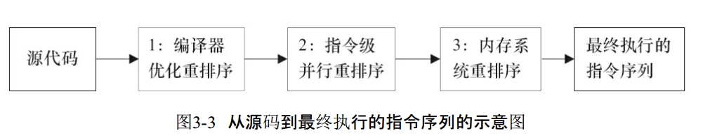

### volatile 关键字

Java语言是支持多线程的, 为了解决线程并发的问题, 在语言内部引入了 同步块 和 volatile 关键字机制;  
Java语言中的 volatile 变量可以被看作是一种 "程度较轻的 synchronized", 与 synchronized 块相比, volatile 变量所需的编码较少, 并且运行时开销也较少,   
但是它所能实现的功能也仅是synchronized 的一部分;  

volatile关键字的特点:  
1.. volatile 保证共享变量的可见性;  
当一个共享变量被volatile修饰时, 它会保证修改的值, 会立即从工作内存更新到主存, 当有其他线程需要读取时, 它会去内存中读取新值;  
而普通的共享变量不能保证可见性, 因为普通共享变量被修改之后, 什么时候被写入主存是不确定的, 当其他线程去读取时, 此时内存中可能还是原来的旧值, 因此无法保证可见性;  
另外, 通过 synchronized 和 Lock 也能够保证可见性, synchronized 和 Lock 能保证同一时刻, 只有一个线程获取锁, 然后执行同步代码, 并且在释放锁之前, 会将对变量的修改刷新到主存当中;  
volatile变量规则: 对一个变量的写操作, 先行发生于, 后面对这个变量的读操作;  
###  指令排序  
指令排序, 是为了使处理器内部的运算器, 能够被充分利用, 处理器可能会对, 输入指令, 进行重排, 优化执行效率;  

```
int a = 10;    // 语句1  
int r = 2;    // 语句2  
a = a + 3;    // 语句3  
r = a*a;     // 语句4  
```
这个时候会指令排序吗?  
当然不会了,  因为 他们有相互依赖的关系, 质量排序, 只是机器优化, 提高运行效率, 并不会改变其运行结果;  

在执行程序时, 为了提高性能, 编译器和运算器, 常常会对指令重新排序  
1.. 编译器优化的重排序;  
      编译器在不改变单线程程序语义的前提下, 可以重新安排语句的执行顺序;  
2.. 指令级并行的重排序;  
      现代处理器, 采用了指令级并行技术, 来将多条指令重叠执行;  
      如果不存在数据依赖性, 处理器可以改变语句对应机器指令的执行顺序;  
3.. 内存系统的重排序;  
      由于处理器使用缓存, 和读写缓冲区, 这使得加载和存储操作, 看上去可能是在乱序执行;  

深入理解JVM, 对指令排序的描述  
除了增加高速缓存之外, 为了使得处理器内部的运算单元能尽量被充分利用, 处理器可能会对输入代码进行乱序执行(Out-Of-Order Execution)优化,   
处理器会在计算之后将乱序执行的结果重组, 保证该结果与顺序执行的结果是一致的, 但并不保证程序中各个语句计算的先后顺序与输入代码中的顺序一致,   
因此, 如果存在一个计算任务依赖另外一个计算任务的中间结果, 那么其顺序性并不能靠代码的先后顺序来保证;   
与处理器的乱序执行优化类似, Java虚拟机的即时编译器中也有类似的指令重排序(Instruction Reorder)优化;  
  

❀ as-if-serial语义  
不管怎么重排序(编译器和处理器为了提高并行度), (单线程)程序的执行结果不能被改变;  
编译器, runtime和处理器都必须遵守as-if-serial语义;  
为了遵守as-if-serial语义, 编译器和处理器不会对存在数据依赖关系的操作做重排序, 因为这种重排序会改变执行结果;  
但是, 如果操作之间不存在数据依赖关系, 这些操作就可能被编译器和处理器重排序;  

3.. volatile并不能保证操作的原子性;  
4.. 单独使用 volatile 还不足以实现计数器, 互斥锁;  

要使 volatile 变量提供理想的线程安全, 必须同时满足下面两个条件:    
1.. 对变量的写操作不依赖于当前值;  
2.. 该变量没有包含在具有其他变量的不变式中;  

第一个条件的限制使 volatile 变量不能用作线程安全计数器;  
虽然增量操作(x++)看上去类似一个单独操作,   实际上它是一个由读取－修改－写入操作序列组成的组合操作,   
必须以原子方式执行, 而 volatile 不能提供必须的原子特性;实现正确的操作需要使 x 的值在操作期间保持不变, 而 volatile 变量无法实现这点;  
然而, 如果将值调整为只从单个线程写入, 那么可以忽略第一个条件;  
在目前大多数的处理器架构上, volatile 读操作开销非常低 —— 几乎和非 volatile 读操作一样;而 volatile 写操作的开销要比非 volatile 写操作多很多,   
因为要保证可见性需要实现内存界定(Memory Fence), 即便如此, volatile 的总开销仍然要比锁获取低;  
volatile 操作不会像锁一样造成阻塞, 因此, 在能够安全使用 volatile 的情况下, volatile 可以提供一些优于锁的可伸缩特性;  
如果读操作的次数要远远超过写操作, 与锁相比, volatile 变量通常能够减少同步的性能开销;    

[volatile 示例](volatile_sample.md)    
状态标志  
一次性安全发布   

### 参考   
https://github.com/LRH1993/android_interview/blob/master/java/concurrence/volatile.md  
http://www.cnblogs.com/dolphin0520/p/3920373.html  
http://www.importnew.com/27002.html  
https://www.cnblogs.com/paddix/p/5428507.html  
https://juejin.im/post/59db333b6fb9a00a69752a39  
https://juejin.im/post/5b722dd4f265da27e6334924  
