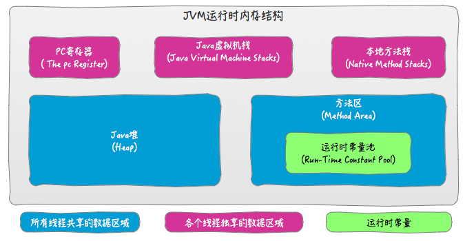

java 内存结构, java 内存模型, java 对象模型;  
  
  
  

Java 内存模型(JMM);  volatile 关键字;  
[链接](jvm/jmm_concept.md)  

对象的创建;  对象的内存布局;  Java 对象结构; 类加载的生命周期;  类加载器 ClassLoader, 与双亲委派模型;  
[链接](jvm/object_info.md)  

垃圾收集算法; 可达性分析算法;  垃圾收集器;  GC Roots;  JVM 怎么判断对象是否已死;  
finalize;  内存分配与回收策略;  手动尝试垃圾回收;  
[链接](jvm/garbage_collection.md)  

### 对象引用  
❀ 对象引用  
当前讨论现象, 建立在一个对象是 gc root 可达;  
强引用: 就是指在程序代码之中普遍存在的, 类似 "Object obj = new Object()" 这类的引用, 只要一个对象是 gc root 可达, 并且存在强引用, 垃圾收集器永远不会回收掉被引用的对象;  
软引用: 只要一个对象是 gc root 可达, 不存在强引用(对象引用置为 null), 存在软引用可达, 则内存空间足够, 垃圾回收器就不会回收它;  
              如果内存空间不足了, 就会回收这些对象的内存, 只要垃圾回收器没有回收它, 该对象就可以被程序使用, 软引用可用来实现内存敏感的高速缓存;  
弱引用: 只要一个对象是 gc root 可达, 不存在强引用(对象引用置为 null) 和 弱引用(对象引用置为 null), 存在软引用可达, 当垃圾收集器工作时,  
              无论当前内存是否足够, 都会回收掉只被弱引用关联的对象;  
虚引用: 只要一个对象是 gc root 可达, 并且只存在虚引用, 无法通过虚引用来取得一个对象实例;  
              为一个对象设置虚引用的唯一目的就是能在这个对象被收集器回收时刻得到一个系统通知;  

### java 内存结构  
JVM 运行时数据区域:  程序计数器, Java 虚拟机栈, 本地方法栈, Java 堆(Heap), 方法区(Method Area), 直接接内存;  

#### 程序计数器 (Program Counter Register)  

程序计数器:  
程序计数器是一块较小的内存空间, 它可以看作是, 当前线程所执行的字节码, 的行号指示器;  
在 Java 虚拟机的概念模型里, 字节码解释器, 工作时, 就是通过改变这个计数器的值, 来选取下一条, 需要执行的字节码指令;  
在执行所有的操作, 包括异常处理, 线程恢复等, 都需要依赖这个计数器来完成;  

程序计数器 与 多线程:  
由于 Java 虚拟机的多线程, 是通过线程轮流切换, 并分配处理器的执行时间, 来实现的, 在任意时刻, 一个处理器(对于多核而言就是一个内核),  
都只会执行一条指令(一个线程), 因此, 为了线程切换后能恢复到, 正确的执行位置, 每一条线程都需要, 有一个独立的程序计数器,  
各各线程之间的计数器, 互不影响, 独立存储, 属于 "线程私有" 内存;  

如果线程正在执行的是一个 Java 方法, 这个计数器记录的, 是正在执行的, 虚拟机字节码指令的地址;  
如果正在执行的是 Native 方法, 这个计数器值则为空(Undefined);  
此内存区域是, 唯一一个在 Java 虚拟机规范中, 没有规定任何 OutOfMemoryError 情况的区域;  

#### Java.虚拟机栈 (Java Virtual Machine Stacks)  
与程序计数器一样, Java 虚拟机栈(Java Virtual Machine Stacks), 也是线程私有的, 它的生命周期与线程相同;  
每个方法被执行的时候, 都会创建一个栈帧(Stack Frame), 用于存储: 局部变量表, 操作数栈, 动态连接, 方法返回地址等信息;  
每一个方法的执行过程, 就对应着一个栈帧, 的入栈和出栈的过程;  

局部变量表:  
局部变量表存放了, 编译期可知的, 各种基本数据类型, 对象的引用(指针);  
局部变量表用于存放方法参数和方法内部定义的局部变量;  
局部变量表所需的内存空间, 在编译期间完成分配, 在方法运行期间不会改变;  
其中 64 位长度的 long 和 double 类型的数据, 会占用 2 个局部变量空间(Slot), 其余的数据类型只占用 1 个;  

操作数栈:  
当一个方法刚执行的时候, 这个方法的操作数栈是空的, 在方法执行的过程中, 会有各种指令进行, 入栈和出栈;  

动态连接:  
每个栈帧都包含一个, 指向运行时常量池中, 该栈帧所属的方法的引用, 持有这个引用, 是为了支持方法在调用过程中的动态链接(Dynamic Linking);  
动态链接, 是把符号形成的方法调用, 翻译成实际的方法调用, 装在必要的, 类解释还没有定义的符号;  
并把变量访问编译成, 与这些变量运行时, 的存储结构相应的偏移地址;  

返回地址:  
当一个方法开始执行后, 只有两种方式可以退出这个方法:  
第一种方式是, 执行引擎遇到任意一个, 方法返回的字节码指令, 这时候可能会有返回值, 传递给上层的方法调用者;  
是否有返回值和返回值的类型, 将根据遇到方法返回指令来决定, 这种退出方法的方式称为正常完成出口;  
另外一种退出方式是, 在方法执行过程中遇到了异常, 并且这个异常, 没有在方法体内得到处理;  
无论是 Java 虚拟机内部产生的异常, 还是代码中, 使用 throw 字节码指令产生的异常, 只要在本方法, 的异常表中, 没有搜索到匹配的异常处理器, 就会导致方法退出;  
这种退出方法的方式, 称为异常完成出口, 一个方法使用异常完成出口的方式退出, 是不会给它的上层调用者产生任何返回值的;  
无论采用何种退出方式, 在方法退出之后, 都需要返回到方法被调用的位置, 程序才能继续执行;  
方法返回时, 可能需要在栈帧中保存一些信息, 用来帮助恢复它的上层方法的执行状态;  
一般来说, 方法正常退出时, 调用者的 PC 计数器的值, 可以作为返回地址, 栈帧中很可能会保存这个计数器值;  
而方法异常退出时, 返回地址, 是要通过异常处理器表来确定的, 栈帧中一般不会保存这部分信息;  
方法退出的过程, 实际上就等同于把当前栈帧出栈, 因此退出时可能执行的操作有:  
恢复上层方法的, 局部变量表和操作数栈;  
把返回值(如果有的话), 压入调用者栈帧的操作数栈中;  
调整 PC 计数器的值, 指向方法调用指令, 后面的一条指令等;  

#### 本地方法栈  
本地方法栈(Native Method Stacks), 与虚拟机栈所发挥的作用是非常相似的,  
其区别不过是, 虚拟机栈为虚拟机执行 Java 方法(也就是字节码)服务, 而本地方法栈, 则是为虚拟机使用到的 Native 方法服务;  
本地方法栈区域, 也可能会抛出 StackOverflowError 和 OutOfMemoryError 异常;  

#### Java 堆(Heap)  
对于大多数应用来说, Java 堆是 Java 虚拟机所管理的内存中, 最大的一块, Java 堆是被所有线程共享的一块内存区域;  
在虚拟机启动时, 创建此内存区域的唯一目的, 就是存放对象实例, 几乎所有的对象实例, 以及数组都在这里分配内存;  

Java 堆是垃圾收集器管理的主要区域, 现在的垃圾收集器, 基本都是采用的分代收集算法, 所以 Java 堆中还可以细分为:  
年轻代, 年老代, 持久代;  
新生对象被分配到 Young Generation 的 Eden 区, 大对象直接被分配到 Old Generation;  
Java 堆可以处于, 物理上不连续的内存空间中, 只要逻辑上是连续的即可;  
如果在堆中没有内存完成实例分配, 并且堆也无法再扩展时, 将会抛出 OutOfMemoryError 异常;  

#### 方法区(Method Area)  
与 Java 堆一样, 是线程间共享的内存区域, 它用于存储已被虚拟机加载的, 类信息, 常量, 静态变量, 即时编译器, 编译后的代码等数据;  
Java 虚拟机规范对这个区域, 的限制非常宽松, 除了和 Java 堆一样不需要连续的内存, 可以选择固定大小或者可扩展外, 还可以选择不实现垃圾收集;  
相对而言, 垃圾收集行为在这个区域是比较少出现的, 但并非数据进入了方法区就如永久代的名字一样 "永久" 存在了;  
这个区域的内存回收目标, 主要是针对常量池的回收, 和对类型的卸载, 一般来说这个区域的回收 "成绩" 难以令人满意, 尤其是类型的卸载, 条件相当苛刻;  
但是这部分区域, 的回收确实是有必要的;  
根据 Java 虚拟机规范的规定, 当方法区无法满足内存分配需求时, 将抛出 OutOfMemoryError 异常;  

❀ 运行时常量池(Runtime Constant Pool)  
运行时常量池, 是方法区的一部分, 用于存放编译期生成的, 各种字面量和符号引用(类和方法的符号引用), 这部分内容将在类加载后存放;  
Java 虚拟机对 Class 文件每一部分(包括常量池)的格式都有严格规定:  
一般来说, 除了保存 Class 文件中描述的符号引用外, 还会把翻译出来的直接引用, 也存储在运行时常量池中;  
运行时常量池, 相对于 Class 文件常量池, 的另外一个重要特征是具备动态性, 运行期间也可能将新的常量放入池中;  
这种特性被开发人员利用得比较多的, 便是 String 类的 intern()方法;  
既然运行时常量池是方法区的一部分, 自然受到方法区内存的限制, 当常量池无法再申请到内存时会抛出 OutOfMemoryError 异常;  

#### 直接内存(DirectMemory)  
直接内存(Direct Memory)并不是虚拟机运行时数据区的一部分, 也不是 Java 虚拟机规范中定义的内存区域;  
但是这部分内存也被频繁地使用, 而且也可能导致 OutOfMemoryError 异常出现,  
在 JDK 1.4 中新加入了 NIO(New Input/Output)类, 引入了一种基于通道(Channel)与缓冲区(Buffer)的 I/O 方式,  
它可以使用 Native 函数库直接分配堆外内存, 然后通过一个存储在 Java 堆中的 DirectByteBuffer 对象作为这块内存的引用进行操作;  
这样能在一些场景中显著提高性能, 因为避免了在 Java 堆和 Native 堆中来回复制数据;  
显然, 本机直接内存的分配不会受到 Java 堆大小的限制, 但是, 既然是内存, 肯定还是会受到本机总内存大小以及处理器寻址空间的限制;  
服务器管理员在配置虚拟机参数时, 会根据实际内存设置-Xmx 等参数信息, 但经常忽略直接内存,  
使得各个内存区域总和大于物理内存限制(包括物理的和操作系统级的限制), 从而导致动态扩展时出现 OutOfMemoryError 异常;  

### Class 类文件结构  
魔数, Class 文件版本, 常量池, 访问标志, 类-父类-接口索引集合, 字段表集合, 方法表集合, 属性表集合;  
Class 文件是一组, 以一个字节(8 位)为基础单位的二进制流, 各个数据项目严格按照顺序紧凑地排列在 Class 文件之中, 中间没有添加任何分隔符,  
当遇到需要占用 8 位字节以上空间的数据项时, 则会按照高位在前的方式分割成若干个 8 位字节进行存储;  
根据 Java 虚拟机规范的规定, Class 文件格式采用一种类似于 C 语言结构体的伪结构来存储数据, 这种伪结构中只有两种数据类型: 无符号数和表;  

魔数与 Class 文件版本  
每个 Class 文件的头 4 个字节称为魔数(Magic Number), 它的唯一作用是确定这个文件是否为一个能被虚拟机接受的 Class 文件;  
很多文件存储标准中都使用魔数来进行身份识别, 譬如图片格式, 如 gif 或者 jpeg 等在文件头中都存有魔数;  
使用魔数而不是扩展名来进行识别, 主要是基于安全方面的考虑, 因为文件扩展名可以随意地改动;  
文件格式的制定者可以自由地选择魔数值, 只要这个魔数值还没有被广泛采用过同时又不会引起混淆即可;  
紧接着魔数的 4 个字节存储的是 Class 文件的版本号,  高版本的 JDK 能向下兼容以前版本的 Class 文件, 但不能运行以后版本的 Class 文件;  

常量池  
在 Class 文件版本号之后, 是常量池, 常量池可以理解为 Class 文件中的资源仓库, 常量池中的常量的数量不固定, 但是常量池入口会声明常量的数量;  
常量池中主要存放两大类常量: 字面量(Literal), 和符号引用(Symbolic References);  
字面量比较接近于 Java 语言层面的常量概念, 如文本字符串,  声明为 final 的常量值等;  
符号引用则属于编译原理方面的概念, 包括了下面三类常量:  
类和接口的全限定名(Fully Qualified Name);  
字段的名称和描述符(Descriptor);  
方法的名称和描述符(Descriptor);  
Java 代码子进行编译的时候, 并不是会像 C++ 那样有'连接'这一步, 而是在虚拟机加载 Class 文件的时候进行动态连接;  
也就是说, Class 文件不会保存方法和字段的最终内存信息, 当虚拟机运行时, 需要从常量池中获取到符号引用, 在类创建或者运行时经过解析得到真正的内存地址;  
符号引用, 用一组符号来描述所引用的目标, 符号可以是任何形式的字面量, 只要使用时能无歧义的定位到目标即可;  
符号引用与虚拟机实现的内存布局无关, 引用的目标并不一定已经加载到内存;  
各个虚拟机实现的内存布局可以不相同, 但是他们接受的符号引用必须一致;  
直接引用是可以直接指向目标的指针, 相对偏移量或者间接定位到目标的句柄;  
直接引用的实现是和虚拟机实现的内存布局相关的, 同一个符号引用在不同虚拟机上翻译出来的直接引用一般不相同;  
如果有了直接引用, 那么引用的目标必定在内存中已存在;  

访问标志  
在常量池结束之后, 紧接着的两个字节代表访问标志(access_flags), 这个标志用于识别一些类或者接口层次的访问信息,  
包括: 这个 Class 是类还是接口, 是否定义为 public 类型, 是否定义为 abstract 类型, 如果是类的话, 是否被声明为 final 等;  

类索引, 父类索引与接口索引集合  
Class 文件中由这三项数据来确定这个类的继承关系; 类索引用于确定这个类的全限定名, 父类索引用于确定这个类的父类的全限定名;  
由于 Java 语言不允许多重继承, 所以父类索引只有一个;  
除了 java.lang.Object 之外, 所有的 Java 类都有父类;  
接口索引集合就用来描述这个类实现了哪些接口, 这些被实现的接口将按 implements 语句后的接口顺序, 从左到右排列在接口索引集合中;  

字段表集合  
字段表(field_info)用于描述接口或者类中声明的变量, 字段(field)包括类级变量以及实例级变量, 但不包括在方法内部声明的局部变量;  
字段信息包括: 作用域(private, public 等), 是否有 static 修饰, 是否有 final 修饰, 等等;  

方法表集合  
方法表的结构如同字段表一样, 依次包括了:  
访问标志(access_flags),  名称索引(name_index),  描述符索引(descriptor_index),  属性表集合(attributes)  

属性表集合  
Class 文件, 字段表, 方法表, 都可以携带自己的属性表集合;  
如果字段有额外信息, 会在 attributes 里面出现;  
1.. Code 属性  
Java 程序方法体中的代码, 经过 javac 编译之后, 最终会变成字节码指令, 存储在 attributes 的 Code 属性里面;  
2.. Exceptions 属性  
列举出方法中可能抛出受检异常, 也就是在 throws 之后列举出来的异常;  
3.. LineNumberTable 属性  
用于描述 java 源代行号与字节码行号之间的对应关系;  
它并不是运行时必须的属性, 但是默认情况下会生成到 class 文件中, 也可以在 javac 添加属性 -g:none 选项来取消这项信息;  
如果没有 LineNumberTable 并不会影响程序运行, 只是在产生异常时, 堆栈信息中并不会打印行号, 也无法进行断点调试;  
4.. LocalVariableTable 属性  
用于描栈帧中的, 局部变量表中的变量与 java 源码中定义的变量的关系;  
它也不是运行时必须的属性, 但是默认情况下会生成到 class 文件中, 也可以在 javac 添加属性 -g:none 选项来取消这项信息;  
如果没有这个属性, 并不会影响程序的运行, 只不过是方法的名称和参数的名称会丢失;  
5.. SourceFile 属性  
用于记录生成这个 class 文件的源文件的名称;  
它也不是运行时必须的属性, 但是默认情况下会生成到 class 文件中, 也可以在 javac 添加属性 -g:none 选项来取消这项信息;  
如果没有 SourceFile 属性并不会影响程序运行, 只是在产生异常时, 堆栈信息中并不会显示错误代码所属的源文件名称;  
6.. ConstantValue 属性  
用于通知虚拟自动为静态变量赋值, 只有被 static 关键字修饰的变量才会用到这个属性;  
7.. InnerClass 属性  
用于记录内部类和宿主类之间的关联;  
如果一个类中定义类内部类, 那么编译器会为它和它所包含的内部类生成 InnerClass 属性;  
内部类的访问标志有, 是否为 public , private, 是否为 static, 是否为 final,  是否为接口, 是否为 abstract, 是否为注解, 是否为枚举, 是否为用户代码产生;  
8.. Deprecated 和 Synthetic 属性  
Deprecated 用于标记某个类, 方法, 字段是否被作者标记为不再推荐使用;  
Synthetic 是用于标记某个类, 方法, 字段, 是不是由编辑器自动生成的;  
9.. StackMapTable 属性  
它是一个复杂的变长的属性, 会在虚拟机加载字节码校验阶段被新类型的检查验证器使用, 目的在于代替比较消耗性能的基于数据流分析的类型推导验证器;  
10.. Signature 属性  
主要用于记录泛型签名信息, 它是一个可选的定长属性, 可以出现在类, 字段, 方法表结构的属性表中;  
11.. BootstrapMethods 属性  
它是一个复杂的变长属性,  

### 参考  
http://www.importnew.com/17770.html  
http://www.cnblogs.com/dingyingsi/p/3760447.html  
http://www.cnblogs.com/dingyingsi/p/3760730.html  
https://github.com/LRH1993/android_interview/blob/master/java/virtual-machine/Garbage-Collector.md  
http://blog.csdn.net/ns_code/article/details/17565503  
https://juejin.im/post/5b8f7e43f265da0afe62b9f8  
https://blog.csdn.net/qq_26222859/article/details/73135660  
https://blog.csdn.net/vegetable_bird_001/article/details/51278339  
https://juejin.im/post/5c6b987ae51d45362c3631ca  
https://juejin.im/post/5d4789afe51d453b386a62ac  

垃圾回收  
https://www.ibm.com/developerworks/cn/java/j-lo-JVMGarbageCollection/index.html  

class 文件结构  
http://www.it610.com/article/5901050.htm  
https://yq.aliyun.com/articles/663999  

