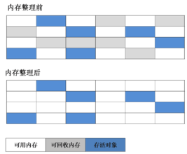
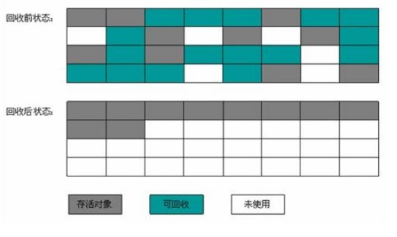

### 垃圾收集算法

标记-清除算法、标记-整理算法、复制算法、分代收集算法   

◆ 标记-清除算法  
最基础的收集算法是“标记-清除”（Mark-Sweep）算法，如同它的名字一样，算法分为“标记”和“清除”两个阶段。  
首先标记出所有需要回收的对象 ，在标记完成后统一回收所有被标记的对象。  
不足：  
效率问题：标记和清除两个过程的效率都不高  
空间问题：标记清除之后产生大量不连续的内存碎片，空间碎片太多可能会导致以后程序运行过程中需要分配较大对象时，
无法找到足够的连续内存而不得不提前触发另一次垃圾收集动作。  

  

◆ 标记-整理算法  
复制收集算法在对象存活率较高时，就要进行较多的复制操作，效率就会变低。 根据老年代的特点，提出了”标记-整理“算法。   
标记过程仍然与”标记-清除“算法一样，但后续步骤不是直接对可回收对象进行清理，而是让所有存活的对象都向一端移动，然后直接清理掉边界以外的内存。  

  
  
◆ 复制算法  
目的：为了解决效率问题。  
将可用内存按容量大小划分为大小相等的两块，每次只使用其中的一块。当一块内存使用完了，就将还存活着的对象复制到另一块上面，  
然后再把已使用过的内存空间一次清理掉。这样使得每次都是对整个半区进行内存回收，内存分配时也就不用考虑内存碎片等复杂情况。
缺点：将内存缩小为了原来的一半。  

  

现代的商业虚拟机都采用这种收集算法来回收新生代，IBM公司的专门研究表明，新生代中对象98%对象是“朝生夕死”的，  
所以不需要按照1：1的比例来划分内存空间，而是将内存分为较大的Eden空间和两块较小的Survivor空间，每次使用Eden和其中一块Survivor。  
HotSpot虚拟机中默认Eden和Survivor的大小比例是8：1。  

####  分代收集算法

一般是把Java堆分为新生代和老年代，这样就可以根据各个年代的特点采用最适当的收集算法。  
在新生代中，每次垃圾收集时都发现有大批对象死去，只有少量存活，那就选用复制算法。  
在老年代中，因为对象存活率高、没有额外空间对它进行分配担保，就必须采用“标记-清除”或“标记-整理”算法来进行回收。  

Java虚拟机的堆内存共划分为：年轻代（Young Generation）、年老代（Tenured Generation）、持久代（Permanent Generation）;    
年轻代和年老代的划分，对垃圾回收影响比较大；  
新生对象被分配到 Young Generation 的 Eden 区，大对象直接被分配到 Tenured Generation；  

所谓的大对象是指，需要大量连续内存空间的Java对象，最典型的大对象就是那种很长的字符串以及数组。  
 
◆ 年轻代  
所有新生成的对象，首先都是放在年轻代 Eden 区，目的就是快速回收掉短命的对象，年轻代分为：  
1个Eden区和2个Survivor区（分别叫from和to），默认比例为8：1；

一般情况下，新创建的对象都会被分配到Eden区，这些对象经过第一次Minor GC后，如果仍然存活，将会被移到Survivor区。  
对象在Survivor区中每熬过一次Minor GC，年龄就会增加1岁，当它的年龄增加到一定程度时，就会被移动到年老代中。   
因为年轻代中的对象大多数都很快被回收，所以在年轻代的垃圾回收算法使用的是复制算法，复制算法的基本思想就是将内存分为两块，
每次只用其中一块，当这一块内存用完，就将还活着的对象复制到另外一块上面。复制算法不会产生内存碎片。
在GC开始的时候，对象只会存在于Eden区和名为“From”的Survivor区，Survivor区“To”是空的。紧接着进行GC，Eden区中所有存活的对象都会被复制到“To”，  
而在“From”区中，仍存活的对象会根据他们的年龄值来决定去向。年龄达到一定值(年龄阈值，可以通过-XX:MaxTenuringThreshold来设置)的对象会被移动到年老代中，  
没有达到阈值的对象会被复制到“To”区域。经过这次GC后，Eden区和From区已经被清空。这个时候，“From”和“To”会交换他们的角色，也就是新的“To”就是上次GC前的“From”，  
新的“From”就是上次GC前的“To”。不管怎样，都会保证名为To的Survivor区域是空的。Minor GC会一直重复这样的过程，直到“To”区被填满，  
“To”区被填满之后，会将所有对象移动到年老代中。  

◆ 年老代  
在年轻代中经历了N次垃圾回收后仍然存活的对象，就会被放到年老代中。因此，可以认为年老代中存放的都是一些生命周期较长的对象。

◆ 持久代    
用于存放静态文件，如今Java类、方法等。持久代对垃圾回收没有显著影响，但是有些应用可能动态生成或者调用一些class，例如Hibernate等，  
在这种时候需要设置一个比较大的持久代空间来存放这些运行过程中新增的类。持久代大小通过-XX:MaxPermSize=<N>进行设置。  

◆ 参考  
http://www.importnew.com/26821.html  
