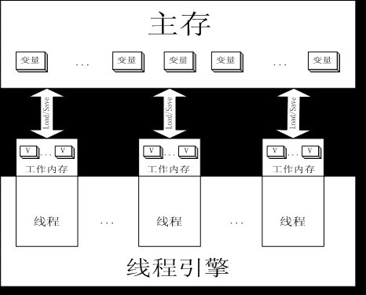

### 基本概念

JMM(Java Memory Model ,JMM)定义了线程和主存之间的抽象关系;  
Java内存模型就是一种符合内存模型规范的, 屏蔽了各种硬件和操作系统的访问差异的, 保证了Java程序在各种平台下对内存的访问都能保证效果一致的机制及规范。  
JMM是一种规范, 目的是解决由于多线程通过共享内存进行通信时, 存在的本地内存数据不一致、编译器会对代码指令重排序、处理器会对代码乱序执行等带来的问题。  
Java内存模型规定了所有的变量都存储在主内存中, 每条线程还有自己的工作内存, 线程的工作内存中保存了该线程中是用到的变量的主内存副本拷贝,   
线程对变量的所有操作都必须在工作内存中进行, 而不能直接读写主内存。不同的线程之间也无法直接访问对方工作内存中的变量,   
线程间变量的传递均需要自己的工作内存和主存之间进行数据同步进行。  

❀ 什么是内存模型  
内存模型描述了程序中各个变量(实例域、静态域和数组元素)之间的关系, 以及在实际计算机系统中将变量存储到内存和从内存中取出变量这样的底层细节,   
对象最终是存储在内存里面的, 这点没有错, 但是编译器、运行库、处理器或者系统缓存可以有特权在变量指定内存位置存储或者取出变量的值。  
JMM, Java Memory Model的缩写, 允许编译器和缓存以数据在处理器特定的缓存(或寄存器)和主存之间移动的次序拥有重要的特权,   
除非程序员使用了final或synchronized明确请求了某些可见性的保证。  

❀ Java内存模型的目的  
屏蔽掉各种硬件和操作系统的内存访问差异, 以实现让java程序在各种平台下都能达到一致的内存访问效果。  
定义程序中各个变量的访问规则, 即在虚拟机中将变量存储到内存和从内存中取出变量这样的底层细节。  
此处的变量与Java变成中所说的变量是有所区别, 它包括了实例字段, 静态字段和构成数组对象的元素, 但不包括局部变量和方法参数。  

❀ JMM 结构 的介绍  
JVM 中存在一个主存(Main Memory 或 Java Heap Memory), Java 中所有的变量, 都会存在内存中, 对于所有线程进行共享,   
而每个线程有存在自己的, 工作内存(Working Memory), 工作内存中保存的是, 主存中某些变量的备份;  
线程对所有变量的操作, 并非发生在主存中, 而是发生在工作内存中, 线程之间不能直接访问工作内存, 变量在程序中的传递, 是依赖主存完成的;  
在当今多核处理器中, 大部分数据存储在, 高速缓存中;
synchronized 和 volatile 关键字提供内存模型中的可见性, 是使用一些特殊指令来刷新缓存, 刷新硬件缓存, 延时执行功能操作, 无疑会对程序的性能, 产生一点的影响;  
  

为什么要有工作内存和主存  
工作内存用到的共享变量, 只是对主存的拷贝;  
工作内存对共享变量的修改, 只是少量的;  
工作内存所产生的变量, 大多数跟随线程的生命周期而销毁;  
工作内存对主存共享变量的修改, 需要特殊处理;  
大多数情况下, 线程之间的通信, 需要控制的变量, 不是很多;  
颗粒度更细致, 更方便管理;  

### 可见性(visibility)  
所有的变量, 都存储在主存中(虚拟机内存的一部分), 对于所有线程都是共享的;  
每条线程, 都有自己的工作内存, 工作内存中保存的是, 主存中某些变量的拷贝, 线程对变量的所有操作, 都是在工作内存中进行, 而不是直接读写主内存中的变量;  
JMM 在默认情况下, 不会处理, 各个线程对同一内存区域的可见性, 因此需要去手动实现;  
JMM 内存模型里面, 并发线程修改全局变量的时候, 必须将变量同步到内存后, 其他线程才能正确访问到;  
当一个线程需要修改, 另一个线程的, 可见单元的时候, 必须遵循以下原则:  
1.. 一个写入操作的同步锁, 和紧随其后, 进行读取的同步锁, 是同一个;  
2.. 一旦某个字段, 被声明为 volatile, 任何写操作会, 立刻将其同步到主存, 而不是只缓存在工作内存中;  
### 原子性  

什么是原子性?  
即一个操作或者多个操作 要么全部执行并且执行的过程不会被任何因素打断, 要么就都不执行。  

JMM规定的原子性有哪些？  
在Java中, 只有 对基础数据类型的变量 的 直接读写操作, 是 原子性操作;  
例如:  
int x, y;    
x = 10;  //语句1  
y = x;  //语句2  
x++;  //语句3  
x = x+1;  //语句4  
以上只有 语句1  的操作时原子性的, 是属于对基础数据类型的 直接读写操作;    
语句2  有两步操作:读取x数值, 写入y的数值;  
语句3  有两步操作的, 读取x的数值, 写入新的数值;  
语句4  有两步操作的, 读取x的数值, 写入新的数值;  

在Java中, JMM保证的原子性操作, 范围非常小, 如果要实现更大范围的原子性操作, 可以通过 synchronized 或者 lock 来实现;  
由于 synchronized 和 lock 能够在保证在某一时刻, 只有一个线程执行该代码块, 故此操作不会出现并发修改的问题, 从而保证了原子性。  

JMM的原子性有一个规则, 如果在读取一个变量时, 这个数值是由某一个其他线程写入, 而不是由其他多个线程并发写入, 这个时候, JVM本身不需要关心数据是来自什么线程;  
原子性就是原子级别的操作, 比如最小内存块的读写操作, 可以理解为native的读写操作;  
JMM的原子性有一个规则, 如果在读取一个变量时, 这个数值是由某一个其他线程写入, 而不是由其他多个线程并发写入, 这个时候, JVM本身不需要关心数据是来自什么线程;  
原子性就是原子级别的操作, 比如最小内存块的读写操作, 可以理解为native的读写操作;  

❀ 可排序性  
排序性主要围绕 读写语句有关的序列, 如果在该模型内部使用了 一致的同步性 的时候, 这些属性都会遵循比较简单的原则:  
每个同步块内的任何变化都具备了原子性以及可见性, 每个同步块都有一个独立空间 以及独立的同步控制器 和 锁机制,   
然后对外按照JVM的执行指令进行数据的读写操作, 使得使用内存的过程变得非常严谨。  

❀ 关于主内存与工作内存之间具体的交互协议  
即一个变量如何从主内存拷贝到工作内存、如何从工作内存同步回主内存之类的实现细节, Java内存模型中定义了8种操作来完成, 并且每种操作都是原子的、不可再分的。
 
### happens before  
在JMM中, 如果一个操作执行的结果需要对另一个操作可见, 那么这两个操作之间必须要存在happens-before关系。  
这里提到的两个操作既可以是在一个线程之内, 也可以是在不同线程之间。  

A happens before B 意思就是 B 要能访问到A;  

注意点:  
两个操作之间具有happens-before关系, 并不意味着前一个操作必须要在后一个操作之前执行！  
happens-before仅仅要求前一个操作（执行的结果）对后一个操作可见, 且前一个操作按顺序排在第二个操作之前;  

❀ 八种操作:
lock: 作用于主内存的变量, 把一个变量标识为一条线程独占的状态;  
unlock: 作用于主内存的变量, 把一个处于锁定状态的变量释放出来;  
read: 把一个变量的值从主内存传输到工作内存中, 以便随后的load使用;  
load: 把read操作从主内存中得到的变量值放入到工作内存的变量副本中;  
use: 把工作内存中一个变量的值传递给执行引擎, 每当虚拟机遇到一个需要使用变量的值的字节码指令时将会执行这个操作;  
assign: 把一个从执行引擎中接收到的值赋值给工作内存中的变量, 每当虚拟机遇到一个给变量赋值的字节码指令时执行这个操作;  
store: 把工作内存中的一个变量的值传递到主内存, 以便随后的write使用;  
write: 把store操作从工作内存中得到的变量值放入到主内存的变量中;  

### 参考  
http://www.cnblogs.com/BangQ/p/4045954.html  
https://github.com/LRH1993/android_interview/blob/master/java/concurrence/volatile.md  
http://www.hollischuang.com/archives/2550  
https://juejin.im/post/5cad4adc5188251b1f4d87d2  
li