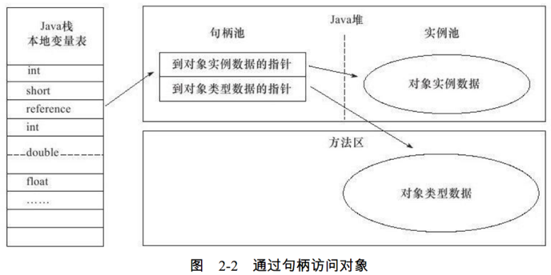
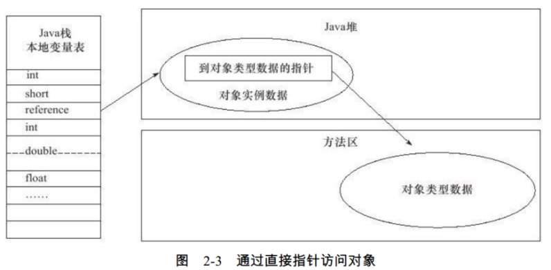
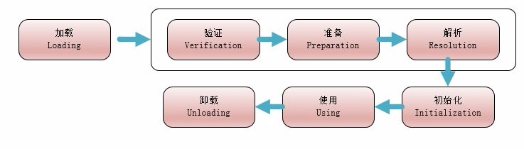
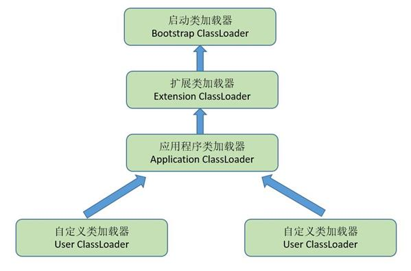

### 对象的创建  
❀ 加载类, 分配内存  
虚拟机遇到一条 new 指令时, 首先将去检查这个指令的参数, 是否能在常量池中定位到一个类的符号引用,  
并且检查这个符号引用代表的类是否已被加载,  解析和初始化过, 如果没有, 那必须先执行相应的类加载过程;  

在类加载检查通过后, 虚拟机将为新生对象分配内存, 并确定对象所需内存的大小,  
为对象分配空间的任务等同于把一块确定大小的内存从 Java 堆中划分出来;  

❀ 初始化对象信息  
接下来, 虚拟机要对对象进行必要的设置, 例如这个对象是哪个类的实例,  如何才能找到类的元数据信息,  
对象的哈希码,  对象的 GC 分代年龄等信息;这些信息存放在对象的对象头(Object Header)之中;  

❀ init 方法  
在上面工作都完成之后, 从虚拟机的视角来看, 一个新的对象已经产生了, 但从 Java 程序的视角来看,  
对象创建才刚刚开始--<init>方法还没有执行, 所有的字段都还为零;  
所以, 一般来说, 执行 new 指令之后会接着执行<init>方法,  
把对象按照程序员的意愿进行初始化, 这样一个真正可用的对象才算完全产生出来;  


### 对象的内存布局  
对象结构  
对象在内存中存储的布局, 可以分为 3 块区域:  
对象头(Header), 实例数据(Instance Data), 对齐填充(Padding);  

❀ 对象头  
jvm 中采用 2 个字来存储对象头, 其主要结构是由 Mark Word 和 Class Metadata Address 组成;  
1.. 第一部分用于存储对象自身的运行时数据,  
如哈希码(HashCode),  GC 分代年龄,  锁状态标志,  线程持有的锁,  偏向线程 ID,  偏向时间戳等,  
这部分数据的长度在 32 位和 64 位的虚拟机中分别为 32bit 和 64bit, 官方称它为"Mark Word";  
对象需要存储的运行时数据很多, 其实已经超出了 32 位, 64 位 Bitmap 结构所能记录的限度,  
但是对象头信息是与对象自身定义的数据无关的额外存储成本, 考虑到虚拟机的空间效率,  
Mark Word 被设计成一个非固定的数据结构以便在极小的空间内存储尽量多的信息,  
它会根据对象的状态复用自己的存储空间; 例如, 在 32 位的 HotSpot 虚拟机中,  
如果对象处于未被锁定的状态下, 那么 Mark Word 的 32bit 空间中的 25bit 用于存储对象哈希码,  
4bit 用于存储对象分代年龄, 2bit 用于存储锁标志位, 1bit 固定为 0;  

2.. 对象头的另外一部分是类型指针, 即对象指向它的类元数据的指针(Class Metadata Address);  
Class Metadata Address  类型指针指向对象的类元数据, JVM 通过这个指针确定该对象是哪个类的实例;  
虚拟机通过这个指针来确定这个对象是哪个类的实例;  
并不是所有的虚拟机实现都必须在对象数据上保留类型指针,  
换句话说, 查找对象的元数据信息并不一定要经过对象本身, 另外, 如果对象是一个 Java 数组,  
那在对象头中还必须有一块用于记录数组长度的数据,  
因为虚拟机可以通过普通 Java 对象的元数据信息确定 Java 对象的大小,  
但是从数组的元数据中却无法确定数组的大小;  

❀ 实例数据  
接下来的实例数据部分是对象真正存储的有效信息, 也是在程序代码中所定义的各种类型的字段内容;  
无论是从父类继承下来的, 还是在子类中定义的, 都需要记录起来;  
这部分的存储顺序会受到虚拟机分配策略参数(FieldsAllocationStyle)和字段在 Java 源码中定义顺序的影响;  
HotSpot 虚拟机默认的分配策略为:  
longs/doubles,  ints,  shorts/chars, bytes/booleans,  oops(Ordinary Object Pointers),  
从分配策略中可以看出, 相同宽度的字段总是被分配到一起; 在满足这个前提条件的情况下,  
在父类中定义的变量会出现在子类之前; 如果 CompactFields 参数值为 true(默认为 true),  
那么子类之中较窄的变量也可能会插入到父类变量的空隙之中;  

❀ 对齐填充  
第三部分对齐填充并不是必然存在的, 也没有特别的含义, 它仅仅起着占位符的作用;  
由于 HotSpot VM 的自动内存管理系统要求对象起始地址必须是 8 字节的整数倍, 换句话说,  
就是对象的大小必须是 8 字节的整数倍; 而对象头部分正好是 8 字节的倍数(1 倍或者 2 倍),  
因此, 当对象实例数据部分没有对齐时, 就需要通过对齐填充来补全;  

### 对象的访问定位  
在 Java 栈(Java 虚拟内存栈)的本地变量表中存储, 对象的引用; 而对象的访问形式取决于虚拟机的实现方式,  
目前主流的访问方式分为两种, 使用句柄 和 直接指针 两种;   

句柄访问方式  
Java 堆会划分出一块内存, 用来作为句柄池, 对象引用中存储着 对象的句柄池 的地址,  
而对象句柄中, 包含了对象实例数据的指针, 对象类型数据的指针;   
  

直接指针访问  
Java 堆对象的布局中就必须考虑如何放置访问类型数据的相关信息, 而对象引用中存储的直接就是对象地址  
  

二者比较  
这两种对象访问方式各有优势, 使用句柄来访问的最大好处就是,  
reference 中存储的是, 稳定的句柄地址, 在对象被移动(垃圾收集时移动对象是非常普遍的行为)时,  
只会改变句柄中的实例数据指针, 而 reference 本身不需要修改;   
使用直接指针访问方式的最大好处就是速度更快, 它节省了一次指针定位的时间开销,  
由于对象的访问在 Java 中非常频繁, 因此这类开销积少成多后也是一项非常可观的执行成本;   
就本书讨论的主要虚拟机 Sun HotSpot 而言, 它是使用第二种方式进行对象访问的,  
但从整个软件开发的范围来看, 各种语言和框架使用句柄来访问的情况也十分常见;   

### 类加载的生命周期  
加载, 验证, 准备, 解析, 初始化, 使用, 卸载;  
其中验证, 准备, 解析 3 个部分统称为连接;  
  

 触发类加载的条件  
1.. 遇到 new ,getstatic,putstatic 或 invokestatic 这 4 条字节码指令时, 如果类没有进行过初始化, 则需要先触发初始化;   
生成这 4 条指令的最常见的 Java 代码场景是: 使用 new 关键字实例化对象的时候, 读取或设置一个类的静态字段的时候 ,  
被 final 修饰, 已在编译期把结果放入常量池的静态字段除外, 以及调用一个类的静态方法的时候;   
2.. 使用 java.lang.reflect 包的方法对类进行反射调用的时候;   
3.. 当初始化一个类的时候, 发现其父类还没有进行过初始化, 则需要先出发父类的初始化;   
4.. 当虚拟机启动时, 用户需要指定一个要执行的主类(包含 main()方法的那个类), 虚拟机会先初始化这个主类;   
5.. 当使用 JDK1.7 的动态语言支持时, 如果一个 java.lang.invoke.MethodHandle 实例最后的解析结果 REF_getStatic,REF_putStatic,REF_invokeStatic 的方法句柄,  
     并且这个方法句柄所对应的类没有进行初始化, 则需要先出发初始化;   

类加载的具体过程  
❀ 加载  
1.. 通过一个类的全限定名来获取定义此类的二进制字节流;  
2.. 将这个字节流所代表的静态存储结构转换为方法区内的运行时数据结构;  
3.. 在内存中生成一个 代表这个类的 Class 对象, 作为方法区这个类的各种数据的访问入口;   

❀ 验证  
是连接阶段的第一步, 目的是为了确保 Class 文件的字节流中包含的信息符合当前虚拟机的要求, 并且不会危害虚拟机自身的安全;   
包含四个阶段的校验动作, 文件格式验证, 元数据验证, 字节码验证, 符号引用验证  
```
a. 文件格式验证  
验证字节流是否符合 Class 文件格式的规范, 并且能被当前版本的虚拟机处理;  
常量池中是否有不被支持的常量类型;  
指向常量池中的引用, 是否有指向不存在的, 或者不符合类型的;  
b. 元数据验证  
对类的元数据信息进行语义校验, 是否不存在不符合 Java 语言规范的元数据信息;  
这个类是否有父类, 除了 Object 类, 所有的类都有父类;  
这个类的弗雷, 是否继承了 final class;  
如果这个类不是抽象类, 是否实现了其父类或者接口要求的方法;  
这个类中的字段, 方法是否与父类产生矛盾, 例如错误的重载等;  
c. 字节码验证  
最复杂的一个阶段, 主要目的是通过数据流和控制流分析, 确定程序语义是合法的, 符合逻辑的;  
对类的方法体进行校验分析, 保证被校验类的方法在运行时不会做出危害虚拟机安全的事件;  
保证任意时刻, 操作数栈的数据类型, 与指令字节码序列都能配合工作;  
保证跳转指令不会跑到方法体以外;  
保证方法体内的类型转换都是有效的;  
d. 符号引用验证  
符号引用验证可以看作是对类自身以外的信息进行校验;  
通过全类名能否找到对应的类;  
在指定的类中是否存在合法的字段描述符, 以及简单名称描述的方法和字段;  
符号引用验证, 是为了确保解析动作能正常执行;  
```
❀ 准备  
准备阶段是正式为类变量, 分配内存并设置类变量初始值的阶段, 这些变量所使用的内存都将在方法区中分配, 只包括类变量, 而不包括实例变量;   

❀ 解析  
虚拟机将常量池内的符号引用替换为直接引用的过程;   
"动态解析" 的含义就是必须等到程序实际运行到这条指令的时候, 解析动作才能进行;  
相对的, 其余可触发解析的指令都是 "静态" 的, 可以在刚刚完成加载阶段, 还没有开始执行代码时就进行解析;   

❀ 初始化  
类加载过程中的最后一步;   
初始化阶段是执行类构造器<clinit>()方法的过程;   
<clinit>()方法是由编译器自动收集类中的所有类变量的赋值动作和静态语句块中的语句合并产生的;   
<clinit>()与类的构造函数不同, 它不需要显示地调用父类构造器, 虚拟机会保证在子类的<clinit>()方法执行之前, 父类的<clinit>()方法已经执行完毕;   
简单地说, 初始化就是对类变量进行赋值及执行静态代码块;   
虚拟机会保证一个类的<clinit>()方法在多线程环境中, 被正确的枷锁, 同步, 如果多线程同时会初始化一个类, 那么只会有一个线程去执行这个类的<clinit>()方法,  
其他线程都需要阻塞等待, 直到活动线程执行完<clinit>()方法, 如果一个类的<clinit>()方法耗时很长, 就可能造成多个线程阻塞;  
在活动线程执行完<clinit>()方法, 其他线程被唤醒之后, 不会再次进入<clinit>()方法, 同一个类加载器下, 一个类只会被初始化一次;  

### ClassLoader  
```
java.lang.ClassLoader  
   | java.security.SecureClassLoader  
       | sun.plugin.javascript.JSClassLoader  
       | java.net.URLClassLoader  
           | sun.misc.Launcher.AppClassLoader  
           | sun.misc.Launcher.ExtClassLoader  
```
JVM 存在两种不同的类加载器:  
一种是 启动类加载器(Bootstrap Classloader), 这个类加载器使用 C++语言实现, 是 JVM 自身的一部分;  
一种是 其他类加载器, 这些类加载器都是 Java 语言实现的, 独立于 JVM 之外, 并且全部继承于 ClassLoader ;  
常用类加载器:  
启动类加载器(Bootstrap ClassLoader)  这个类 加载 放在 JAVA_HOME/lib 下的 class 文件;  
扩展类加载器(Extension ClassLoader)这个加载器由 sun.misc.Launcher$ExtClassLoader 实现, 负责加载 放在 JAVA_HOME\lib\ext 下的 class 文件;  
应用程序类加载器(Application ClassLoader)这个类加载器由 sun.misc.Launcher$AppClassLoader 实现,  
负责加载 ClassPath 上所指定的 class 文件, 如果开发者没有指定类加载器, 那么默认就是使用这个类加载器,  

每一个 ClassLoader 都有一个 parent, parent 并不是父类的意思, 而是父加载器;  
String.class.getClassLoader();  是 null;  
所有 java 包下面的类, classLoader 都是 null;  
因为他们都是 Bootstrap ClassLoader 加载的,  
Test.class  
```
ClassLoader loader = Test.class.getClassLoader();  
while (loader != null) {  
    LogTrack.w(loader);  
    loader = loader.getParent();  
}  
输出结果:  
sun.misc.Launcher$AppClassLoader@18b4aac2  
sun.misc.Launcher$ExtClassLoader@2f0e140b  
```
  
双亲委派模型的工作过程:  
如果一个类加载器收到了类加载的请求, 它首先不会自己去尝试加载这个类, 而是把这个请求委派给父加载器去完成;  
每一个层次的类加载器都是如此, 因此所有的加载请求最终都应该传送到顶层的启动类加载器中;  
只有当父加载器反馈自己无法完成这个加载请求时, 子加载器才会尝试自己去加载;  

双亲委托模式的好处:  
1.. 避免重复加载, 如果已经加载过一次 Class, 就不需要再次加载, 而是先从缓存中直接读取;  
2.. 更加安全, 如果不使用双亲委托模式, 就可以自定义一个 String 类来替代系统的 String 类, 这显然会造成安全隐患,  
      采用双亲委托模式会使得系统的 String 类在 Java 虚拟机启动时就被加载, 也就无法自定义 String 类来替代系统的 String 类,  
      除非我们修改类加载器搜索类的默认算法, 还有一点, 只有两个类名一致并且被同一个类加载器加载的类, Java 虚拟机才会认为它们是同一个类;  
