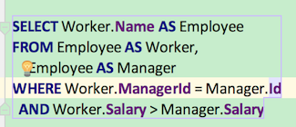
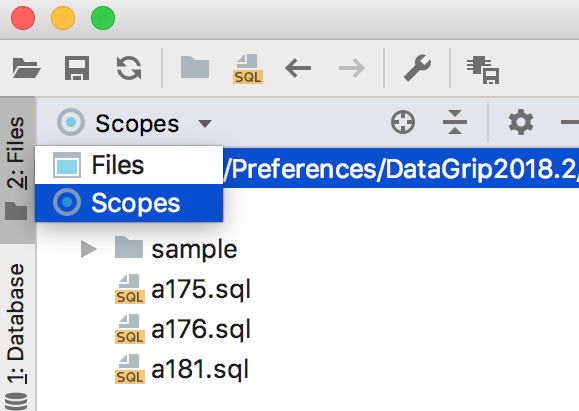

### datagrip 使用教程  

### 常见设置  

代码块，会被圈住，圈起来  
  
Edit -> Color Scheme -> Database  -> Console  -> Statement to execute  :  勾掉 Effects  

分包，分文件夹  
  

选择驱动，更新驱动  
File  -> data sources  ->  左边的 drivers  -> 选择 MySql  ->  右边的 Setting  ->  选择 driver files  

设置关键字自动大写  
File -> setting  ->  Editor  ->  Code Style  ->  SQL  ->  Case  ->  word case  ->  keywords  :  To upper   

快速执行当前sql语句  
mac :  command  +  enter   
他会提示运行当前 block 还是 整个 文件中的所有 sql， 如果只是运行当前block，再敲一次enter即刻  

 