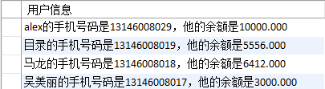

### 常用函数  

时间戳  
```
-- 时间戳
-- 更多api见 http://dev.mysql.com/doc/refman/5.5/en/date-and-time-functions.html#function_current-timestamp
insert into t_cart values('c_6','u_2',DATE_FORMAT('2016-10-17 23:00:02','%Y-%m-%d %H:%i:%s'), DATE_FORMAT(SYSDATE(),'%Y-%m-%d %H:%i:%s'),200, 20,'first created');

-- 连接符 字符串拼接
select concat(t_user.uname, '的手机号码是', t_user.phone, '，他的余额是', t_user.accountbalance) as '用户信息' from t_user;

```
    

单行函数  
```
字符串截取
/*(13146008029)从 第2个 开始，向右 找4个*/
select substring(t_user.phone, 2,4) from t_user where t_user.uname = 'Alex';
获取字符串的长度
/*获取字符串的长度*/
select length(t_user.uname) from t_user where t_user.uname = 'Alex';
获取字符在字符串中的首次位置
/*获取 e  首次在 alex 中是第一个字母*/
select t_user.uname, instr(t_user.uname, 'e') from t_user where t_user.uname = 'Alex';
左对齐
select lpad(t_user.accountbalance, 10,0) from t_user;
select lpad(t_user.accountbalance, 10,'0') from t_user;
右对齐
select rpad(t_user.accountbalance, 10,'0') from t_user;

左对齐
select lpad(t_user.accountbalance, 10,0) from t_user;
select lpad(t_user.accountbalance, 10,'0') from t_user;
右对齐
select rpad(t_user.accountbalance, 10,'0') from t_user;

字符删除
/*删除首 a*/
select t_user.uname, trim(leading 'a' from 'alexa') from t_user where t_user.uname = 'Alex';
/*删除 首位两端的 a*/
select t_user.uname, trim(both 'a' from 'alexalexa') from t_user where t_user.uname = 'Alex';
/*删除尾部的a*/
select t_user.uname, trim(trailing 'a' from 'alexa') from t_user where t_user.uname = 'Alex';

字符替换
/*将所有的 a 换成 z*/
select t_user.uname, replace('alexalexa', 'a', 'z') from t_user where t_user.uname = 'Alex';

判断数据为空
/*如果 积分余额 为空， 就用'没有积分代替'*/
select t_user.uname, ifnull(t_user.pointbalance, '没有积分') from t_user;
```
数据精度  
```
/*保留2位小数， 4舍 5入*/
select round(123.456, 2), round(123.456, 0), round(123.456, -2) from t_user;

/*数据 截断*/
select truncate(123.456, 2), truncate(123.456, 0), truncate(123.456, -2) from t_user;

求余
/*取 余*/
select mod(123, 2)  from t_user;
```

求平均值  
```
/*查询学生表中，学生的 平均学分， 没有学分的数据 不算在内*/
select avg(t_student.credit)from t_student;
/*查询学生表中，学生的 平均学分， 没有学分的 按0 来算*/
select avg(ifnull(t_student.credit, 0))from t_student;
/*查询学生表中，学生的 平均学分，按班级进行分组 */
select t_student.cid, avg(ifnull(t_student.credit, 0))from t_student group by t_student.cid;
/*查询学生表中，学生的 平均学分 大于100的 所在班级的id 和 该班级的平均学分，按班级分组*/
select t_student.cid, avg(ifnull(t_student.credit, 0)) 
from t_student 
group by t_student.cid 
having avg(ifnull(t_student.credit, 0))>100;

最值
/*查询学生表中，学生的 最高学分 大于120的 所在班级的id 和 该班级的平均学分，按班级分组*/
select t_student.cid, avg(ifnull(t_student.credit, 0)) 
from t_student 
group by t_student.cid 
having max(ifnull(t_student.credit, 0))>120;

差值
/*查询学生表中，学生的学分差值，按班级分组*/
select t_student.cid, max(ifnull(t_student.credit, 0)) - min(ifnull(t_student.credit, 0)) 
from t_student 
group by t_student.cid ;
```
IFNULL  为空判断，非空判断  
IFNULL(A, B)  如果A不为null，结果是，否则结果是B  
```
select IFNULL(
         (select Distinct Salary from Employee order by Salary DESC limit 1,1),
         null) as SecondHighestSalary;
```


